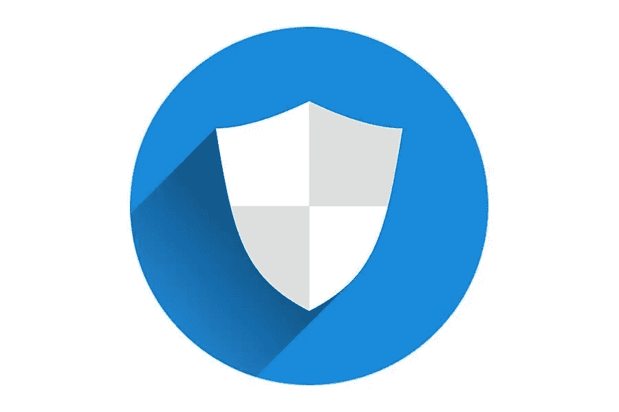

# 网站保护的 5 大最佳 WordPress 安全插件

> 原文：<https://medium.com/visualmodo/top-5-best-wordpress-security-plugins-for-website-protection-cb212fc4b588?source=collection_archive---------0----------------------->

拥有一个没有利用一些最好的 WordPress 安全插件的功能性 WordPress 站点是致命的。致命是指 WordPress 网站在网络攻击中最容易成为目标，因为它在世界各地被广泛使用。在这篇文章中，我们将分享 5 个最好的用于网站保护的 WordPress 安全插件。

# 安全插件从什么开始？

它应该是一个 WordPress 安全工具，可以防御黑客、恶意软件或任何其他形式的对你网站的入侵。它到底是做什么的？一个安全插件扫描恶意软件，清除恶意代码，保护网站免受黑客攻击。安全插件几乎和 VPN 服务于相同的目的。例如，NordVPN Tefincom S.A .是业内最受欢迎的商业服务之一。请阅读上面的评论，以便更好地理解 VPN 的功能。

现在很清楚为什么你的 WordPress 站点需要可靠的安全插件了。那么，你应该考虑拥有哪些最好的 WordPress 安全插件呢？看一看。

# 用于网站保护的安全插件

这个安全插件不仅能够检测被黑的文件，还能检查对它们的任何改变。Wordfence 还可以实时跟踪你的网站流量，这意味着除了实时查看用户流量，你还有权目睹黑客攻击。你还能享受到 Wordfence 的哪些其他产品或功能？安全审计、登录页面保护、各国访客拦截、受损文件的检测和修复等。

# 苏库里

Sucuri 安全插件最令人满意的特性之一是，它可以检测不良流量，并在流量到达您的服务器之前将其过滤掉。它的防火墙保护您的网站免受黑客、DDoS 和恶意软件的攻击。Sucuri 在优化网站性能方面也很可靠。它还可以向谷歌请求删除黑名单。

# 网站保护的安全插件:防弹

这个插件有免费和高级两种形式。它监控文件和保护登录页面。防弹安全也有自己的安全功能。它监控文件和保护登录页面。为了防止网站被操纵，这个插件会注销非活动用户。它还通过在上传部分限制访问或任何形式的执行来提供文件上传保护。

# SiteLock

你想要一个自动扫描的安全插件吗？SiteLock 插件不需要你启动扫描，因为它可以自己完成。该插件的其他功能包括 DDoS 防火墙和自动修补在 [WordPress 核心](https://visualmodo.com/how-to-download-wordpress/)上发现的漏洞。

# 护理不当

近十年来，MalCare 已经被证明是大多数 WordPress 用户非常可靠的安全插件。它有一个扫描仪，甚至可以检测最复杂的恶意软件。一旦启动扫描，它还会无限期地运行清除程序。此外，它还过滤不良流量。你也可以从它的仪表板管理其他 WordPress 站点。

总之，上面强调的只是众多安全插件中的一小部分，你的 WordPress 站点可以从中受益。即使有了安全插件，也不要忽视使用虚拟专用网的需要，因为它也能保证在线安全。如果您已经在使用 VPN，请测试 VPN 以确保它没有泄露您的数据、IP 或 DNS。