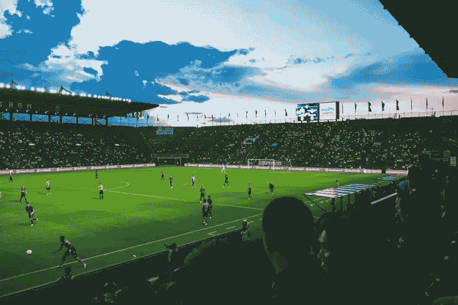

# 欧洲足球锦标赛前七名

> 原文：<https://medium.com/visualmodo/top-7-arenas-hosting-uefa-euro-39b52b78dbf6?source=collection_archive---------0----------------------->

现在，所有的体育迷都在搞 2020 欧锦赛。大多数人不得不在家观看比赛，并在网上用 TonyBet 奖金押注自己喜欢的球队，而不是去体育场。但是一些幸运儿将会在竞技场观看比赛。这 7 个体育场举办了大部分比赛。在这篇文章中，我们将分享举办欧洲联盟杯的七大赛场。

# 英格兰温布利体育场:举办欧锦赛的竞技场

世界上最著名的足球场之一举办七场比赛。除了 D 路的三场比赛，温布利球场还举办两场 1/8 决赛，都是半决赛，以及[决赛](https://visualmodo.com/the-gaming-industry-a-winner-in-the-coronavirus-pandemic/)。这是英国竞技场欠布鲁塞尔的。回到 2017 年，欧盟首都竞技场建设的问题变得更加生动。当时，比利时主办的比赛被交给了伦敦。此外，由于这种形式，英格兰队有更好的机会进入决赛。

# 俄罗斯克雷斯托夫斯基体育场

圣彼得堡体育场举办三场小组赛和一场四分之一决赛。克雷斯托夫斯基体育场(Gazprom Arena)建于 2016 年 12 月。就新颖和建筑设计而言，Gazprom 竞技场是 2020 年欧洲杯最新的比赛场馆之一。

2021 年 4 月 23 日，决定来自都柏林的路径 E 匹配在圣彼得堡。

# 约翰克鲁伊夫竞技场，荷兰:举办欧锦赛的竞技场

不久前，荷兰首都的主体育场还是阿姆斯特丹竞技场。但是这位著名的荷兰前锋的去世永远地改变了这座体育场的历史。竞技场于 1996 年准备就绪。Johan Cruijff Arena 主办了所有涉及荷兰国家队在 c 路的比赛。它是主办所有主队小组赛的体育场之一。

# 德国安联竞技场

在德国所有精美的体育场中，2020 年欧洲杯选择的体育场是慕尼黑的安联体育场。柏林奥林匹克体育场不再满足今天的期望和要求后，德国国家队搬到了这个体育场。新的竞争对手是在 2005 年。从那以后，它一直是欧洲最好的体育场之一。安联竞技场承办德国所有的 F 路比赛。

# 阿塞拜疆巴库奥林匹克体育场

巴库占地 225，000 平方米的体育场仅在 6 年前，2015 年欧洲运动会之前就准备好了。此后，该体育场举办了几场重大体育赛事，如 2017 年的伊斯兰运动会和 2019 年的欧洲联赛决赛。

今年的 2020 年欧洲杯是这座体育场有史以来最大的赛事。bakolimpiya stadio nu 从未在比赛日之间不到一周的时间里欢迎这么多人参加一项赛事。