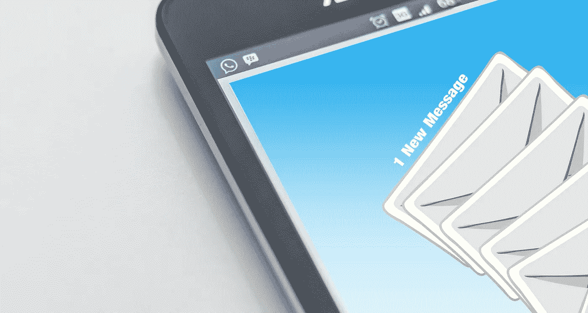

# 雇主在建立邮件列表时会犯的 7 大错误

> 原文：<https://medium.com/visualmodo/top-7-mistakes-employers-make-when-building-an-email-list-6d476fdf2c7e?source=collection_archive---------0----------------------->

每天发送 2050 亿封电子邮件。根据《持续接触》的报道，人们在建立邮件列表上投入如此多时间和精力的原因在于它的潜力:在邮件上每花 1 美元，你就能得到 38 美元的回报。

当然，我们都知道建立一个正确的电子邮件列表有多重要。我们意识到在正确的时间将精心制作的信息发送给正确的受众的重要性。然而，遗憾的是，雇主和招聘人员都会一次又一次地犯同样的错误。

你可能想知道这些错误是什么，以及如何防止它们发生。如果是这样，请继续阅读，因为我们将在几秒钟内向您介绍他们。

即使你认为你是这方面的真正专家，不需要任何指导，我们也强烈建议你看看我们的清单:你可能会惊讶地看到你所做的事情，发现它们绝对正常，而事实上它们破坏了你的形象，损害了你的业务和招聘过程。

# 制作邮件列表时的 7 个错误

1.  **没有给予加入或者订阅的动机。**
    我们都会收到数十封电子邮件，邀请我们加入某项活动或订阅电子邮件活动。天气越来越好了。订户已经对这种类型的消息免疫了。你能让他们订阅或加入的唯一方法是给他们一些免费的东西作为回报，或者给他们有价值的独特内容。

换句话说，如果你希望你的邮件列表活动有效，你必须提供激励。或者他们会在你邀请他们做之前删除它。因此，如果你想让他们按照你的要求去做，就听从我们的建议，为他们的行为提供真正的价值。

1.  精心设计一个平庸的主题。主题行决定了读者是否愿意阅读你的邮件。如果这封信很吸引人并且与他们的利益相关，他们会打开它。如果没有，他们会认为这是垃圾邮件，并在打开之前删除。

此外，主题行应该解释这封邮件能解决读者的哪些痛点。它必须听起来有吸引力和有趣。否则，你只是在浪费你和用户的时间。
我们还想提到的是[建议](https://visualmodo.com/)在主题行中使用数字、主动语态和“[有力词汇](https://smartblogger.com/power-words/)”:这些技巧对你的邮件列表活动成功率有奇效。

1.  **问题太多。**
    你可能知道问问题让用户参与对话有多重要。然而，虽然开始讨论和开始对话通常是一件好事，但问太多的问题有点烦人。这会让观众反感，所以不要这样做，尽量坚持每封邮件三个问题的神奇数字。把它们放好，均匀地分布在整个文本中。

把你的电子邮件想象成一次对话:如果你问了太多问题，不给人们停下来思考答案的机会，他们可能会认为你是一个爱管闲事、令人讨厌的家伙。
同样的道理也适用于此:凡事适度为好。

1.  **添加断开的链接。如果你对电子邮件不够重视，你可能最终会发出毫无结果的信件。这就是为什么要确保你在邮件中插入的每一个链接都是有效的，而不是浪费几个小时去写、润色和瞄准。**

此外，让链接在文本中可见也很重要。根据你使用的电子邮件营销服务，你可以将你的链接风格化，并插入到特殊的按钮中。在这种情况下，它们会更加明显和生动。这是成功的电子邮件活动的关键。

1.  **不升级你的网站。你的网站，你业务的核心，必须看起来完美无瑕。它的主要目标是为访问者提供所有必要的信息。如果你通过邮件把人们送回你的网站，你必须 100%确定它是完美的。如果它有点旧，可能需要重新设计或做一些工作，但它必须在表面上有所有必要的信息。无需翻阅文档来寻找问题的答案。所以，瞄准这样的标准！**
2.  **隐藏表单。如果你的邮件中有表格，它必须是可见的。只要[可能](https://visualmodo.com/)，直接添加到邮件中。不要要求人们采取任何额外的行动来填写表格。我们要说的是，将它们重定向到第三方网站并不是一个好主意。一路上你会失去一半的人。
    但只要客户不用留下电子邮件就能看到这些表格，你就会得到你想要的所有回复。**
3.  **选择不当的风格。最后一个但并非最不重要的错误是:雇主往往听起来过于官方和专横。然而，这并不是接受者所期望的风格或态度。人们讨厌被教导。他们希望被平等对待。所以，如果你的邮件听起来太遥远和奇怪，你很可能得不到你想要的回复。选择友好的语气！**

总而言之，电子邮件活动对你的业务取得全面成功极其重要。众所周知，它们会带来巨大的投资回报。如果他们不为你工作，那么你可能做错了。仔细看看我们的列表，检查你是否没有犯这些错误。如果是，那么欢迎您尝试并立即修复它们！

有了结构良好和高质量的电子邮件，你就可以加入成千上万成功的雇主的行列，他们学会了如何正确地开展电子邮件活动，现在正在收获他们辛勤工作的成果！