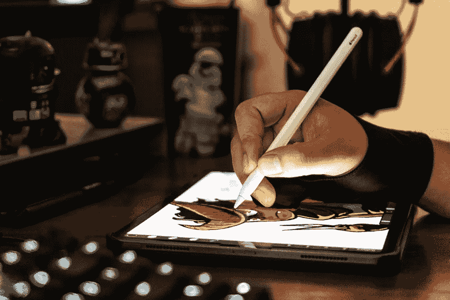

# 面向所有人的苹果铅笔应用

> 原文：<https://medium.com/visualmodo/top-apple-pencil-apps-for-everyone-ff41a98a0a60?source=collection_archive---------0----------------------->

这一天已经到来，我迫不及待地想重新使用我的苹果铅笔。这里有一些最好的 Apple Pencil 应用程序，它们与素描或绘画完全无关。许多创造性的应用程序都可以使用 Apple Pencil，但是你不一定要成为艺术家、音乐家或设计师才能使用它们。以下是 Apple Pencil 的一些最佳应用程序，许多人可能会喜欢并使用它们。

# 最佳铅笔应用

# Adobe Comp CC

Apple Pencil 是 Adobe Comp CC 的天作之合。如果您从未尝试过任何 Adobe iOS 应用程序，这是您应该开始的地方。尤其是如果你有一支苹果铅笔的话。Comp CC 是一个线框和实体模型工具，它绝对可以让设计师的生活更简单。Adobe Comp CC 与 iOS 和 PC/Mac 的 Creative Cloud 应用程序套件完全兼容，它将让你有机会像其他应用程序一样充分利用 Apple Pencil。此外，像所有的 Adobe 移动应用程序一样，它是免费的，即使没有 CC 订阅。

# PDF 专家

有时候你需要在最后期限前签署一些[重要的](https://visualmodo.com/wordpress-themes/)文件。有时你可能需要在文件上做笔记，以便退回工作。 [PDF Expert](https://itunes.apple.com/us/app/pdf-expert-by-readdle/id743974925?mt=8) 是一款 Apple Pencil 应用程序，可以让你充分利用当初购买它的原因。PDF Expert 不仅仅是签名和批注，它还能让您完全控制 PDF 文件的编辑，因此您不必担心回到计算机上使用 Acrobat 进行编辑。使用 Apple Pencil，就像在记事本上写字一样——只是更酷。

# uMake

不仅仅是实体模型，uMake 是一个 CAD 应用程序，可以让你释放你的 Apple Pencil。使用手写笔(是的，我们已经确定不止这些)，你可以 3D 建模几乎任何你能想到的东西。uMake 最有用的一个方面是，虽然它是移动的，功能强大，但你可以导出文件，以便可以 3D 打印或在桌面应用程序上进一步编辑。你不必担心手机版功能不够强大或无法完成你的任务。有了 Apple Pencil，你可以在任何地方把它放在膝盖上完成。

# 像素化器

当然可以，App Store 上有免费的 Adobe Photoshop CC 应用，也很不错。当然了。但当你谈论 Apple Pencil 应用程序时，你真的应该看看 [Pixelmator](https://itunes.apple.com/app/pixelmator/id924695435?mt=8) 而不是。该应用程序针对 Apple Pencil 的使用进行了优化，在 App Store 上获得了很高的评价。你可以用它做很多事情，即使你不是艺术家或摄影师，你也能很快知道如何美化你的照片。

# 液体文本

[LiquidText](https://itunes.apple.com/app/liquidtext-pdf-document-reader/id922765270?mt=8) 在一个非常不起眼的包里做了很多。虽然它的核心是一个 PDF 编辑器和笔记应用程序，但你不应该简单地看待它。它更像是一套工具，无论你在做什么，你都可以用它来保持自己的工作效率。从思维导图和开发者所谓的“墨水链接”，到跨多个文档的全面搜索(这在移动应用中并不常见)，你手中的 Apple Pencil 绝对会得到锻炼。只是一定要从你和你的铅笔所获得的乐趣中不时地伸展你的手指。

# 色素

首先，让我们谈谈一个不是用来画画的 Apple Pencil art 应用程序。[颜料](https://itunes.apple.com/us/app/pigment-adult-coloring-book/id1062006344?mt=8)是一款涂色书 app。成人涂色书仍然很受欢迎，理由很充分:它们让人放松，即使你不能画出一条直线，你也可以真正发挥你的创造力。Pigment 与市场上其他一些应用程序的最大区别之一是，它不是一个触摸到颜色的应用程序。你不会默认使用油漆桶工具并用单一颜色填充整个空间，因为你实际上是用画笔上色。你也可以用手指，但是 Apple Pencil 让整个应用程序起飞。

# 苹果笔记

谈到 Apple Pencil 应用，不能不提 iOS 自带的默认 [Notes 应用。如果有一款应用是以 Apple Pencil 为设计理念的，那就是这款。虽然它没有那么出名，但也差不多了。就像苹果公司做的其他事情一样，它被抛光、清洁并且易于使用。你不会觉得你必须花钱买一个高级应用程序，如果你不是一个超级笔记本电脑用户，你可能就没必要这么做。在打开 Apple Pay 之前，尝试一下看看你的想法。](https://support.apple.com/en-us/HT205773)

# 亲和力设计者

Affinity Designer 是一个矢量图形编辑器，如果你想加载一流的 Apple Pencil 应用程序，那么 Serif Labs 的这个绝对不会错。它的标价为 19.99 美元，有些人对 iPad 应用程序望而却步，但类似的桌面软件要贵得多。这就是问题所在:有类似的桌面软件。Affinity Designer 的功能和大多数矢量设计应用一样。这绝对是一款优质产品，但如果你愿意付钱，你的 Apple Pencil 会感谢你的。

# 概念

从你启动它的那一刻起，你就无法否认[概念](https://itunes.apple.com/us/app/concepts/id560586497?mt=8)有多美。作为一个素描应用，你不能做得更好。你的 Apple Pencil 可以让你随时随地随心所欲地创作。虽然素描和绘画绝对是它的主要任务，但你不应该认为这是一个简单的壮举。该应用附带的功能也是顶级的。您将欣赏直接从概念导出的 SVG，无限的分层和无限的画布，因此即使您正在开发应用程序，也不会感到受限。下载是免费的，但当你意识到你需要一个特定的功能或工具时，你可以选择购买应用内的内容。

# 文件设计

[这个名字泄露了这个](https://itunes.apple.com/app/apple-store/id474990205)。它让你签署文件。你的 Apple Pencil 实际上可以让你给出一个真正的签名，而你用手指是无法得到它的。出于商业目的，能够在应用程序中发送和接收电子签名是至关重要的。它既不花哨，也不华而不实，但如果你有一支 Apple Pencil，DocuSign 值得下载。即使你不知道。

# 显著

笔记应用程序是用苹果铅笔设计应用程序的面包。而[的知名度](https://itunes.apple.com/us/app/notability/id360593530?mt=8)在该领域真正脱颖而出。虽然它不提供各种其他应用程序的 PDF 操作，但它做得很好。它记笔记。它可以让你给东西做注解。Apple Pencil 应该感觉像是应用程序的自然延伸。你确实得到了一个基本的文档和照片操作，但这实际上是对你所得到的笔记能力的认可。如果你愿意出 10 英镑，庄稼、草图、不同的笔和记号笔就能让这一切成为定局。

# 结论

新的 Apple Pencil 应用程序一直在 App Store 上弹出。我很快会尝试其他着色应用，比如重新着色。如果你对 Apple Pencil 的应用程序有任何其他建议，我很乐意在评论中听到它们。