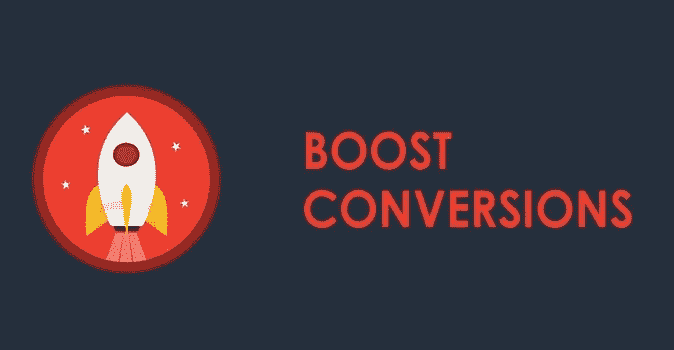

# 顶级转换助推 2018 年网页设计趋势

> 原文：<https://medium.com/visualmodo/top-conversions-boosting-web-design-trends-of-2018-a64e792e48d4?source=collection_archive---------1----------------------->

你知道糟糕的网页设计会让你付出转化的代价吗？如果你的网站看起来不专业，用户就会对你的企业失去信任，或者仅仅因为网站上没有你的联系方式，你可能会失去 40%以上的潜在客户？

设计顾问发布的一份新的[信息图聚焦于其中一些问题，详细列出了 15 种值得关注的网页设计趋势。每一种趋势都配有案例研究、关于要遵循的良好实践的建议以及为了改善用户体验要避免的事情。](https://designadvisor.net/)

# 转化率提升趋势

这里有一个例子:关于用户体验的部分详细说明了几乎所有的用户(95%)都把他们在一个网站上的体验作为评估是否购买的最重要因素。例如，负责任医疗医师委员会(PCRM)通过利用品牌故事和改善其美学和用户体验，成功地将移动流量提高了 40%,将社交推荐量提高了 16%。设计顾问建议吸引用户滚动页面，以此来改善他们对你的[网站](https://visualmodo.com/wordpress-themes/)的体验。

有些趋势并不广泛。例如，仅添加您的联系信息就可以大大提高转化率。原因很简单——如果用户在遇到问题时不能很容易地找到与你联系的方式，或者不能了解关于某个产品或服务的更多信息，他们就不会相信这个业务是合法的。这比你想象的要重要得多，因为下面信息图中提到的一项研究显示，在登陆一家公司的网站后，64%的访问者会搜索联系方式[信息](https://visualmodo.com/)。

总而言之，如果你想增加你的转化率，这些趋势是值得关注的。好的网页设计对收入的影响经常被忽视，然而投资它意味着满意的回头客和不满意的回头客之间的差别。查看下面的信息图，了解如何让你的网页设计游戏达到标准。现在请看图片。

 [## 顶级转换助推 2018 年网页设计趋势——visual modo

### 你知道糟糕的网页设计会让你付出转化的代价吗？如果你的网站看起来…

visualmodo.com](https://visualmodo.com/top-conversions-boosting-web-design/)