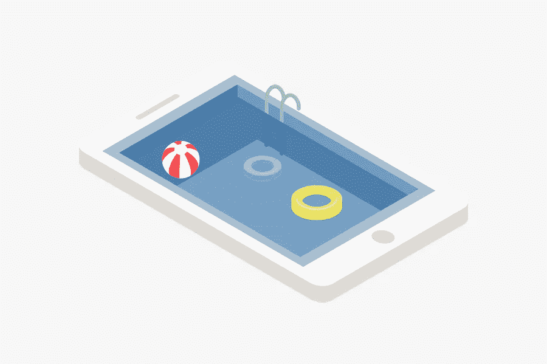

# 旅游博客的热门小工具

> 原文：<https://medium.com/visualmodo/top-gadgets-for-travel-bloggers-bc6f794e8ffc?source=collection_archive---------0----------------------->

在这篇文章中，我们将列出一些顶级的科技产品，供旅游博客作者在旅行时使用，并在旅行过程中不断创建和保存内容。

是的，带着你的工作去度假听起来可能是一个可怕的策略，但是当你对你的博客充满热情，并且它是你的业务，甚至是你的业务的一个重要部分时，你需要确保你能够管理它，即使当你离开与你的家人和朋友一起享受时光的时候。

好了，下面我概述了一些必备的小工具和[技术](https://visualmodo.com/theme/it-wordpress-theme/)我认为所有的旅游博主都应该考虑在他们的背包或行李箱中打包！这些科技产品碰巧也是我旅行时随身携带的东西。我们开始吧！

# 旅游博主的顶级科技产品

# 欧凯 10，000mAh 便携式充电器

作为一个数字流浪者，总是有耗尽能量的风险。有了 10，000mAh Aukey 便携式电源组，这种风险大大降低。因此，这是一个伟大的科技旅游博客小工具。Aukey 是旅行者和博主最必备的小工具之一。因为它可以同时为 2 个设备充电，并具有快速充电 2.0 功能和 LED 闪光灯。因此，它是白天或晚上的最佳伴侣。

# DJI 奥斯莫是旅行者的顶级小工具

视频可以作为你旅行故事内容的一部分发挥重要作用。如果你想通过拍摄美丽、高质量的镜头来捕捉惊人的故事。此外，与你的观众分享它们，然后 DJI 奥斯莫是你所需要的。有了这个智能万向架，你可以拍摄动作而没有任何抖动的迹象。此外，录制视频时不会模糊，因为无论您如何握持，它都能保持相机稳定。所以如果你想知道。如何捕捉完美的全景或令人惊叹的无三脚架长时间曝光，别无他求。

# 旅游博客的科技产品:蜘蛛平台

亚马逊 3.99 美元。为了到达世界各地遥远的目的地，Tara Canon 多年来一直带着她的两个孩子参加旅行马拉松，她已经形成了一种专业技能，这种技能不仅让她能够生存，而且实际上还能享受家庭旅行。坎农在飞行时让孩子们开心的首选是蜘蛛讲台。通用于所有移动设备(也可用于电子阅读器和书籍)，超级便宜的 Spiderpodium 配有八条腿。与你标准的三脚三脚架大相径庭。它可以适应环境，并具有强大的抓地力，可以将您的物品固定到位。最后，一个伟大的科技旅游博客小工具。

# 通用旅行适配器

鹰溪通用适配器|酷旅行配件通用旅行适配器形式鹰溪。如果你经常旅行，你就会知道在你的适配器中翻箱倒柜，试图找到适合下一个国家的适配器是多么痛苦。这就是为什么 Eagle Creek 的世界插头适配器非常好用。它在一个紧凑的插头中拥有您需要的一切。不会再有松散的设备丢失在酒店房间里。为什么是这个？因为它轻便小巧，还带有 2 个 USB 插座。

# 旅游博客的顶级科技产品

你在你的智能手机上花了很多钱，为什么你不去照顾它呢？Lifeproof 是您的电子产品的最佳外壳，使它们防水和减震。相信我，我们已经测试过了。如果你像我一样经常摔手机，或者计划进行水上旅行或冒险旅行，你会想要这个箱子。我在惠斯勒的潮湿条件下毁了一个手机滑雪板，如果我当时有这个箱子，我的手机就会得救。

# 存储卡固定器

如果你和我们一样，你有很多不同的 SD 卡。在我们的照片和视频安全之前，我们不喜欢删除任何东西，但在我们的行李中丢失存储卡也不是一个选项。这款铝制记忆卡与我们的苹果产品搭配得很好(因为它是银色的),可以舒适地存放 SD 和 Micro SD 记忆卡。这永远不会离开我们的相机包。我们也用它来整理东西，把用过的卡片放在一边，没用过的放在另一边。为什么是这个？大多数存储卡卡座都很软，您的卡可能会损坏。这是一个硬盒，它存储两种类型的卡。

这是你最喜欢的科技旅行小工具？请在下面的评论区告诉我们，并分享你的经验。