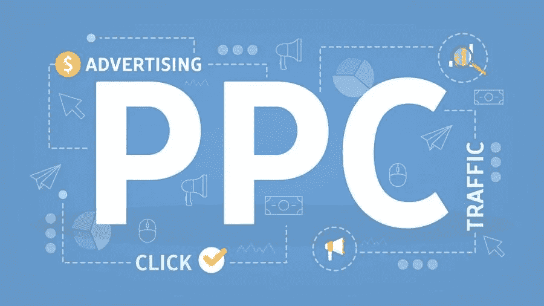

# 最值得利用的 PPC 营销趋势

> 原文：<https://medium.com/visualmodo/top-ppc-marketing-trends-to-capitalize-on-abc3e106b63d?source=collection_archive---------0----------------------->

如果你想增加收入，数字营销应该是优先考虑的。然而，你需要知道如何在网上接触到你的目标受众。如何包装您的数字营销内容也是一个重要的考虑因素。一个有效的方法是将个性化的广告策略融入到你的营销工作中。你可以利用社交媒体(脸书、Twitter、Pinterest 等)、你的网站、电子邮件或视频营销等平台和策略。在这篇文章中，我们将探讨 6 大 PPC 营销趋势，以利用。

此外，你对数字营销策略的选择应该受到你最终目标的影响。例如，点击付费(PPC)对那些想增加网站流量的人来说很好。如果你想提高你的产品的知名度或者客户的认知度，除了 PPC，还有其他更好的选择。你可以在网上了解更多有用的提示，告诉你如何投资正确的营销策略来实现你的目标。

这篇文章的重点是你可以投资的 PPC 营销趋势:

# 1 PPC 自动化

PPC 广告的一个主要趋势是自动化。这融合了机器学习(ML)和人工智能(AI)来自动化你为谷歌和必应广告执行的任务。PPC 广告的全球自动化有望显著增长。通过自动化，您可以优化您的 PPC 活动。PPC 营销专家使用自动化来:

*   自动生成关于广告表现的报告
*   根据数据馈送和使用谷歌脚本创建和优化您的广告文案
*   提升表现良好的广告，识别表现不佳的广告
*   通过观察产生转化率的概率较高的广告来提高每次点击成本(CPC)
*   制作基于网站内容和用户行为的广告

# 2 PPC 和视频广告营销趋势

谷歌推出的一个主要视频广告功能是 Bumper Machine，这是一种机器学习技术，用于从长视频(90 秒或更短)中创建 6 秒钟的 Bumper 广告。这些广告可以显示在整个 YouTube 的 PPC 营销趋势。

这一策略有助于营销人员有效管理 6 秒广告、可跳过的流内广告和不可跳过的流内广告[谷歌广告](https://visualmodo.com/how-google-ads-can-impact-your-company/)。为了提升你的搜索结果，你也可以在其他视频网站上使用 PPC 广告。