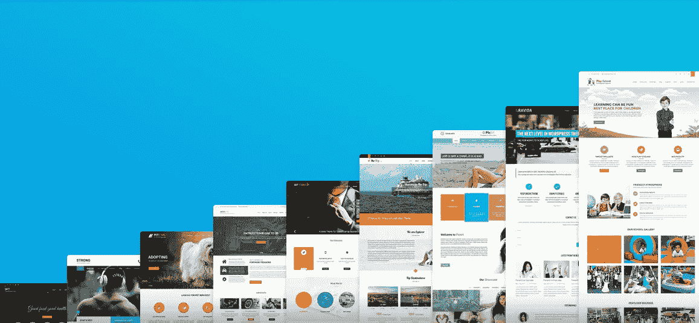

# 为什么你需要选择一个好的主题

> 原文：<https://medium.com/visualmodo/top-reasons-why-you-need-to-select-a-good-wordpress-theme-580443c4bad8?source=collection_archive---------1----------------------->

WordPress 已经变得相当流行，使用 WordPress 的网站数量持续增长。当使用 WordPress 时，它让你简单地开发一个网站；有许多不同的主题可供选择。你需要知道为你的网站选择正确的好的 WordPress 主题的重要性。

有很多因素可以让一个好的主题在众多的主题中脱颖而出，即使它是一些免费的主题或者是一个高级的主题。不要只关注一些 WordPress 主题的美学，重要的是你甚至要考虑一些关于主题的潜在细节，这些细节最终会影响你的网站在各种设备上的呈现方式。它还将观察网站的加载速度，有多少定制，此外，全面的浏览器支持。

# 为什么你需要选择一个好的主题

继续阅读，找出为什么你需要选择一个好的主题。

# WordPress 主题浏览器支持和响应设计

毫无疑问，关注网站如何看待你目前使用的浏览器是很简单的。然而，你也应该知道，并不是所有的人都会使用相同的浏览器，甚至是相同尺寸的屏幕。

有许多互联网用户在浏览互联网时花更多的时间在他们的移动设备上，而不是使用台式电脑。记住这一点，你应该知道选择一个能给出[响应](https://visualmodo.com/blog/)网页设计的 WordPress 主题是至关重要的。

你可以通过预览一些 WordPress 主题来测试它；您可以专门调整浏览器的宽度，然后查看您的网站如何响应大小的变化。

除了响应式设计，你还需要确保在其他浏览器上测试网站，主要是 Internet Explorer，因为 IE 提供了最低水平的兼容性，特别是针对较新的[设计](https://visualmodo.com/wordpress-themes/)功能。

# 主题页面加载时间加上代码膨胀

[由于手机使用量的增加](https://www.ncbi.nlm.nih.gov/pmc/articles/PMC5680647/)，你可能会发现在每个设备上都有一些加载速度很快的网站是很有用的。你可以找到一些免费的在线速度测试，让你知道一个网站的加载速度有多快。当你完成了一个速度测试，你应该可以看到这个主题的源代码，也可以看到 WordPress 主题的 HTML。

当你看到有很多不同的链接专门指向外部脚本时，那么你想得到的 WordPress 主题实际上可能要花很多时间来加载。因此，考虑你是否愿意得到它。记住，没有人喜欢一个花很多时间加载的网站。有些人没有时间等待，可能会选择其他网站。

# WordPress 主题定制

你需要知道浏览器加设备支持，以及页面加载时间，对于提供良好的用户体验来说是很重要的。还有一点要考虑，就是定制。

你可以浏览主题设置，看看你是否能以一种简单的方式改变背景颜色，字体，侧边栏，以及其他布局变化。

你需要找到一些 WordPress 主题，让你开发一个完全符合你的要求的网站。你应该能够创建一些你真正满意的 WordPress 网站。

你可以浏览不同的 WordPress 主题。花点时间选择一个效果最好的，能提供你想要的一切的。

当创建一个网站时，你需要考虑很多因素，比如关键词。你可以去 https://www.helixhouse.com/focused-longtail-keywords/寻求帮助。你选择的主题也很重要。

因此，你需要花时间考虑创建最佳网站的所有方面，这将有助于你的业务。你希望客户喜欢访问你的网站，并发现它很容易导航。

这应该让他们更容易看到你的产品，这样他们就可以考虑购买。如果你想创建一个既能帮助你的生意，又能让客户乐于使用的网站，就要关注所有相关的方面。