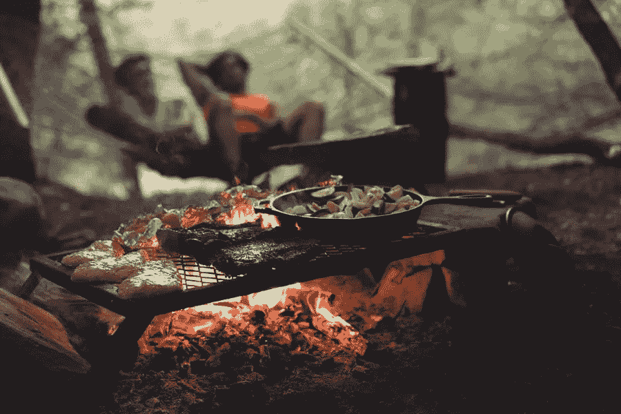

# 举办烧烤聚会而不感到压力的热门建议

> 原文：<https://medium.com/visualmodo/top-trending-tips-to-host-a-barbeque-party-without-stressing-out-1cad91a2409d?source=collection_archive---------0----------------------->

你是不是一个自诩烧烤高手，总在寻找理由举办烧烤聚会？你是打算在夏天的时候在你的新遮阳篷下为你的朋友举办烧烤聚会的人吗？在这篇文章中，你将会看到在没有压力的情况下举办烧烤聚会的热门建议。

你后院的遮阳篷空间不仅能在夏天为你提供阴凉。而且还能为你提供一个完美的娱乐空间。在那里你和你的朋友可以聚在一起享受一些秘密的乐趣。

是的，烧烤聚会很有趣，但是这些聚会需要一些计划。这样你就不会在派对那天累着自己。

因此，这里有一些建议，你可以考虑在自家后院的新泽西州电动汽车遮阳篷下举办一场完美的烧烤聚会时实施:

# 菜单简化:举办烧烤聚会的技巧

说到烧烤。做一顿美味的烧烤，你可以做很多东西。从所有健康的蔬菜到肉类，你可以用你的烧烤技巧变得有创意。

但是，在举办秘密聚会时，最好保持菜单简单。考虑挑选一张容易准备的菜单卡。所以，不会让你慌慌张张跑去收集原料。

你选择的菜肴不应超过五种配料。这样你不仅可以提前准备烧烤。但也能帮你省点钱。

# 用串灯装饰一下

如果你在晚上举办烧烤聚会，有几对夫妇和你一起参加。然后用童话灯或其他灯装饰你的遮阳篷空间，可以创造一种浪漫的感觉。

可以再铺一些长椅，或者安排一个低矮的座位区。放一些爱情歌曲来营造浪漫的氛围。当你用美味的烧烤招待他们的时候。

此外，当天黑时，你不会希望你的客人打开他们的移动灯来战胜黑暗。因此，事先准备好一些派对灯。这样当派对气氛达到高潮时，你就不会破坏跑出去布置灯光的乐趣。

# 提前做好安排:举办烧烤聚会的小贴士

虽然热烤食物感觉像天堂一样。所以，你可能希望你的客人在参加你的烧烤聚会时也有同样的感觉。但是提前做好准备会有很大的不同。

我们不是要求你烧烤每一个项目，并储存在热的情况下。但至少你可以切所有的蔬菜。肉类，并保持在这样的条件下，它成为准备进入烤架。

这样，当你的客人到达时。你可以简单地开始烧烤食物，然后端上来，而不是高高在上。在他们到达的时候做馅饼，花整个晚上做饭，而不是和你的朋友相处。

# 检查你的供给

当你举办烧烤聚会时，一定要事先检查你的丙烷和木炭供应。这样你就不会降落在一个可能需要派人去拿这些必需品的地方。

如果你正在烤这些馅饼，却发现你的燃料耗尽了。然后你可能要拿着半熟的肉饼等着，直到有人拿到订书钉。更进一步，当你再次烹饪时，味道可能会有所不同。你可能需要处理掉这一批，因为它的味道可能和其他烧烤食物不一样。