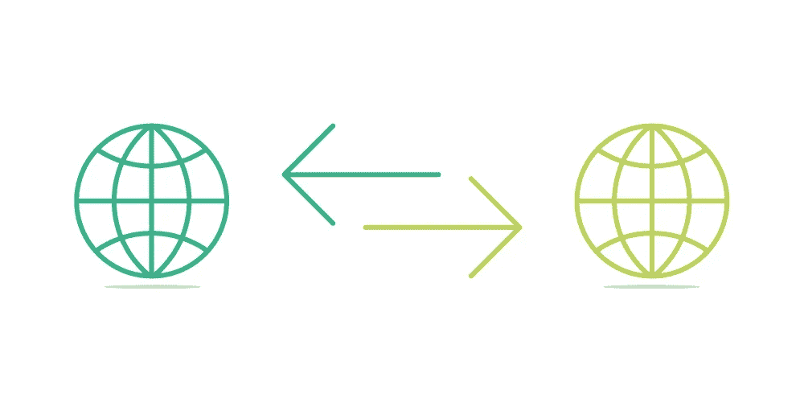

# 将域名转移到新的注册机构

> 原文：<https://medium.com/visualmodo/transfer-domain-name-to-a-new-register-4fafffe2a4ad?source=collection_archive---------0----------------------->

把你的网站搬到一个新的主机上，也需要转移域名吗？也许你已经找到了更好的域名注册协议。在任何情况下，转让您的域名是一个简单的过程，但通常需要几天时间来完成，而你要等待所有参与方批准转让。大部分工作都是在幕后完成的；你只需要填写一些表格。

# 转移域名

虽然本教程是基于我如何将我的域名从 HostGator 迁移到 Namecheap，但它也适用于其他注册服务商，如 Godaddy、Registrar、Network Solutions、 [Bluehost](https://www.bluehost.com/track/claudiocamposp/) 、Dreamhost 等。

现在让我们看看如何将您的域名转移到另一个注册商。只要遵循这些简单的步骤

# Whois 数据电子邮件验证

首先，你必须确保你的域名管理联系人在你的 whois 数据库中有一个有效的电子邮件地址。因为新的注册商会给你的邮箱发一封确认信。

要在 Whois 数据中查看您的电子邮件地址，请访问此网站。输入您的域名，并检查注册人的电子邮件。

如果您的 Whois 数据中有有效的电子邮件地址，您可以跳过这一步。但如果你没有，你需要确保你的隐私保护被禁用。隐私保护是一项向公众隐藏您的个人信息的服务。您可以联系您的注册服务商取消隐私保护。

您也可以从您的域管理中手动完成。以下是如何在 HostGator 上实现的。转到域管理>管理域，然后点击“盾形标志”。并禁用域隐私。

# 域地址解锁

您的域名必须解锁才能转让。域名锁定是一项安全功能，可以防止第三方未经许可试图编辑、转移或删除您的域名。

您可以从控制面板解锁您的域名。对于 HostGator，单击“锁定标志”解锁您的域名。

# 授权代码

授权码也称为 EPP 码或传输密钥。它是字母、数字或符号的独特组合。您可以从您的域名[概览](https://shots.visualmodo.com/)中获取授权码。如果您在帐户上找不到任何授权码，请联系您的域名注册商。要在 HostGator 上获得 EPP 密钥，只需在“管理域”中单击您的域名，就会弹出一个域概述。从那里复制 EPP 密钥。

# 域名转让

现在是时候从你想要的域名注册商那里购买域名了。选择你个人最喜欢的。看看它是否提供廉价的域名转让。当您购买域名转让时，一些提供商可能会让您保留当前注册的所有剩余时间。Namecheap 保留所有剩余时间。

付款后，您需要在新的注册服务商上设置您的授权/EPP 代码。一旦您购买了转让，您将收到一封关于 EPP required 的电子邮件。只需点击链接并输入您的 EPP 代码。

# 来自注册的电子邮件通知

然后，您将收到来自当前注册商和新注册商的确认邮件。你不需要对当前注册员的邮件做任何事情。但是您必须点击新注册商邮件中的确认链接。转移您的域名需要 5-7 天。一旦您的域名转让完成，您将收到新注册商的确认电子邮件。

在转移我的域名[名称](https://awards.visualmodo.com/)时，我没有遇到任何停机。我建议你联系你的新域名提供商了解停机时间。希望有帮助。如果在将您的域名转让给新的注册商时遇到任何困难，请告知我们。别忘了和我们分享你的域名转让经验。