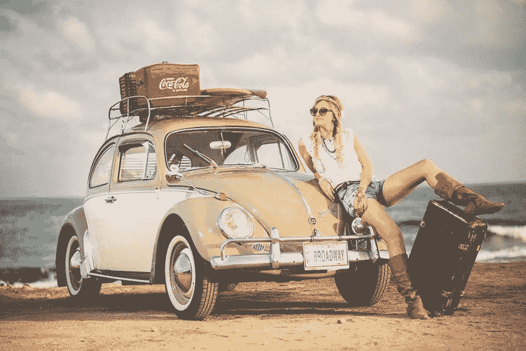

# 旅行广告牌如何把你的车变成一场营销活动？

> 原文：<https://medium.com/visualmodo/traveling-billboards-how-to-turn-your-vehicle-into-a-marketing-campaign-87719565b374?source=collection_archive---------0----------------------->

营销就是正确的想法。这听起来很有趣，但绝不是一件容易的工作。如果你不小心，它会在你的预算上钻一个大洞。更糟糕的是，这会让你处于不利的地位。在这篇文章中，我们将分享如何把你的车变成一个营销活动。

最近的 2020 营销失误应该足以告诉你这一点。一个非常明显的错误涉及百事可乐。为了充分利用黑人的命也是命运动，可口可乐公司发布了一则广告，展示了肯达尔·詹娜提供一罐百事可乐，以缓解抗议者和警察之间日益增长的敌意。结果呢？这个品牌在社交媒体上被掏空了。

要是有一种方法能让你有效地推销自己的品牌，而不必在明星效应上花费太多就好了。值得注意的是，最近百事广告的惨败归咎于内部广告组，因为没有使用任何代理。要是他们有正确的想法就好了。

幸运的是，可能会有一个亮点，一个想法可能会为你带来巨大的品牌效应，但却没有巨大的支出。

我们；我们正在谈论汽车广告。嗯，你可能没有想到，但这可能是一个很好的机会，你可以移动你的营销针。一个普通的美国人每天大约走 3 000 到 4000 步。那大概是一天 1.5 到 2 英里。但是如果当美国人走出去的时候你的营销可以被看到呢？随着国家重新开放经济，这难道不是及时的吗？

如果前景让你望而生畏，这里有一些巧妙的方法，你可以把你的车变成一个有效的营销活动。

# 包好你的车

汽车包装太棒了。凭借出色的设计，当你的车在街上行驶时，你应该能够吸引所有人的注意。你可以使用一个完整的乙烯包裹物，将你的车完全包裹起来。这样你就能在车的两侧获得最大的曝光度。

把你最好的创意溅到你的汽车外壳上。大量使用颜色和图像。它还必须匹配你的企业的标志和品牌。因此，当人们在你的网站上删除谁时，他们会立刻知道。

另外，你应该充分利用这些广告来提升你的在线形象。把你的网站、电子邮件地址和电话号码放在一起，最好是你的社交媒体。所以，人们会在一瞬间知道如何联系。

# 汽车磁铁营销活动

用你的业务信息覆盖你的整个汽车确实是一个好的选择。这可能是一个有效的营销活动。但是，如果你也使用这种交通工具进行个人旅行呢？那么，在这种情况下，覆盖整个车辆可能不是最合适的选择。