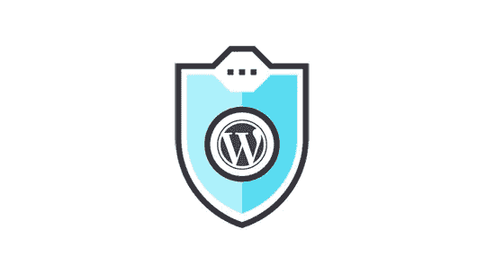

# 试图保护你的 WordPress 网站？

> 原文：<https://medium.com/visualmodo/trying-to-protect-your-wordpress-website-434d78641a59?source=collection_archive---------0----------------------->

从基本的安全实践开始

如果你想保护你的 WordPress 网站？从本文展示的基本安全实践开始

这是每个网站所有者最可怕的噩梦——黑客已经进入了你的 WordPress 网站。当你不顾一切地试图重新获得控制权时，你在这个网站上投入的所有时间、精力和收入都会慢慢地付诸东流。好消息是这种情况很容易避免。坏消息是你可能没有尽一切努力去避免它。

截至 2013 年，[超过 70%的 WordPress 网站容易受到网络罪犯的攻击](https://www.wpwhitesecurity.com/wordpress-security-news-updates/statistics-70-percent-wordpress-installations-vulnerable/)。不幸的是，即使到了今天，这个数字也不太可能有太大的变化。原因很简单。

# 安全实践

大多数网站所有者没有尽力保护他们的资产。

人们很容易对复杂的黑帽子感到恐惧，它配备了一系列不可阻挡的黑客工具，允许他们侵入他们选择的任何系统。然而，这种有组织的专家只是 T4 数字犯罪分子中的少数。即使是老练的人也往往会选择阻力最小的方法，而不是不必要的复杂方法。

换句话说，当你可以穿过一扇没有上锁的门时，为什么要费劲去爬大楼的侧面呢？

就其本身而言， [WordPress 实际上是一个相对安全的平台](https://www.wordfence.com/blog/2018/04/is-wordpress-secure/)。该团队定期发布安全补丁和更新。此外，他们为用户提供了丰富的第一方插件和工具，以帮助他们保护自己的网站免受从垃圾邮件和恶意软件到暴力攻击的一切攻击。

通常情况下，网站被黑是因为它的所有者忽略了一些东西。

他们安装了一个不该安装的插件。他们没有安装安全补丁，让他们的网站带着一个已知的漏洞运行。他们使用了一个脆弱的用户名或密码，或者他们安装了一个未经测试，未经授权的第三方的主题。他们与一个对安全性不够重视的主机合作。

换句话说，他们忽略了网络安全的基本最佳实践，这让他们付出了代价。如果你仍然不相信，WP Template 最近发布了一张信息图，详细说明了网站被入侵的最常见途径。结果很能说明问题:

*   41%的黑客攻击是由托管平台的漏洞造成的。
*   29%是因为不安全的主题。
*   22%是因为一个易受攻击的插件。
*   8%是由于脆弱的用户名/密码。

就是这样。没有复杂的黑客活动，没有政府资助的黑帽机构。简单、可利用的漏洞—大多数在被发现后不久就被修补。

这是个好消息，因为防范此类攻击实际上非常容易:

*   在你的 WordPress 站点上运行常规的恶意软件扫描。
*   安装反垃圾邮件工具，如 Akismet。
*   当插件或你的 WordPress 安装发布新的安全补丁时，立即更新——不要等待。
*   只安装来自可靠来源和市场的插件和主题，如果有人试图“免费”提供，千万不要安装高级主题
*   改变你的用户名和密码，不要用默认的，使用一些既强又容易记住的东西。GREATd0nkeyMAHOGANYavenue 是强密码的一个很好的例子。“密码”不是。
*   确保你确切地知道谁可以访问你的网站，并且他们没有做任何损害你的数据的事情。
*   维护你的[安装的定期备份。](https://visualmodo.com/)
*   使用双因素身份验证—使用内置的身份验证器，而不是 SMS。
*   确保 wp-config.php 和。htaccess 是隐藏的。
*   限制登录您的网站的尝试。
*   确保您选择的主机是安全的

当然，如果你的网站被高度复杂的犯罪集团盯上了，你可能也无能为力。但是这种情况发生的可能性微乎其微。你更有可能遇到一个机会主义者，他不知道你的网站在地上的一个洞里，一个罪犯，他只是在寻找一些易受攻击的东西。

遵循这里的建议，你可以确保自己不会成为这些骗子的目标，他们最终会在其他地方寻找受害者。

作者简介:

Max Emelianov 在 2001 年创办了 [HostForWeb](http://www.hostforweb.com/) 。作为 HostForWeb 的首席执行官，他专注于团队合作，为客户提供最佳支持，同时提供尖端的虚拟主机服务。