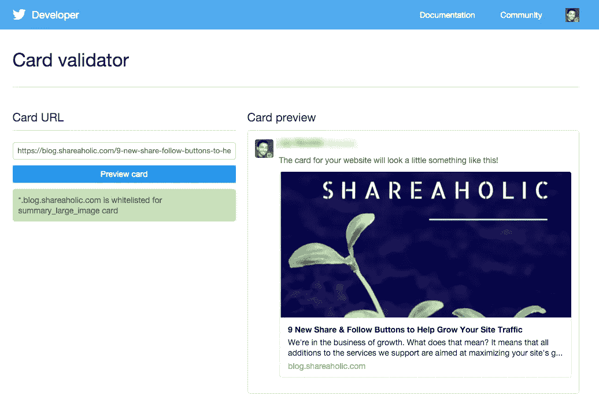
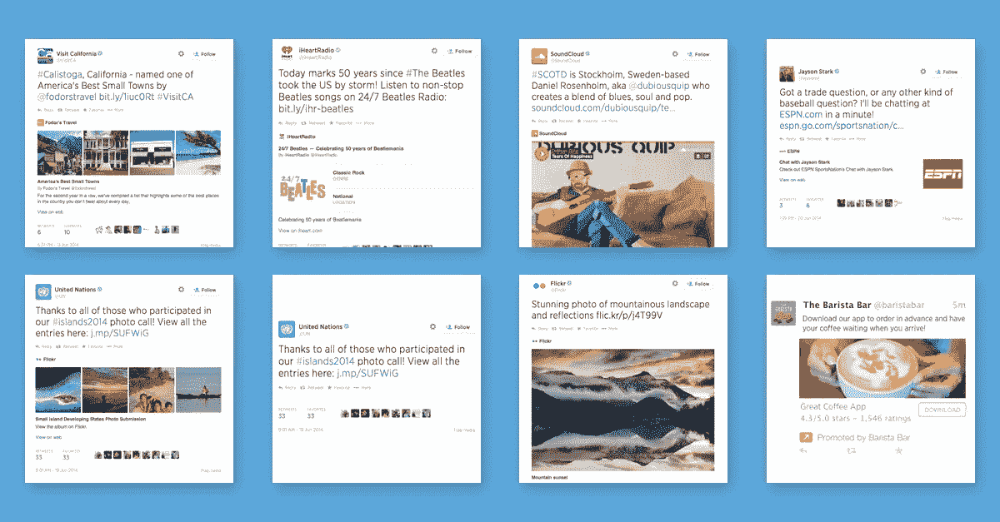
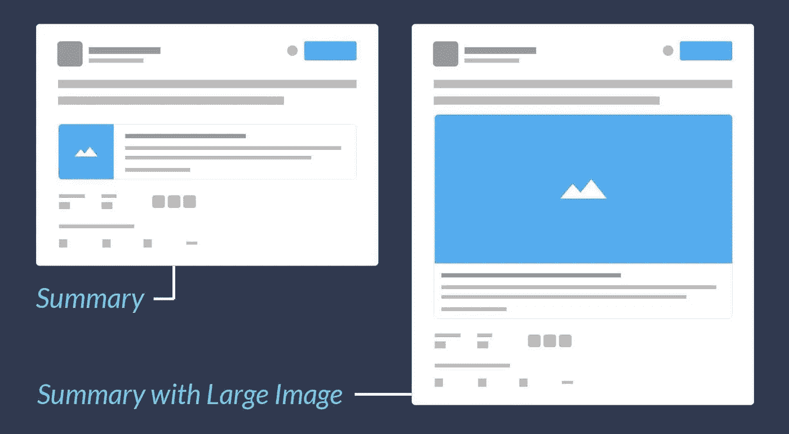

# 推特卡片:完整指南

> 原文：<https://medium.com/visualmodo/twitter-cards-complete-guide-a7ead44f0888?source=collection_archive---------0----------------------->

有了*推特卡*，你可以在推特上附上丰富的照片、视频和媒体体验，帮助你的网站增加流量。只需在你的[网页](https://visualmodo.com/)上添加几行标记，那些在推特上发布你的内容链接的用户就会有一张“卡片”添加到他们的推特上，这样他们的粉丝就能看到了。

早在 2012 年，Twitter 推出了一个名为 [Twitter Cards](https://dev.twitter.com/cards/overview) 的系统，该系统允许网站所有者使用与 OpenGraph 非常相似的语法在他们的网站上显示增强的推文。由于这个新系统，Twitter 可以显示更漂亮的推文，包括包含图像、音频和视频等媒体的推文。

# 它是如何工作的？

正如介绍中提到的， [Twitter](https://visualmodo.com/) Cards 使用了与 OpenGraph 非常相似的语法。Twitter 有一些特定于其平台的属性，您可以在下面的代码片段中看到:

`<metaname="twitter:card"content="summary"/>`

`<metaname="twitter:site"content="@yoast"/>`

`<metaname="twitter:creator"content="@michielheijmans"/>`

属性`twitter:card`是必需的，它定义了您想要显示的卡的类型。这里有四种口味:`summary`、`summary_large_image`、`app`和。所有这些不同卡片之间的区别可以在[文档](https://dev.twitter.com/cards/types)中找到。

`twitter:site`和`twitter:creator`都是可选的，指向发布内容的网站和作者的 Twitter 账户。

# OpenGraph

在解析 URL、图片和描述时，Twitter 利用了现有的`og:`属性。您可以用 Twitter 特有的属性覆盖这些属性`og:`，但是大多数时候这并不是您想要的。如果你的目标是[在 Twitter 上显示](https://visualmodo.com/)完全不同的信息，那么这些标签允许你覆盖默认行为。

当同时使用 Twitter 和 OpenGraph 选项时，有一点需要考虑。Twitter 使用 to `name`来指定属性，而 OpenGraph 使用属性`property`。如果您计划手动实现 Twitter 卡，请考虑这一点。

# 实现 Twitter 卡片

与其他元标签一样，您需要在网站的`<head>`中添加 Twitter 标签，并确保在每页的基础上正确设置这些值。对于一个[博客](https://visualmodo.com/)来说，这可能很快变成一个难以处理的任务，所以我们构建了一个为你生成适当元标签的功能。

想要为特定的帖子或页面更改 Twitter 卡片的外观吗？只需使用社交选项卡上的表单。在这里，您可以根据自己的喜好调整特定的属性。

此外，我们的 Yoast 插件包含社交预览，根据当前页面或帖子显示 Twitter 卡的最终外观:Twitter 卡:使用 Yoast [SEO](https://visualmodo.com/) 预览您的 Twitter 帖子 Twitter 卡是一个很好的(视觉)附加功能，可以帮助增加您网站的流量！