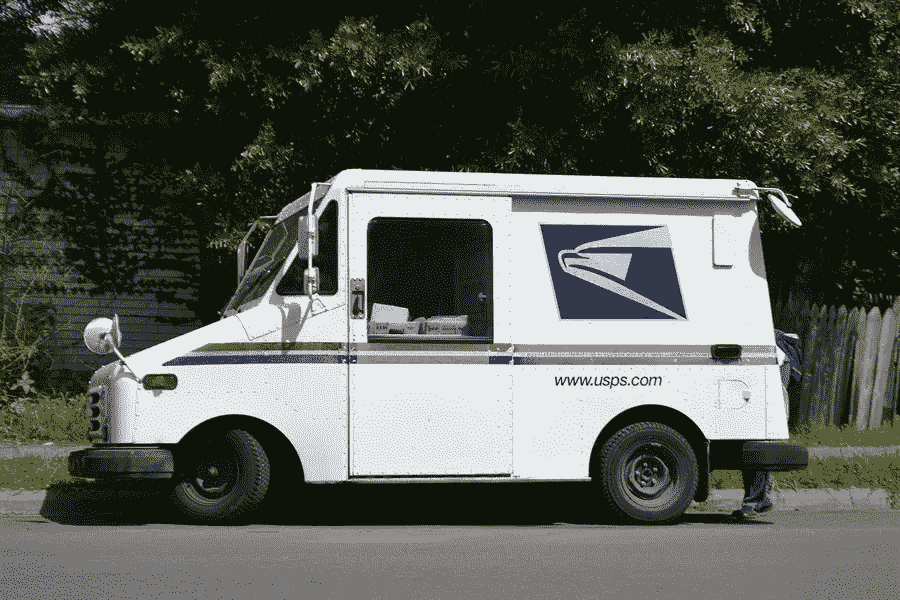

# Usps 考试的类型

> 原文：<https://medium.com/visualmodo/types-of-usps-exams-7f2703f058f0?source=collection_archive---------0----------------------->

战胜考验，在美国邮政局工作

在看到一个列表后，你会考虑尝试一下 USPS 吗？不要马上递交你的申请，因为你可能不知道你会遇到什么样的情况。在这篇文章中，你将会看到 USPS 考试的类型以及如何通过考试并在美国邮政局工作。

根据不同的职位，你必须参加的入职前考试也会相应调整。

虽然每个人都可以通过 USPS 邮政考试，但准备错误的考试可能是灾难性的，特别是因为如果你没有达到最低分数，将有一年的强制性等待期。

这意味着，如果你想在 USPS 得到那份工作，你必须第一次就做对，并且做得足够好，以便从其他申请者中脱颖而出。为什么这很重要？这是因为每个通过 USPS 考试的考生的分数将会相互比较。

到现在为止，你应该对接下来会发生什么有一个很好的想法:你的分数越高，你被雇用的机会就越大。所以，事不宜迟，让我们来看看几个可以帮助你击败 USPS 邮政考试并脱颖而出的技巧，这样你就可以相对轻松地获得这份工作。

# 查找你申请的职位，了解它的职责和责任。

每一次 USPS 邮政考试，无论是 474、475、476 和 477 考试，你都将接受一次工作场景测试，看看你能在多大程度上处理该职位的普通员工定期(如果不是每天)必须经历的事情。

这些场景将遵循多项选择格式和情景判断测试，其中将为您提供冲突、问题、误解，甚至只是工作中的一个技术问题，您必须以最佳方式解决。

这意味着，如果你参加美国邮政 474 邮件承运人考试，你将不得不在美国邮政雇员的鞋子里经历几个场景。

对于 USPS 考试的其余部分也是如此:你将不得不在 USPS 475 邮件处理员考试中处理邮件处理员的问题，在 USPS 476 文书考试中处理办事员的问题，在 USPS 邮政考试 477 中处理助理的问题。

虽然问题和答案很接近，但它们不会偏离你所申请职位的职责和期望太远，这意味着你可以查看他们的工作描述和清单，以了解对他们的期望程度。

# 试着让你的行为符合 USPS 员工的行为，并保持一致！

如果你要参加 USPS 474、475、476 或 477 邮政考试，你将参加两种特定的“行为评估”。

这些将以“[描述你的方法](https://visualmodo.com/youtube-algorithm-why-do-you-need-many-real-views/)”和“告诉我们你的故事”部分的形式出现。

对于前者来说，这是一个专门适合 USPS 员工需求的个性测试。它补充了工作场景部分，因为您的回答之间的任何不一致都可以很容易地注意到。

# 美国邮政考试的可能形式

有两种可能的形式，你会遇到，虽然他们都遵循一个调查类型的考试。

*   你必须表明你同意或不同意某项陈述(类似于李克特量表)。
*   你必须选择所提供的陈述中哪些对你最适用/最不适用。

USPS 邮政考试这一部分的陈述很难。或者软编码为与特定的个性特征相关联，例如勤奋、专注、善于社交等等。

为了有效地解决这一问题，你必须拿出与你申请的职位相匹配的个性特征，因此对于邮件处理员/邮递员来说，你需要表现出你对客户的包裹/信件很小心；对于文员，你将不得不具备良好的沟通和社交能力；对于员工，你必须展示出他们的良好组合，但也要具备一些良好的业务/销售相关的技能。

在“告诉我们你的故事”部分，你会问一些与你的工作经历相关的问题。比如你在上一份工作中工作了多长时间，缺席了多少次等等。所以，一个好主意是 USPS 考试在美国邮政服务工作

尽管他们对这种事情很宽容，但应该注意的是，USPS 对不一致的地方很严格。所以如果他们发现你对你的解雇性质撒了谎。他们可能会当场取消你的资格，理由是“如果他们现在不能信任你，那他们为什么要拿办公室里更重要的事情冒险呢？”。

# 准备他们的能力测试。

475 和 476 邮考。你必须参加一个能力测试。此外，这是“检查错误”评估。

在这一部分，你将给出一个各种各样的小型数据库，然后是一系列的问题。因此，询问某些行是否包含重要信息，如姓名、地址、参考号。电话号码和其他东西是否完全匹配。

最后，为了 477 邮政考试，如果那是你必须参加的。您将通过“注册工作”评估。

# 美国邮政考试测试工作在美国邮政服务结论

在这里，你用最少的钞票和硬币找钱的能力得到了检验。所以如果一个顾客的零钱是五美元。你希望给他们一张五美元的钞票，而不是五张一美元的钞票，等等。

如果你有任何收银机的经验，这将是一个很大的加分。如果没有，那就用随机的数量或者通过美国邮政考试来练习。这两个考试可以极大地帮助，因为这通常是及时的。即使是一个小小的错误也会让你付出高昂的代价。