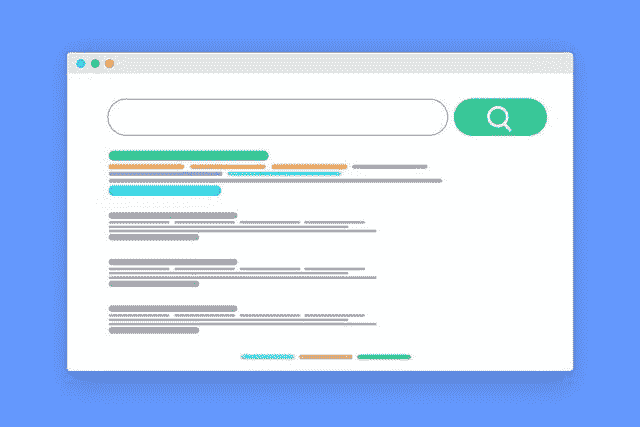

# 初学者 SEO 终极指南

> 原文：<https://medium.com/visualmodo/ultimate-wordpress-seo-guide-for-beginners-step-by-step-ade5b0dbe792?source=collection_archive---------0----------------------->

WordPress 作为一个内容管理系统脱颖而出，尤其是当它涉及到 SEO 的时候。然而，即使你正在使用一个无论如何都能让它正确运行的系统，你仍然需要做很多事情来提高你的性能。你可以采用一些策略和最佳实践来优化你的网站，提高你在搜索引擎中的排名，增加你的销售额，获得更多的用户，等等。在这篇文章中，我们将一步一步地分享给初学者的终极 WordPress SEO 指南。

**初学者 SEO 终极指南**

你必须在你的在线公关和营销的不同方面植入 SEO，这就是为什么你作为 WordPress 用户需要一个 SEO 指南来帮助你最大化这个平台。

**WordPress SEO 设置**

WordPress 上有 SEO 设置，可以用来即时提高网站排名。要配置的三个基本 SEO 设置是:

**站点设置**

WordPress 自带一个内置选项，允许用户阻止搜索引擎蜘蛛抓取他们的网站。您必须确定此设置未打开，以便您的网站可以出现在搜索结果中。

**设置正确的 URL 结构**

你网站上的所有博客文章和页面都有一个永久链接。这些永久链接对你的 WordPress 网站 SEO 初学者指南的 SEO 成功至关重要。这是因为搜索引擎使用永久链接中的单词来理解页面内容。

将 target [关键词添加到永久链接](https://visualmodo.com/woocommerce-seo-improvement-guide/)是一个好主意，可以帮助搜索引擎更好地理解页面代表什么。然而，WordPress 的默认设置不允许使用自定义永久链接结构。所以你必须手动改变它。

您可以在设置>永久链接下更正永久链接结构。许多 WordPress 用户也使用“帖子名称”这是 WordPress 工具的一个内置功能，可以根据页面内容自动建议一个合适的永久链接。它过滤掉不必要的单词，使永久链接更短，而不必改变语义。

**检查网站健康状况:WordPress SEO 初学者指南**

WordPress 的 5.2 版本引入了一个被称为站点健康的功能，5.4 版本还附带了一个站点健康状态的小工具。

该功能允许用户监控他们网站的健康状况，如果需要进行更改或改进，它会通知用户。