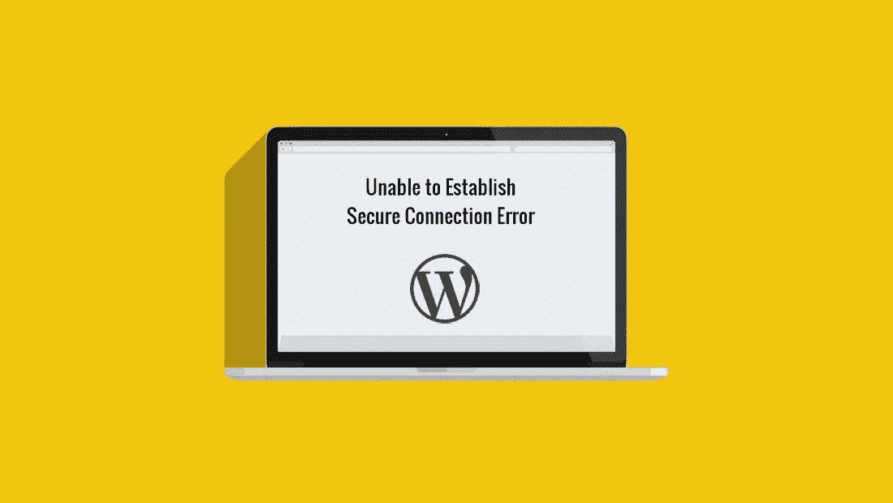

# 无法建立安全连接错误

> 原文：<https://medium.com/visualmodo/unable-to-establish-secure-connection-error-822b3b7ff452?source=collection_archive---------0----------------------->

怎么修？

你在 WordPress 看到“无法建立安全连接错误”了吗？这是一个常见的 WordPress 错误，通常发生在你试图从官方 WordPress.org 目录安装或更新 WordPress 插件或主题的时候。在这篇文章中，我们将向你展示为什么会出现这个错误，以及如何在 WordPress 中轻松修复安全连接错误。

WordPress 的错误有点罕见，但是这个平台非常受欢迎，几乎所有的错误都被很好地分类了。例如，WordPress 安全连接错误很少弹出，但当它出现时，它会阻碍你安装新的插件和主题。

如果您拥有对服务器的完全访问权限，修复这个错误并不太复杂。唯一的问题是，它可能有一个以上的原因，所以你可能需要尝试一些事情，然后你就中头彩了。在这篇文章中，我们将更多地讨论什么是 WordPress 安全连接错误，并教你多种方法来修复它。我们开始吧！

# WordPress 安全连接错误

当你试图从 WordPress 安装或更新插件和主题时，通常会出现 WordPress 安全连接错误。如果您遇到这种情况，您会看到一条与此非常相似的消息:

出现意外错误。WordPress.org 或此服务器的配置可能有问题。如果您仍然有问题，请尝试支持论坛。(WordPress 无法建立到 WordPress 的安全连接。请联系您的服务器管理员。)在/home/username/public _ html/WP-admin/includes/update . PHP 的第 122 行

不像其他 bug，比如死亡的白屏，你会得到一个提示，告诉你出了什么问题。坏消息是，它给你的关于如何解决错误的建议相当平淡。有几种方法可以解决这个特殊的错误，但是首先，让我们来讨论一下它的一些潜在原因:

*   **你的网站负荷过重。**例如，如果你使用共享主机，大量的流量会导致服务器资源紧张。这种压力会导致您对 WordPress.org 的连接请求超时。
*   **你的服务器配置错误。**在某些情况下，由于配置错误，您的网站可能会尝试连接到错误的地址，而不是 WordPress.org。
*   您的防火墙有问题。许多现代网络主机都实施了防火墙系统来阻止潜在的恶意连接。为了做到这一点，这些防火墙通常会阻止整个端口作为预防措施，这可能是他们禁用了您的网站需要的端口。
*   您的网站无法运行必要的脚本来获取所需的文件。当你的服务器试图从远程资源下载文件时，它会运行一个名为 [cURL](http://php.net/curl) 的命令行工具。我们稍后会详细讨论它是如何工作的，但是可以说，如果没有这个工具，你的站点将无法建立它所需要的连接。

在下一节中，我们将教您如何解决这些问题。但是，如果错误的根源是流量过大，您可能需要考虑等待，升级您的计划，或者联系您的主机，看看他们是否可以暂时增加您的服务器资源。

# 修复 WordPress 安全连接错误的 3 种方法

在我们进一步讨论之前，你应该知道如果你使用共享主机方案，这些修正都不会起作用。这是因为与虚拟专用服务器(VPS)或专用服务器等选项不同，您没有获得对服务器配置的完全访问权限。如果你*确实*使用共享主机，你最好的办法是马上联系你的网络主机的[支持](https://visualmodo.com/)团队，这样他们可以做出必要的调整。

在这一节中，我们将处理需要您修补服务器工作方式的修复——不要担心，我们将一步一步地解释一切！

# 1.更新服务器的主机文件

连接到您的服务器并操作您的文件的最有效的方法之一是通过[安全外壳访问(SSH)](https://en.wikipedia.org/wiki/Secure_Shell) 。如果你是一个 Windows 用户，你需要使用一个工具，比如 PuTTy。另一方面，macOS 或 Linux 用户可以使用他们想要的任何命令行工具。

让我们假设您使用的是 Windows。一旦您[安装 PuTTy](https://www.ssh.com/ssh/putty/windows/install) 并运行工具，选择 SSH 作为您的*连接类型*。对于*主机名*，您需要使用您的网络主机提供给您的地址:

在下一个屏幕上，您需要使用服务器的管理员凭证通过 SSH 登录到您的服务器。如果您不确定它们是什么，请尝试询问您提供商的支持团队:

登录后，您将拥有对服务器的完全访问权限，因此我们最终可以通过运行以下命令来开始工作:

sudo nano /etc/hosts

这只是使用 nano 编辑器打开*主机的*文件，这基本上是一个用于将特定 IP 地址与网站相关联的列表:

这里的目标是确保您的*主机的*文件将 WordPress.org 映射到正确的 IP 地址。为此，我们将使用 nano 在文件中增加一行:

66.155.40.202·api.wordpress.org

一旦您将更改保存到您的*主机的*文件，关闭它并返回到您的仪表板。现在试着安装之前给你带来问题的插件或主题。如果错误仍然存在，请检查其他方法。

# 2.检查 PHP 是否启用了 cURL 扩展

WordPress 主要依赖于 PHP，所以如果你没有安装正确的版本——或者甚至是一些必要的扩展——它可能不会像预期的那样工作。记住这一点， [cURL](http://php.net/curl) 是一个 PHP 扩展，它使你能够通过命令行传输文件。更具体地说，你需要 cURL for WordPress 来从官方资源库下载插件或更新主题。使用 SSH，执行以下命令:

sudo nano /etc/php.ini

如果您是 Windows 用户，请在文件中查找以下行:

；extension=php_curl.dll

请记住，对于 macOS 和 Linux 用户，这一行看起来略有不同:

；延伸=卷曲. so

如果在 *php.ini* 中看不到其中任何一行，继续添加它们，就像前面的方法一样。现在保存对 *php.ini* 的更改并重启服务器。这将强制文件再次加载，此时您应该检查错误是否消失。

# 3.检查防火墙上的正确端口是否打开

您的服务器是否使用现成的防火墙主要取决于您使用的托管服务和计划。例如，如果您使用 VPS，您可能需要自己设置和配置防火墙。

如果你的服务器*使用了防火墙，你需要确保它不会阻塞你的网络服务器软件使用的端口。默认情况下， [Apache](https://httpd.apache.org/) 和 [nginx](https://nginx.org/en/) 使用端口号 *80* 或*8080*——所以这两个是你需要注意的。*

根据您的主机，您可以直接从控制面板配置防火墙:

无论如何，你最好的选择是查阅你的主机提供商的文档。在里面，您应该可以找到关于他们实施防火墙的方式以及他们是否首先这样做的信息。如果是这样的话，应该会有如何疏通毛孔的说明。

# 结论

就 WordPress bugs 而言，安全连接错误大多是无害的。如果需要，你仍然可以通过 FTP 手动上传主题和插件。尽管如此，尽快修复它还是有意义的。毕竟，这表明您的服务器配置存在问题，如果不进行排序，可能会对您造成影响。

如果你使用的主机为你提供了对服务器的完全访问权限，这里有三种方法来修复 WordPress 中的*无法建立安全连接*错误:

1.  更新你的服务器的*主机*文件。
2.  检查 PHP 是否启用了 [cURL](http://php.net/curl) 扩展。
3.  检查防火墙上的正确端口是否打开。