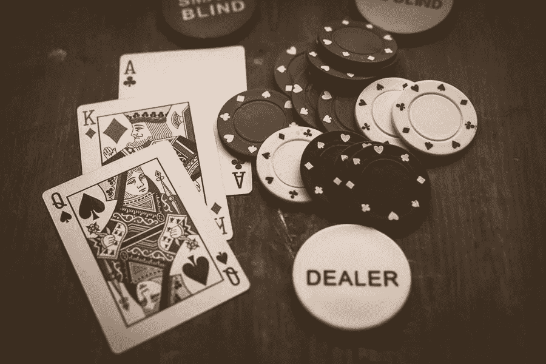

# 独特的网络游戏设计

> 原文：<https://medium.com/visualmodo/unique-online-games-designs-2c95a400562f?source=collection_archive---------0----------------------->

有数百个伟大的网上赌场，玩家可以在业内利用，这是全球公认的。相比之下，大型赌场集团拥有其他新的和不太成熟的赌场。在这篇文章中，你会看到五个独特的网上赌场设计。

其中一件事，往往设置最好的网上赌场除了彼此是设计和品牌的这些，因为这往往是单向玩家可以认同他们。

同一运营商拥有的一些品牌通常具有相似的设计模板。对于训练有素的眼睛和更有经验的网上赌场玩家来说，这是显而易见的。

除此之外，有些网站在设计时就考虑到了特定的主题，因此，这一点在他们的品牌和他们在整个网站上使用的颜色和字体方面表现得很明显。

考虑到这一点，我们提出了以下五个独特的设计，其中一些可以被视为新的在线赌场，应用了一些最新的审美趋势。

# 888 女士在线赌场设计

888 Ladies 是一个专门面向更多女性观众的网站(但不限于此)，尤其容易受到女性赌徒的欢迎。这意味着主题包含的颜色通常与女孩更相关，如调色板所示，如粉色和淡紫色。此外，888 做了很好的工作，确保这个网站是直截了当的眼睛，特别是功能，一切都很容易找到。

# 玩耍先生

这是一个有很多好处的网上赌场，但当你第一次访问时，首先映入你眼帘的是令人惊叹的醒目设计。结合干净的蓝白配色方案，加上黑色的微妙元素，他们还有一个有趣的标志，几乎给它带来一些个性，这是一个类似于在线赌场名称“先生”部分的小胡子。