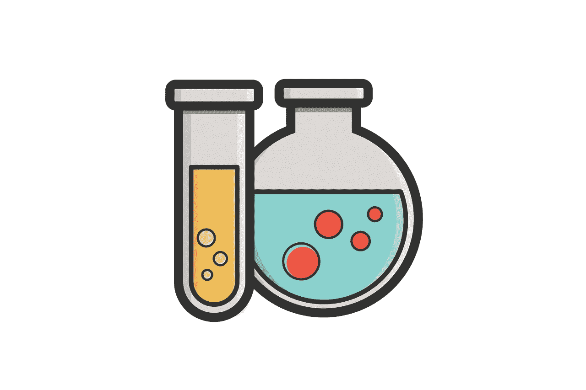

# 在 WordPress 开发中使用登台环境及其原因

> 原文：<https://medium.com/visualmodo/using-a-staging-environment-in-wordpress-development-reasons-for-it-643357be7c9b?source=collection_archive---------0----------------------->

你曾经对一个客户的 WordPress 站点做了一个改变，然后它崩溃了吗？也许你正在更新一个插件或者定制模板中的代码，然后网站就关闭了。当你不顾一切地试图让网站重新上线时，恐慌开始了。你意识到访问者看到网站关闭，可能很快就会给你的客户打电话。不久之后，你会接到一个非常恼火的客户打来的电话。作为专业开发人员，我们显然希望避免这种情况。那么我们怎么能呢？好吧，您不需要对一个活动的站点进行代码更改或更新，而是想要测试您对登台环境的更改。从那里，您可以将它们转换到实时站点。

# 暂存环境 WordPress 使用原因

出于构建和测试的目的，暂存环境通常托管在你的 WordPress 站点的私有子域上。您可能希望将它用作:

首先，一个空白的画布，从这里你可以建立一个新的网站或创建新的网页，你计划添加到现有的网站。这样，你的客户，你的经理，或者其他任何想在适当的时候加入进来的人，在你准备好分享之前，都不会看到你的作品。一个你想测试新 WordPress、插件或主题更新的网站的镜像。更新首先在中转站点上处理。确认不存在任何问题后，您可以在实时网站上继续处理这些问题。

其次，创建一个您想要实现代码或设计更新的实时网站的镜像。如果你试图自己编写一个新的特性，并且担心结果会破坏某些东西，这是非常有用的。一个活网站的克隆，你可以用它来节省从头开发一个相似结构的 WordPress 站点的时间。

最后，一个平台阶段的网站预推出，以进行质量保证和测试。然后，团队成员、客户和其他项目利益相关者将获得一个到暂存站点前端的链接，以供审查。测试新编码技术的地方。您可以使用一个已经存在的网站的副本，或者使用一个示例网站来测试理论，或者在将它添加到您的工作流程之前完善您的实施过程。您还可以将此作为团队中新开发人员的培训平台。

# 暂存环境的优势:

*   一般来说，分段环境有助于更安全的编码实践。
*   他们给你建立和更新网站的隐私，没有一堆窥探的眼睛检查你。
*   如果代码中引入了一些不可靠的东西，它不会关闭正在运行的网站，也不会阻止 WordPress admin 的完全访问，这将对你和你的客户都产生不良影响(如果访问者注意到的话)。
*   登台站点节省了时间，否则您将花费这些时间来修复死机的白屏或解决由现场安装中的牛仔编码引起的其他问题。
*   它们保护一个实时网站的[搜索排名](https://visualmodo.com/increase-search-influencer-marketing/)，因为你可以防止机器人遇到一个错误百出的网站、一个离线网站或一个正在过渡并发送混合信号的网站。

因此，临时站点旨在维护向访问者显示的实时站点的完整性。下一节解释如何着手设置一个。

# 启动暂存环境

如何设置暂存环境取决于它的用途。如果你打算把它作为一个培训或实验平台，你可以做任何你想做的事情。然而，如果你打算将它用于任何其他目的(例如，实现 WordPress 更新，修改设计和代码，添加新页面)，那么暂存的内容需要与网站相同。

这意味着拥有相同的:托管。WordPress 版本。PHP 版本。主题版。插件版本。对于网站如何在实时主机上运行至关重要的配置。要在暂存环境中建立你的 WordPress 站点的镜像，你可以使用三种方法之一:手动方法，使用你的托管 WordPress 主机或者使用 WordPress 插件。

# 托管 WordPress 主机

虽然手动方法让你在控制面板和 SFTP 中工作来设置一个登台环境，但是在 WordPress 之外有另外一个选项可以做同样的事情。然而，这需要您做的工作要少得多。

如果你的网站有一个托管的 WordPress 托管计划，你很幸运:大多数托管的 WordPress 托管计划都有一个点击式的暂存区或预制的暂存区。你所需要做的就是登录到你的托管账户，并立即在你的服务器上创建一个受密码保护的临时站点。

你的 WordPress 主机也能够保存你的暂存站点的备份，所以你不用担心没有快速重置的方法会丢失进度或者“破坏”测试站点。

使用此选项，将更新从临时站点推送到实时服务器也同样简单。只需点击一下，您的暂存环境就将上线。

# 通过 WordPress 插件

如果你想在这两者之间选择一个——一个在服务器上需要更少的工作，并且不需要托管 WordPress 主机的成本——使用 WordPress 插件。我将在这里推荐两个选项，实际上，这两个选项的区别在于你对设置 WordPress Multisite 的舒适度。

不带 Multisite: All-in-One WP 迁移插件:All-in-One WP 迁移是一个具有多种用途的插件。它可以作为备份插件、迁移插件，是的，甚至可以作为升级插件。但是让我们把重点放在如何利用这一点进行分期。

*   在你的 WordPress 站点上安装并激活插件。进入侧边栏的多合一 WP 迁移菜单，点击“导出”。
*   点击“添加”按钮。在“查找”和“替换”框中，输入实时网站的名称作为“查找”，输入临时子域的名称作为“替换”。(假设您已经从控制面板创建了一个用于暂存的子域。).
*   然后，选择导出到文件。单击该框，将其保存到您的计算机中。
*   接下来，登录到您的登台环境(您创建的子域上的那个)的 WordPress 安装。安装相同的迁移插件。
*   点击导入。

将您刚刚保存的文件上传到您的机器。当您看到此警告时，请单击“继续”。仅此而已。你现在有一个镜像你的生活网站坐在你的分期子域。要将您的暂存环境和其中所做的任何更改投入使用，您只需颠倒这个过程。

# 克隆 WordPress 插件

还可以选择在多站点网络上建立自己的子域。以这种方式创建暂存环境的最大好处之一是，你可以在一次 WordPress 安装中保存你的实时 WordPress 站点及其私有的不可索引的暂存子域。因此，你不必在控制面板和各种 WordPress 实例之间来回移动来管理它们。

## 流程:

*   启用多站点(如果尚未启用)。
*   使用快照备份您的多站点。
*   为您的暂存子域向多站点网络应用新站点。在子域的信息选项卡下，取消选中“公共”并保存您的更改。您只希望您的管理员能够看到该网站。
*   在您的多站点网络上安装克隆程序。
*   导航到插件菜单，并点击克隆设置。从这里，您可以决定克隆多站点子域的哪些部分。保存您的更改。
*   在顶部管理栏中，将鼠标悬停在“我的站点”>“网络管理”上，然后选择“站点”。找到要复制的直播网站，悬停在上面，点击“克隆”。
*   如果您已经为暂存环境设置了子域，请选择“替换现有站点”并在搜索栏中找到它的名称。否则，只需在网络上创建一个新站点。

最后，不要忘记检查“阻止搜索引擎索引克隆的网站”。然后，单击“克隆站点”。如果您确定要用 live 站点的内容替换子域，请跳过警告消息。然后，您应该准备好开始在您的试运行环境中工作。所有设置、文件和数据库都将反映实时网站上的内容。

要将临时环境转移到活动服务器，只需颠倒一下过程。将没有必要创建新的网站或子域。一旦你得到了客户的认可，或者你已经确认可以更新了，只要简单地将子域复制到活动站点就可以了。

# 用手

手动方法非常简单:

1.  保存你的 WordPress 站点的备份。
2.  在你的 WordPress 站点上创建一个子文件夹。
3.  在上面安装一个新的 WordPress。
4.  将你当前站点的文件复制到这个新的 WordPress 安装中。
5.  将您的数据库从当前站点复制到这个新的安装中。
6.  从您的控制面板创建一个子域，此临时站点将位于此子域中。

# 结论

想想在你的 WordPress 开发工作流程中使用 staging environments 将会节省多少时间。无论是为了防止收到来自客户的不必要的反馈，结果是，在发布更新时保持你的网站安全，此外，在一个单独的环境中编写新功能，暂存环境保持你的实时 WordPress 网站的完整性，直到你 100%确定这些更新可以在前端反映出来。