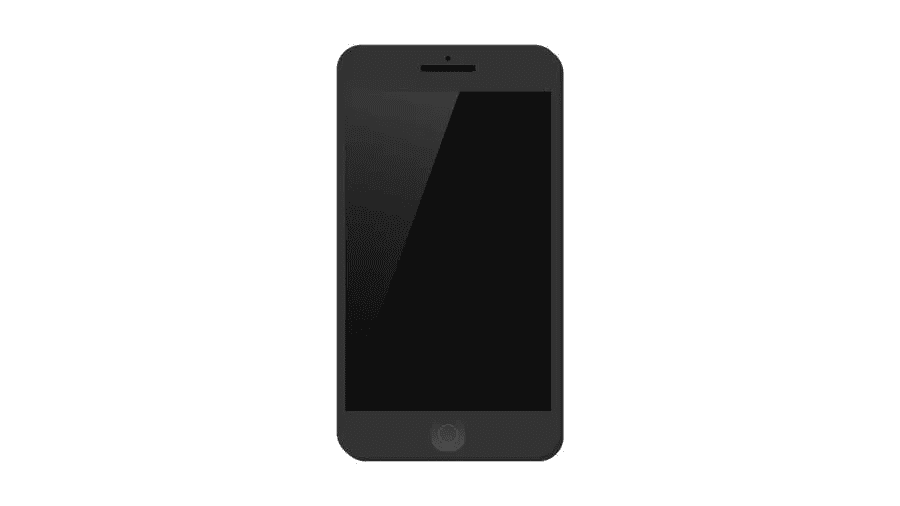

# 使用人工智能设计更好的移动应用程序用户体验

> 原文：<https://medium.com/visualmodo/using-ai-to-design-better-mobile-app-user-experience-f250665e69e7?source=collection_archive---------0----------------------->

假设您已经创建了一个有用的移动应用程序来管理您的财务。你已经在 Android 和 iOS 的软件开发人员身上花费了数千美元，以吸引尽可能多的用户。但是，你的 app 好像不成功。在这篇文章中，你将学习如何使用人工智能来设计更好的移动应用用户体验，它的好处和优势。

为什么这样 25%的人说他们很难在类别之间切换，10%的人声称你的应用程序设计丑陋，20%的人厌倦了每个月填写相同的字段，因为你的应用程序不记得并自动完成。

# 人工智能设计更好的移动应用用户体验

# 如何解决所有这些问题？

通过 **AI 开发**和改善用户体验。他们的目标是消除你的移动应用程序停机时间，并减少用户花费在找出哪里是什么上的平均时间。

# 人工智能软件

每一台机器或一个程序执行需要人类控制的任务。机器学习在人工智能中占主导地位。这是一个全面的过程，可以归结为将数据输入机器进行处理和进一步使用。与人脑类似，机器学习、记忆、处理和使用信息。

另一方面，UX 设计与**人工智能软件开发齐头并进。**后者通过教会机器执行基于模式的任务，让我们的生活变得更加轻松，而前者则利用这种能力来为用户提供最佳的产品体验。因此，人工智能是设计移动应用程序的一个很好的工具。

如果你想降低产品费用，并为你的口袋带来可观的利润，UX 设计是必要的。尽管看起来令人惊讶，但如果你只想着钱，你永远也不会实现这个目标。达到目标的唯一方法是照顾好你的顾客。

手机 app 越方便，越有用，越简单，越会有人坚持使用。在一个知识渊博的人工智能程序员的帮助下，你的应用很有可能达到顶峰，击败你的竞争对手。

# 人工智能设计更好的移动应用:工具还是平台

一个好的人工智能工具或平台包括自然语言处理、语音识别、卷积神经网络、递归神经网络、图像处理和其他类型的人工智能开发。市场上最常见的平台有:

*   IBM 沃森
*   Infosys Nia
*   亚马逊机器学习
*   张量流
*   微软 Azure 人工智能平台
*   谷歌云人工智能平台

人工智能技术与用户体验设计相结合，成为帮助您的业务更上一层楼的强大武器。根据 2019 年人工智能指数和福布斯，2019 年约有 58%的大公司在至少一个生产领域采用了人工智能技术。

这就是为什么人工智能市场被认为是快速增长和扩大的。它从未停止创造需求。最棒的是，人工智能让经理们能够更好地了解移动应用开发。因此，如果你正在创建一个移动应用程序，尝试人工智能和 UX 设计为你的客户带来更多价值。