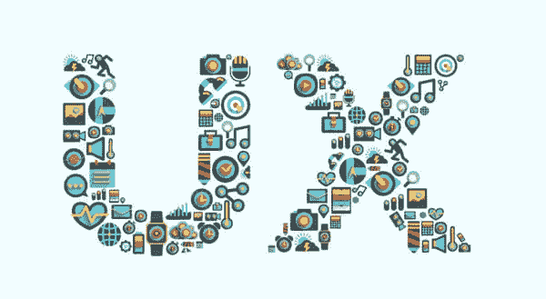
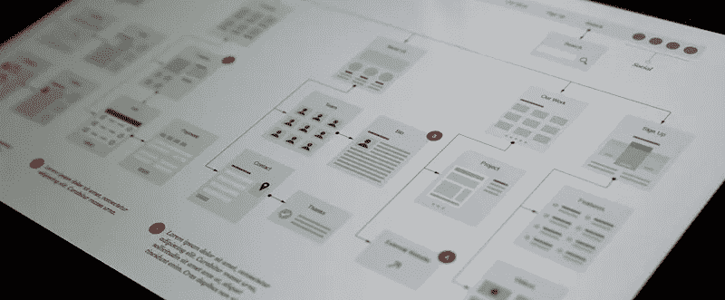

# UX WordPress 实践

> 原文：<https://medium.com/visualmodo/ux-wordpress-practices-6510d6cdf790?source=collection_archive---------0----------------------->

用户体验(UX)设计是为用户创造有意义和相关体验的产品的过程。这涉及到获取和整合产品的整个过程的设计，包括品牌、设计、可用性和功能等方面。

你可能已经知道用 WordPress 创建一个网站是多么容易。但是一旦你增加了功能和内容，事情就会变得很复杂。你必须记住的一个重要方面是 WordPress 的 UX 最佳实践。用户体验(UX)是企业成功的关键。购买你的商品和服务的是用户，而不是搜索引擎。

经常会发现网站所有者甚至开发者和设计师把 UX 和用户界面(UI)混为一谈。UX 和 UI 密切相关，但又有很大的不同，需要解释一下。

# UX 和 UI 的区别

为了更好地理解，让我们用以下术语来定义它们:

网站可用性:网站的易用性。

**用户界面(UI)** :人类与机器互动的地方。例如，按钮是用户界面的一部分。开发人员使用工具来开发一个符合业务需求的用户界面。

**用户体验(UX)** :这关系到用户以及他们对你网站的感受。设计师需要确保用户体验始终是顶级的，用户交互是愉悦的。

例如，一个有很好用户体验的 WordPress 主题可以有很多用户界面(像[主题](https://visualmodo.com/)，但是每一个都必须为你的特定领域提供最好的用户体验。

如果你有一个公司网站，主页应该明确你的业务是什么，你的核心理念/价值观是什么，并可能展示你的产品或提供一个获得报价的方法。许多公司网站使用大的“文件夹上方”照片或他们办公室的背景视频。也许他们会展示他们的主要产品，它们是如何制造的，以及它们能提供什么样的好处。如果你经营一个公司网站，立即陈述你的情况是很重要的。

对于其他利基市场，不同的因素可能会发挥作用。如果你是一名博客写手，人们想更多地了解你个人、你的背景和你的能力，所以要把重点放在让自己变得透明和可爱上，以获得信任。如果你是一个音乐家，你最好突出你的音乐和最新专辑或 EP 艺术。

> 可用性

良好的可用性是优秀用户界面不可或缺的一部分。用户界面是你的品牌在线形象的正面，因为它直接影响用户体验。现在我们知道了区别，让我们继续 UX WordPress 的最佳实践。

# WordPress 的 UX 最佳实践

WordPress 是一个 CMS，擅长提供工具来建立你的网站，但是它并不保证它在每个方面都是完美的。你需要 UX 的最佳实践来让你的访客值得花时间，并从他们与你的品牌的第一次互动中建立信任。

# 简洁的设计

你知道什么最吸引人吗？简洁的设计。开发人员总是致力于让网站充满特色，这是很常见的。但是，他们经常忘记他们建立网站的真正原因是什么。除非用户能够轻松使用网站，否则他们不会关心网站的功能。

这是一个好主意，不断问自己“访问者或网站管理员能够毫无困难或困惑地使用它吗？”这将确保您的最终设计符合当前的设计标准。如果在任何一步答案是“不”，那么你需要回到绘图板，思考如何使它更直观。

当你的用户登陆到集中的、整洁的页面时，你就有更多的机会将他们转化为订户和/或客户。人在浏览的时候不喜欢动脑筋。为他们做这些是你的工作。好消息是，大多数最好的 WordPress 主题都提供了一个简单而整洁的设计，可以很容易地定制。如果你想设计你的 WordPress 网站，确保你坚持简单。它给你更多的灵活性和更少的移动部件，可以打破。

# 响应式网页设计

现代用户体验(UX)的一个重要方面是拥有一个响应式的网页设计。移动设备已经接管了互联网。我听说人们在智能手机上运行他们的整个业务，特别是随着 5.5 英寸和更大尺寸设备的兴起。这使得 WordPress 网站能够响应和适应所有的屏幕尺寸，以及所有的屏幕分辨率和视网膜屏幕变得非常重要。

响应式设计不仅能改善用户体验，还能提高你的流量。停留时间是谷歌最近用来衡量用户在搜索结果页面中点击你的网站时的满意度的指标。如果他们花的时间比你的网站附近的其他结果少，这意味着你的网站有问题，他们会把它放在更靠下的位置。

你可以在你的网站上改进两个主要方面:

*   信息质量
*   信息呈现的方式

良好的用户体验意味着网站在所有屏幕上提供有用的信息。

# 易于使用的导航

我今天看到的几乎所有其他网站都有与之相关的复杂信息架构。他们有多层次的页面或帖子。设计师必须与开发人员合作，确保访问者可以通过正确的导航轻松浏览网站。WordPress 提供了所有你需要添加导航菜单的工具，但是如果你有很多链接，你可以添加一个大菜单插件，比如优步菜单。

如果可能的话，你也应该选择一个简单的永久链接结构。除非你经营一个新闻网站或者一天发表几篇文章，否则我建议你使用“文章名”结构(你也可以使用这个指南来改变你的永久链接)。

大多数人在浏览时并不仅仅依靠导航。一个可用性好的网站应该包括:

*   搜索框
*   面包屑
*   种类
*   档案

最流行的 WordPress 插件之一，Yoast SEO，给你一个选项来添加面包屑到你的 WordPress 主题。Visualmodo WordPress 主题与 Yoast SEO 兼容，很容易添加面包屑。

为用户创建许多不同的方式来浏览你的网站可以确保更好的可用性和更愉快的用户体验。

# 围绕内容进行设计

没有内容的网站是不完整的。伟大的设计可能是有吸引力的，但它的内容将有助于你向目标受众推销你的业务。以内容为中心的布局不仅赏心悦目，还能让用户轻松消化你的内容。用户消化的内容越多，他们对你的了解和信任就越多，你得到的线索就越多。

基于最佳实践的 UX 设计总是首先考虑文本。为你的利基选择正确的排版，围绕内容创造 UX。

> 突出你的内容的重要部分，以打破文本行，使你的写作更有趣。

你的内容要好看。正确的字体、大小和颜色可以让你的内容光彩照人，让用户对你要说的内容产生兴趣。格式也应该补充你的内容流。正确的格式意味着你使用标题和副标题，项目符号列表，不同的句子长度，使用粗体或斜体来强调重要的单词，图片，列表等。所有这些都让你的内容读起来更有趣。

# 使用微互动

微互动是访问者与你的网站互动的一种简单方式。它们包括当你点击文章标题或工具提示时的微妙效果，当你下载时的悬停和滚动效果或图标动画等。

微交互有两个主要好处:

*   鼓励互动
*   给出反馈

这看起来不多，但实际上，它在 WordPress 的 UX 最佳实践中起着至关重要的作用。微交互对你的用户来说是小奖励。通过实现它们来改善用户体验。

# 结论

创建一个吸引人的网站不是一件简单的事情。WordPress 让任何人都可以在几分钟内轻松创建一个网站，但要创建一个足够可用且具有出色 UX 的用户界面需要很多思考。你应该始终考虑访问者将如何使用一个页面或一个部分，然后实现特性和功能。让你的网站容错也很重要，所以确保你有一个自定义的 404 页模板。不存在的或错误的页面可以是起点，而不仅仅是死胡同。

如果你没有耐心或者没有时间和精力关注 WordPress 的 UX 最佳实践，你可以简单地得到一个我们手工制作的 Visualmodo 主题。他们都使用 UX 的最佳实践，是任何新网站设计的一个很好的起点。

用户体验是一个复杂的行业，不可能在一篇博文中包含所有的概念。希望这篇文章介绍了 UX WordPress 的最佳实践，以及当你创建或购买下一个主题时需要考虑的事情。

你如何看待 WordPress 的 UX 最佳实践？你目前的 WordPress 主题为你的用户提供了良好的用户体验吗？为什么？我听着呢。