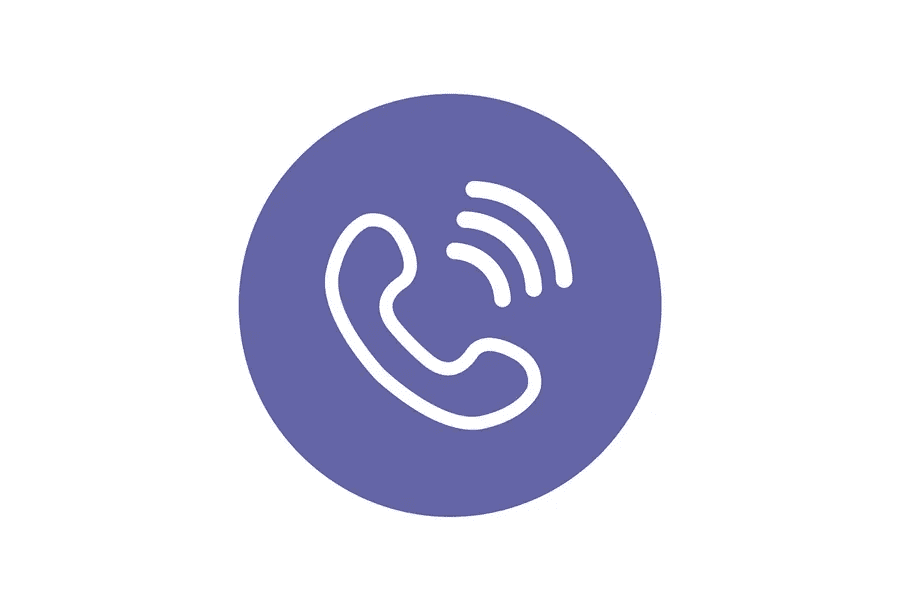

# 你网站业务的虚荣心电话号码

> 原文：<https://medium.com/visualmodo/vanity-phone-number-for-your-website-business-65d07230b172?source=collection_archive---------0----------------------->

消费者很容易记住虚名电话号码，这也使它们更有利于品牌推广。免费虚荣电话号码的例子有 1-800-CONTACTS 和 1-800-FLOWERS。对于顾客来说，几乎不需要猜测，因为措辞与品牌或产品密切相关。另外，这 800 个号码都有相同名字的网站:1800contacts.com 和 1800flowers.com。对于这些企业来说，虚荣心电话号码也是一个易于回忆的网址。也有虚荣的电话号码，可能不会拼写任何东西，但因为数字的顺序而引人注目。例如，1–800–123–4567 或 1–800–222–3333。

# 你网站业务的虚荣心电话号码

你有没有想过某些公司是如何为他们的商业网站购买一个虚假电话号码的？虚荣心电话号码是便于记忆和推广的商务电话号码。例如，1500-FLOWER 是鲜花递送服务的免费电话号码。虚荣心数字的排序或拼写更容易以创造性的方式推广。虚荣心电话号码在建立你的品牌形象方面也非常有效。

# 专业外观

如果你是一个新的企业或试图建立你的信誉，一个免费的虚荣心号码可以向客户和潜在客户传达你对你的业务是认真的。

尽管许多人的手机或座机套餐中都包含了全国范围内的通话，但免费电话仍然传达着你关心你的客户，并计划继续经营几个月以上。此外，免费号码价格合理，可以与大多数 VoIP 提供商集成，这意味着您在本地号码上拥有技术灵活性。但请记住，有些人会寻找一个本地号码，所以一定要包括在您的联系信息。

# 虚荣心电话号码很好记

我不知道我父亲的手机号码是多少，但你知道我随时都能脱口而出什么吗？营销软件提供商 HubSpot 的电话号码(1 888 HUB SPOT，如果你感兴趣的话)。

没有比这更简单的了，整个电话号码就是公司名称。当然，如果你没有七个字母的名字，在选择你的虚荣心电话号码时，你可能要更有创意一点。幸运的是，你可以在这里查找一个虚荣心号码。无论你选择什么，一个虚数比一串数字更容易记住。因为记住一两件事比记住 7 件事容易。

# 营销工具

许多企业将公司名称和电话号码印在自己的车辆上。我最近刚给水管工打了个电话。因为我记得他卡车侧面的车牌号。但是，我没有给废品回收公司打电话，上面印着正规的号码。为什么不呢？我就是记不住那个名字和号码。

所以，我忙着看那些数字，完全忘记了公司的名字。当你能把一个关于你企业的关键元素整合到一个电话号码中时——比如你的名字或你做什么——你的电话号码就成了一个营销工具，强化了你的品牌。