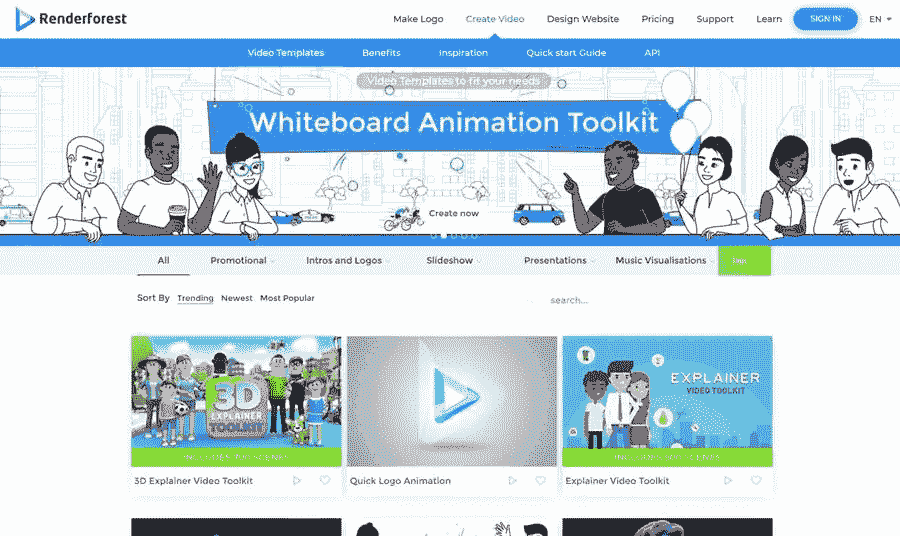

# 视频营销是新的黑色

> 原文：<https://medium.com/visualmodo/video-marketing-is-the-new-black-6af45c4f2f24?source=collection_archive---------0----------------------->

现在这个时代，视频无处不在。为什么？因为它们在所有平台上都很好看。视频包括文本、图像、音乐和反向链接，使它们更引人入胜，更令人难忘。网站、社交媒体和电视等所有平台都使用视频营销来有效传达清晰、直接和有趣的信息。除了视频之外，没有任何其他媒体包含这些属性，这就是为什么视频是所有内容类型中的王者。

说到标题…说“视频营销是新的黑色”没有错“黑色”代表力量、权力、优雅、权威和成熟。在这篇文章中，用于视频营销的术语“新黑色”代表了视频营销是对你的业务增长的一种强有力的、有价值的投资。

# 为什么要视频营销？

视频营销是在较短时间内传达大量商业信息的最有效方式。这是您成功接触关键消费者的门户。大多数人不喜欢阅读冗长的文本，但他们更有可能停下来观看精彩的视频。统计数据显示，63%的品牌已经开始使用视频营销，其中 82%的品牌发现视频营销是其营销战略的重要组成部分。

在这个快节奏的世界里，视频营销是网络营销中最热门的趋势之一。由于许多大品牌都采用了这一趋势，视频营销被认为是一颗冉冉升起的新星。这种热门营销趋势背后的原因是这些视频有可能接触到全球数百万人。

视频是客户的首选沟通方式，78%的在线观众使用视频。这个数字还在继续增长，思科预测，到 2021 年，视频将占所有互联网流量的 80%。

如果你不相信视频内容的重要性，请继续阅读。以下几个原因说明了为什么你需要在营销策略中嵌入视频:

*   易于加工

人脑处理视频的速度比处理文本快 6 万倍。人类的大脑天生会忽略苛刻的认知压力，这就是为什么你的大脑总是选择更容易处理的数据。在这个内容超载的世界里，视频被认为是一股新鲜空气，对大脑来说更容易。这就是为什么人们喜欢看 2 分钟的剪辑，而不是花半个小时阅读文本形式的相同数据。

*   生产速度更快

有一种误解认为视频创作是一个富有挑战性、昂贵且耗时的过程，但事实并非如此。构建短视频内容比以文本形式编写相同的信息更简单。网上有许多在线视频制作工具，可以方便快捷地制作视频。只需选择一个工具，用它来创建惊人的商业视频在任何时候。

例如， [Renderforest](https://www.renderforest.com/online-video-editor) 是一个很棒的视频制作工具，人们用它来制作创意视频，而不会浪费你的基本时间。你所需要的只是一个创造性的想法。直接从 Renderforest 中选择一个模板，并将您的想法嵌入到主题中，以制作出一个令人惊叹的商业视频。

*   信任因素

当谈到激励和教育人们或建立你的品牌意识时，视频是最好的。许多人根据产品评论或博客更新做出购买决定。研究证明，96%的顾客发现视频对他们在网上做出购买决定非常有帮助。此外，58%的人认为制作视频的品牌更值得信赖。因此，维护一个生动的视频帮助论坛可以让消费者更容易信任品牌并做出最终的购买决定。

*   使用脸书

据 TechCrunch 报道，脸书的视频浏览量在短短 7 个月内翻了一番，从每天 40 亿次增加到 80 亿次。这意味着大量的广告费。脸书不断推出新功能，以增强观众的体验和扩大业务增长。因此，现在是时候将脸书融入你的商业视频营销策略中了。

*   提升你的品牌搜索引擎优化

包括雅虎、谷歌、必应在内的搜索引擎始终支持富媒体，即视频。与文本信息相比，你在不同在线渠道上传的视频能获得更高的排名也就不足为奇了。他们成功的另一个重要因素是——YouTube。搜索引擎谷歌拥有 YouTube，经常推送视频。这就是为什么最近的搜索功能视频作为更好的搜索引擎优化在线营销的重要组成部分。

*   视频是病毒选项

与其他内容形式相比，人们更有可能观看、喜欢和分享视频。根据 MyCustomers 进行的一项调查，用户点击在线视频广告的可能性是标准横幅广告的 27.4 倍。这表明视频[内容](https://visualmodo.com/blog/)是全球大多数人的偏好。它使视频营销成为品牌、公司和营销人员以更愉快的方式分享产品故事的优秀工具，以吸引和吸引越来越多的目标受众。现在就将视频介绍给你的商业营销策略，并开始与你的观众分享你的品牌使命和愿景，以获得最大的影响力。

# 视频:营销的未来

现在视频营销的概念变了。观众不得不等待免费、放松和下载视频来观看的日子已经一去不复返了。数据显示，现在超过 90%的客户正在通过手机、笔记本电脑和平板电脑观看视频，18 至 24 岁的人中有近 40%每周观看视频超过 10 次。视频[营销](https://awards.visualmodo.com/)不仅帮助你抓住观众的注意力，提高你的视频的观看率。它还在以令人难忘的方式传播您的品牌信息方面发挥着理想的作用，从而对您的访问者产生更大的影响。

视频营销是未来——它是最新营销策略的核心和关键。因此，要想在竞争中脱颖而出，迅速将视频整合到你的品牌营销工作中至关重要。