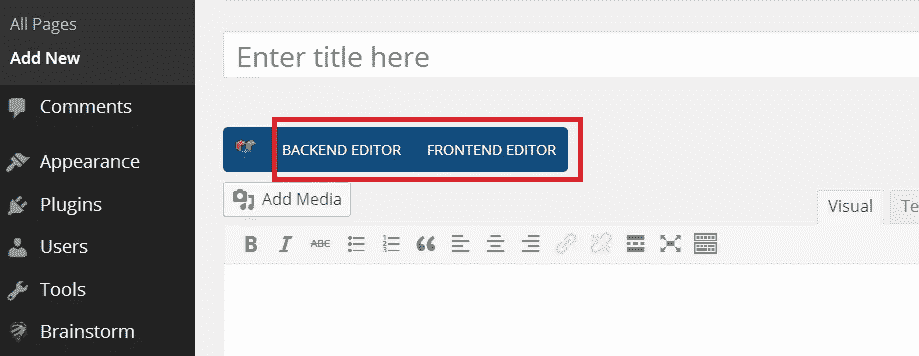
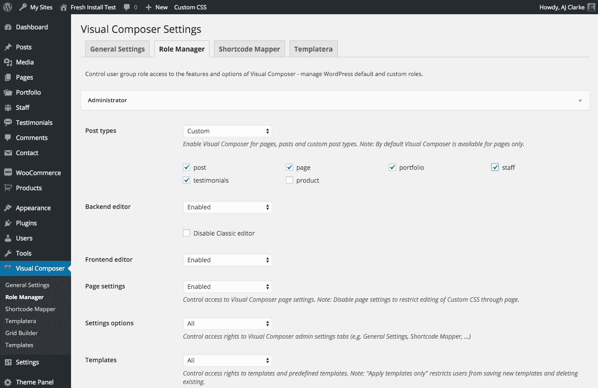
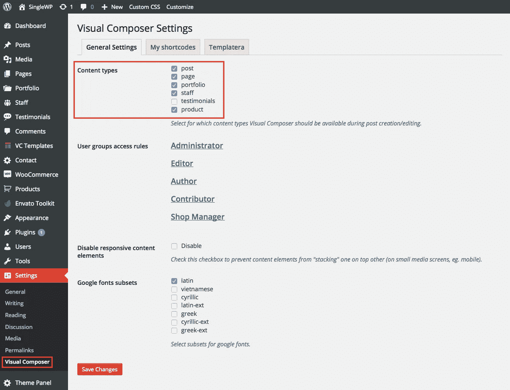

# 可视化编辑器按钮缺失修复

> 原文：<https://medium.com/visualmodo/visual-composer-buttons-missing-fix-ef81a436bd7f?source=collection_archive---------0----------------------->

可视化编辑器是最受欢迎的 WordPress 页面生成器插件，但是有时打开插件功能的后端和前端可视化编辑器按钮不会出现在你的页面或你的文章/自定义文章类型上，现在看看如何修复。

启用/禁用自定义帖子类型的可视化编辑器。

在 Visual Composer 4.8+中，为您的自定义帖子类型启用 Visual Composer 的方法是转到 ***Visual Composer >角色管理器*** ，在您想要设置帖子类型的用户角色下，从下拉菜单中单击“自定义”，然后选中您想要使用 Visual Composer 的所有帖子类型。

# 缺少可视化编辑器按钮？

# 旧的 Visual Composer 设置

在版本 1.6.3 和更高版本中，Visual Composer 应该自动激活页面、作品集帖子和员工帖子。您可以很容易地禁用这些帖子类型的可视化编辑器，甚至为其他类型的帖子启用它。这是通过 Visual Composer 设置面板完成的，如下图所示:

# 什么是自定义帖子类型？

WordPress 默认有两种帖子类型，页面和帖子，但是一些[主题](http://www.mojomarketplace.com/item/spark-multipurpose-retina-wordpress-theme)和插件添加了更多的自定义帖子类型，例如 WooCommerce 插件，它添加了“产品”帖子类型或我们的 Visualmodo 主题，让您创建您想要的自定义帖子类型，例如“投资组合”自定义帖子类型或“团队”自定义帖子类型。

> 所有的 Visualmodo WordPress 主题都包含了免费的可视化编辑器插件，这样你就可以扩展你的设计体验，轻松地建立你梦想中的网站

通过观看此视频，了解如何设置 Visual Composer 来编辑您的 WordPress 站点中的页面、帖子和自定义帖子类型，以满足特定用户组或自定义帖子类型的需求。

可视化编辑器编辑按钮缺失问题已解决。