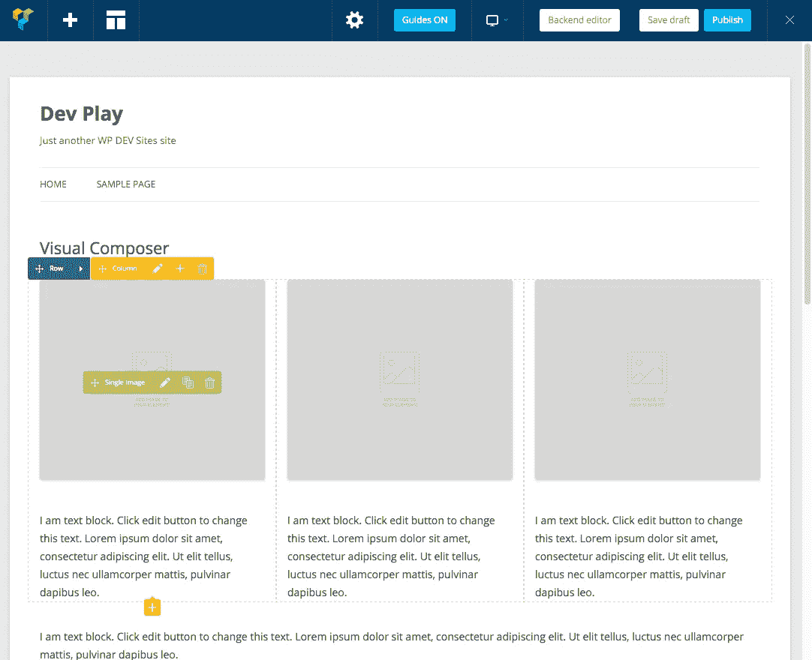
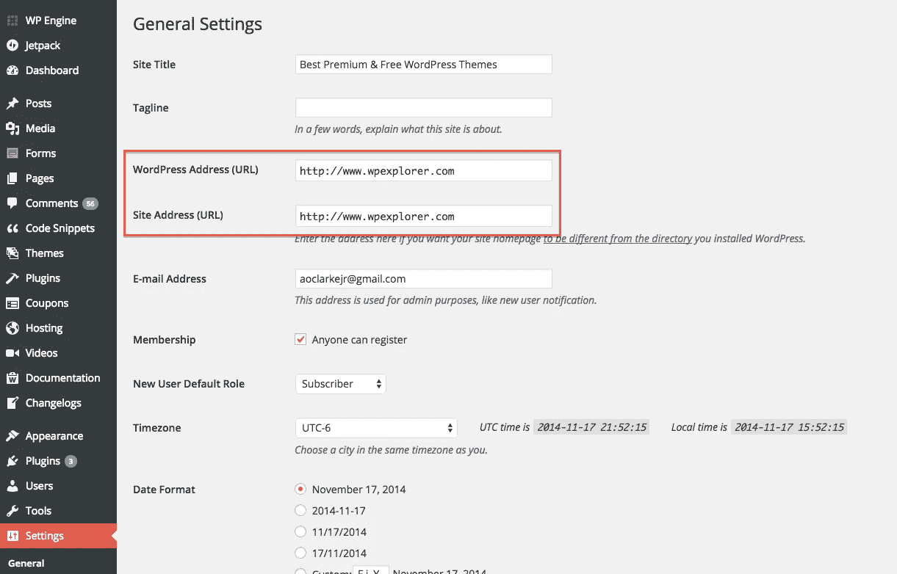
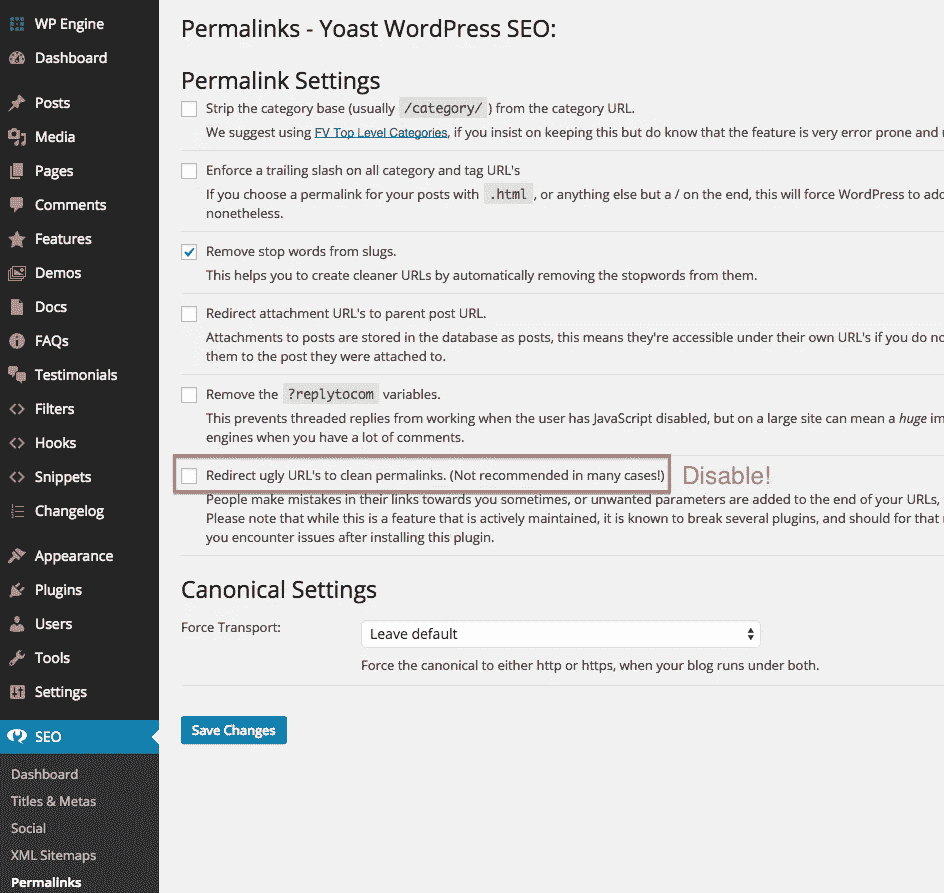
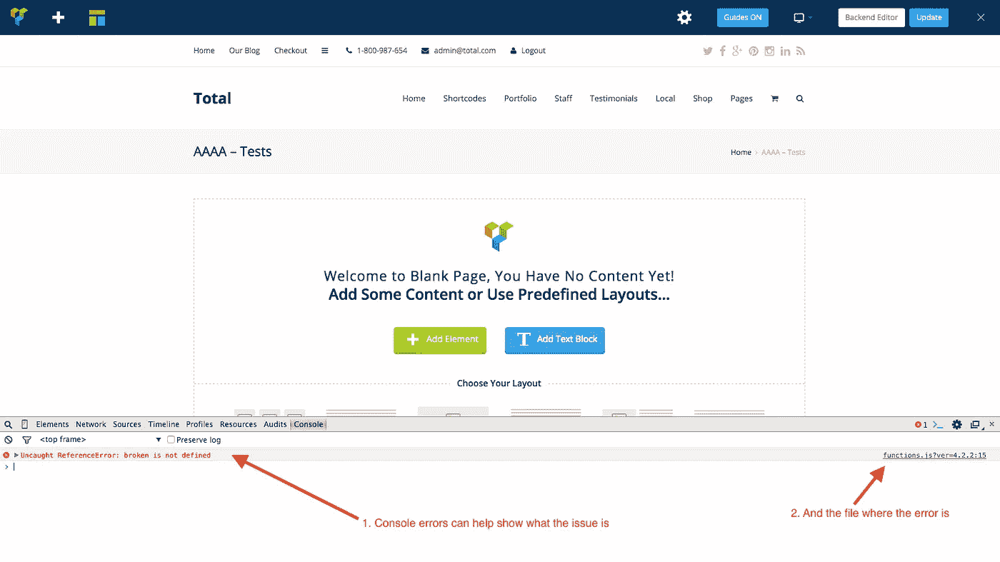

# 解决了可视化编辑器的问题

> 原文：<https://medium.com/visualmodo/visual-composer-issues-solved-wordpress-plugin-6c9158e9c0c9?source=collection_archive---------0----------------------->

## Visual Composer 前端编辑器是与 Total 一起工作的最好和最重要的方面之一，所以如果它不能正常工作，那将是一个令人失望的结果。以下是帮助修复 Visual Composer 问题的任何错误并使其正常运行的基本步骤！看这里简单有效的方法让这个 WordPress 插件完美的工作。

# 1.重新保存页面可以修复 Visual Composer 问题

第一件要做的事情就是直接进入后台页面，点击“更新”按钮重新保存页面。然后再次尝试 Visual Composer 生成器，看看它是否工作。

# 2.确保你的主题和插件是最新的

大多数人对 Visual Composer 有疑问的原因是因为 Visual Composer 插件不是最新的。请仔细检查变更日志，并确保您的版本与可用的最新版本相匹配。否则请更新。

# 3.禁用所有第三方插件

大多数人对可视化编辑器有问题的第二个原因是因为第三方插件破坏了它。请逐个禁用任何第三方插件(并在每次禁用新插件时清除缓存)，然后重试 Visual Composer，看看它是否能解决问题。如果一个插件破坏了可视化编辑器，很可能是由于前端的 PHP 错误，你可能需要启用 WP_Debug 来验证是否是这样，否则可能是 javascript 编码不正确的问题。

# 4.确认你的网站和 WP 的网址是相同的

如果你的站点和 WordPress 的 URL 不同，可能会导致前端不能在可视化编辑器上工作，所以请确保它们是相同的。你可以在“设置/常规”中检查这个选项。

# 为什么会这样呢？

浏览器规则阻止了 iframe——iframe 操作不能针对不同的 url(这是安全原因，CSRF 发布了 XSS 攻击)。这可能会产生视觉合成问题。

我们不能做任何事情，唯一的方法是使用一个“补丁”浏览器，允许在另一个域 iframe 中进行不安全的操作。

# 5.缺少核心 Composer 模块？检查您的设置

如果您没有看到所有可用的 Visual Composer 模块，请转到 **Visual Composer >角色管理器**并仔细检查它们是否都为您的特定管理角色启用。如果你不确定如何做，请查看我们的[视频指南](https://wpbakery.atlassian.net/wiki/spaces/VC/pages/524311/Visual+Composer+Settings)。

# 6.前端编辑器不起作用？确保 Yoast SEO 的重定向丑陋的网址的设置被禁用

如果你使用的是 Yoast 的 WordPress SEO，并且你已经启用了“重定向难看的 URL 以清除永久链接”的设置，它将会破坏前端并给你带来可视化编辑器的问题。无论如何，这个设置在大多数情况下都不应该使用(正如它明确指出的那样)。所以一定要禁用它。

# 7.检查您的浏览器控制台

如果您是开发人员，您应该熟悉浏览器控制台，这是找到任何可能破坏 Visual Composer 的错误的最佳方式。请检查浏览器控制台，如果您发现任何错误，您可以截图并通过 ThemeForest 评论将截图发送给我，这将有助于我及时为您提供支持。大多数情况下，浏览器控制台中的任何错误都会显示其来源的 URL，通常是来自一个插件，因此您可以看到哪个插件正在破坏东西并将其停用。

# 8.检查 Plesk WordPress 安全设置

不确定 Plesk 是什么？那么请忽略这部分…

感谢 Donnie [PixelCraft 工作室](http://pixelcraftstudio.com/)指出这一点。在 Plesk 的新版本中，有一个 [WordPress 工具包](http://sp.parallels.com/products/plesk/wordpress-toolkit/)，它有一些很棒的选项，但是，如果设置不正确，它可能会导致可视化编辑器无法在前端编辑器中工作。因此，如果你正在使用这些功能，请仔细检查，以确保它们不是你的问题的原因。

# 9.尝试使用另一个用户名

使用另一个用户名进行测试可能是值得的。因此，在你的 WordPress 安装上创建一个新的管理员用户，看看它是否能用这个新用户名。这可能是旧用户名的问题。如果是这种情况，以管理员身份打开 cmd.exe 并运行 ipconfig /flushdns 可能有助于解决这个问题(感谢 WhisparDesign 的提示)。

> **重要提示**:虽然本故障排除指南可用于任何主题的任何 Visual Composer 实例或使用 Visualmodo WordPress 主题的任何安装，但它与插件 100%兼容，您将获得它。如果你还没有购买我们的主题，请点击了解更多信息。作为 Visualmodo WordPress 主题的客户，您将获得 Visual Composer 插件的完全支持。因此，如果您需要任何帮助，请务必在项目页面上留下评论，或者在故障排除指南无法帮助您解决问题时开一张罚单。

Visualmodo WordPress 主题修复了 Visual Composer 问题

来源:[https://visualmodo.com/](https://visualmodo.com/)