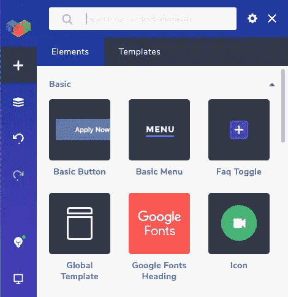
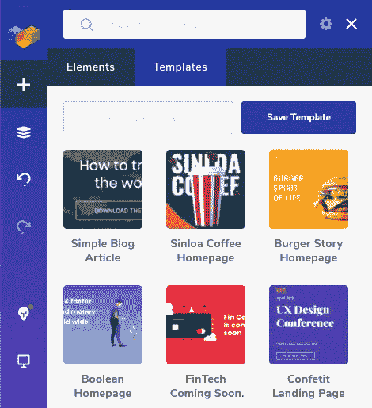

# 视觉作曲家评论

> 原文：<https://medium.com/visualmodo/visual-composer-review-34e518503411?source=collection_archive---------0----------------------->

拖放插件可视化编辑器最好的一点是，它让任何人都可以轻松地创建自己的网站。如果你从零开始，定制你网站的每个方面是可能的。你也可以选择一个设计师制作的模板开始。在这篇文章中，我们将对可视化编辑器 WordPress 插件做一个回顾。

它提供免费和付费版本。高级版将为您提供广泛的功能，但如果您想创建一个基本的网站，免费版是完美的。

在这篇文章中，你将会对这个 WordPress 网站构建器的工作原理和特性有一个大致的了解。还会有对界面的深入了解，让你更容易做出决定。所以，如果视觉作曲家是正确的选择。

# 内容元素

Visual Composer 最强大的功能之一是内容元素。例如文本块、按钮、证明、时间线和帖子网格。使用 Visual Composer 简单而强大的工具，可以组合这些元素来构建您需要的独特设计。

还有一些兼容性元素可以帮助你和其他流行的 WordPress 插件无缝地工作。除了 [WooCommerce](https://visualmodo.com/seller-woocommerce-wordpress-theme/) ，Slider Revolution，还有火山口形态。

# 模板

有助于快速建立网站的最大因素之一是访问预制模板和模板块。许多漂亮的模板在插件中等待着。

你可以找到像餐馆这样的热门行业的模板。美女，房产。此外，根据您正在寻找的页面类型。