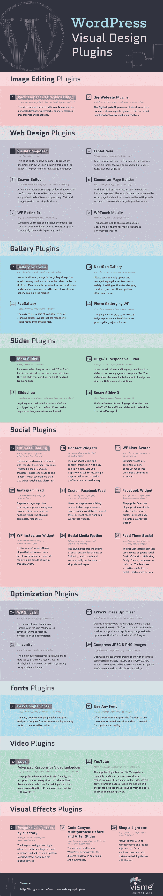

# 视觉设计 WordPress 插件

> 原文：<https://medium.com/visualmodo/visual-design-wordpress-plugins-95fa11e587c2?source=collection_archive---------0----------------------->

虽然 WordPress 提供了大量的功能和灵活性，但是核心软件仍然缺少很多功能。当然，弥补缺失的最好方法是给自己找一个合适的插件。这张信息图将向你展示最好的视觉设计。

WordPress 插件为网站管理员提供了各种各样的定制，然而，WordPress 插件目录有近 40，000 个选项可供选择，更不用说所有可用的优质产品，从好的和不太好的中挑选出好的是很困难的。

寻找漂亮的插件来增强你的 WordPress 的网页设计？

为了帮助你节省大量的搜索时间——因为让我们面对现实吧，有很多很棒的插件——然后决定，你可以从他们制作的这张信息图中列出的前 36 个插件开始。

如果你正在寻找图像编辑，网页设计，画廊，滑块，社会，优化，字体，视频，或视觉效果插件，那么你被覆盖。简单地从这个列表中选择，一次尝试一个。如果这不是你要找的，你可以很容易地尝试另一个。

定制你的[确实很费时间，但是美丽确实需要时间，对吗？](https://visualmodo.com/)

所以这里有一个免费和高级必备的 WordPress 插件的集合，可以帮助你的网站从优秀走向伟大。我在视觉设计中包含了所有的选项。只需点击鼠标，WordPress 插件就可以添加到网站上。你不需要雇人来获得这种功能(质量和外观除外)。

在这个列表中你有最喜欢的插件吗？我们是否错过了一个你认为对每个 WordPress 网站绝对重要的东西？请在下面的评论中告诉我们。我们希望收到您的来信！