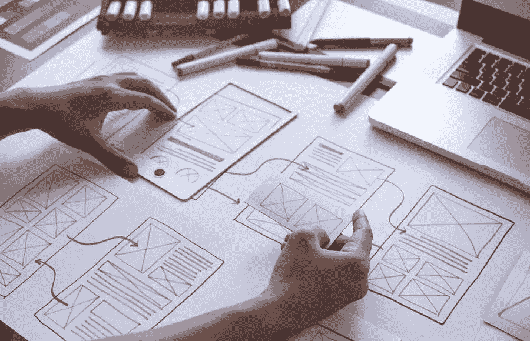

# 网站的视觉元素

> 原文：<https://medium.com/visualmodo/visual-elements-to-your-website-886a8bafd3ac?source=collection_archive---------0----------------------->

人们创建网站有很多原因。通常，他们利用这个平台从电子商务中获利，与读者分享信息，并建立强大的商业存在。有些人也利用网站来表达自我。在这篇文章中，我们将分享和探索在你的网站中加入视觉元素的好处和影响。

但是不管出于什么目的，你都不应该仅仅为了网站而创建网站。随着越来越多的个人和企业制作自己的网站，你应该花时间和精力让你的网站成功——这就是视觉元素可以帮助你的地方。整体布局、配色方案、版式和导航等细节会通过以下方式对您的网站产生重大影响:

# 在网站中加入视觉元素的好处和影响

*   引起注意

无论你创建网站的目的是什么，你都需要吸引在线用户的注意力来实现你的目标。如果没有人停留在你的网站上查看你的目录，谁会在网上购买你的产品？如果在线用户一打开你的网站就立即点击关闭按钮，你如何使用这个平台表达自己？

在你的网站上添加视觉元素可以帮助你吸引更多在线用户的注意。例如，一个与你的产品或业务相关的免费股票视频可以让访问者参与到你的网站中，并鼓励他们在你的页面上探索更多的选项。请记住，人类天生喜欢看漂亮的东西，正确的视觉元素可以做到这一点。

*   创造一个强烈而积极的第一印象

你的网站看起来如何可以创造一个印象，并影响访问者光顾你的产品或服务的决定。例如，如果你打算在网上卖衣服，不在你的网站上使用任何图片肯定会导致访问者质疑你作为一个企业的可信度和声誉。

如果你想通过你的网站创造一个强烈而积极的第一印象，战略性地使用视觉元素。为此，你可以添加一段介绍视频，介绍你的目的或你正在销售的产品和服务。使用视觉元素来突出你独特的销售主张也是创造正面印象的好方法。

当决定使用哪种视觉元素来创造一个在线印象时，想想你的品牌和当访问者看到你的网站时你想要创造的形象。如果你在网上卖健康食品，考虑添加红色的视觉元素，因为这种颜色可以刺激食欲。如果你通过你的网站推销你的法律服务，使用白色，因为这种颜色意味着公平和平等。

*   添加视觉元素的影响:建立专业关系

不管你最初创建网站的原因是什么，可以肯定的是，你不是第一个也不是唯一一个这样做的人。在今天的数字时代，你会发现无数的个人也在出于职业和个人原因使用一个网站。幸运的是，添加正确的视觉元素可以帮助你的网站从竞争中脱颖而出，吸引顾客和追随者。

如前所述，你网站上的视觉元素可以创造一种印象——这种印象可以帮助访问者确定你的品牌是否符合他们自己的兴趣、爱好和需求。

例如，如果你卖的是女装，你可以加入行动号召按钮来表明你的产品有多实惠。通过这种方式，你可以创造一种你在销售高质量且价格合理的服装的形象，使你的产品吸引预算有限的妈妈和妇女。

你用视觉元素定义的形象可以成为你与潜在客户建立健康和专业关系的入场券。如果在线访问者喜欢他们在你的网站上看到的东西，并且他们认为你的品牌符合他们的偏好，他们通常会选择你的产品而不是竞争产品。

*   鼓励完美的沟通

通过你的网站与你的客户保持健康的关系。这可能是你在商业中获得权威和信誉的优势。通常，企业家很容易诱使顾客向他们购买。但鼓励他们多年来保持对同一品牌的忠诚可能会成为一个挑战。你可以通过在网站中使用视觉元素来实现后者。

视觉元素实际上可以鼓励和改善网站上的客户沟通。通过使用久经考验的视觉[策略](https://visualmodo.com/visual-concepts-for-your-seo-strategy/)，你可以保持简单的联系方式。创建易于联系的单列表单域，并提供即时聊天选项。这些功能将使你很容易获得你的访问者的信息。同样的，这些也可以帮助你的访客轻松接触到你。

*   添加视觉元素的影响:增加可用性

与流行的观念相反，网站的视觉元素不仅仅包括你的访问者能看到的东西；视觉元素也会影响网站的可用性。这些可以帮助您以更结构化的方式安排和发布内容。

遵循使用视觉元素的网站设计实践，将需要你在美观和用户友好的网站之间创造一个平衡。通过使用正确的视觉元素，并把它们添加到网站的正确区域。因此，你可以让你的行动号召按钮更清晰、更明显。简化所有网页的导航，优化移动设备的设计。恰当地使用项目符号来划分大块的文本。

当所有这些视觉元素在你的网站上正确使用时。你的访客不会有困难的时间导航它。这将使你的访客更容易下订单。为您的服务付费，或者在您的网站上填写表格。

# 少即是多

添加视觉元素可以提高网站的性能，但是要记住，做过头也会产生负面影响。添加过多的视觉元素会让你的网站看起来太过。因此，它会损害你作为企业或个人的信誉。

确保你添加的视觉元素只会有助于网站的成功。所以，保持设计平衡，用网格划分设计。记得在你的网站上添加空白，让你所有的视觉元素看起来更有凝聚力和美感。说到网页设计，少就是多。