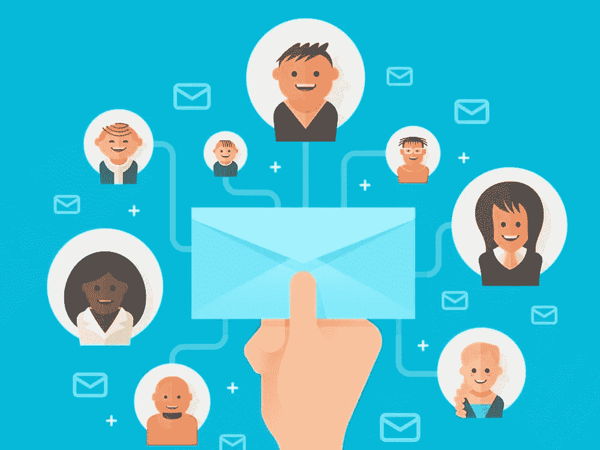

# 管理您的网站以获得更多订户的重要提示

> 原文：<https://medium.com/visualmodo/vital-tips-managing-your-website-to-gain-more-subscribers-b2df1aaa5e9d?source=collection_archive---------1----------------------->

拥有大量的网站订阅者是增加销售量的最好方法之一。一旦你有了订户，把他们转化成顾客就变得容易多了。这一切都是为了找到正确的方法，首先帮助你获得这些订户。

拥有正确的信息有助于制定增加网站订户数量的策略。同时，你应该熟悉有可能增加你的[用户](https://visualmodo.com/)的新趋势。

# 以下是一些你可以获得更多订户的方法:

# 1.创建对用户有用的内容

如果你想为你的网站赢得更多的订户，首先，你必须尽你所能来增加访问者的数量。做到这一点的最好方法之一就是创造出[满足](https://awards.visualmodo.com/)用户需求的内容。当内容本身没有达到标准时，使用正确的关键词是不够的。只要你的内容符合大量搜索者的意图，你的网站就会在搜索引擎上排名靠前。

# 2.内容丰富多样

改变你的内容是扩大受众的一个非常有效的方法。因此，如果你能做些什么，让你的内容在发布时有不同的旋转，那就去做吧。你可以使用视频、[信息图](https://visualmodo.com/blog/)、案例研究、新闻、实验、汇编和教程来创建面向不同人群的内容。

# 3.使用最合适的行动号召

当涉及到确定实际订阅你网站的访问者数量时，你的行动号召会产生巨大的影响。这不仅仅是关于访问者消费你的内容，而且是采取你希望他们采取的行动。一个好的行动号召可以吸引访问者订阅。

# 4.使用正确的设计和主题

在设计你的网站时，要尽可能有创意，因为设计会影响到你的访客数量和实际订阅的人数。你不必在你的网站上到处呼吁行动。只要有一两个，让你的设计为你吸引访客。

# 5.请访问者订阅

大多数使用谷歌的人实际上是想学习一些东西或者寻找解决问题的方法。如果他们觉得你的内容有用，那么你就有很大的机会转化他们。一个很好的方法是让他们订阅以获得更重要的信息。例如，你可以有关于[脸书赠品规则](https://nationalsweepstakescompany.com/blog/facebook-giveaway-rules/)的内容，然后有一些更重要的信息等待那些真正订阅的人。

# 6.查看您的内容

不要在开始赢得更多订户后沾沾自喜。你希望通过不断地检查你的内容来确保那些订阅者留下来，看看什么是最好的，什么可能需要一些改进。设定一些目标，然后监控哪些内容最有效。

当试图增加你网站的订户时，选择正确的方法非常重要。你必须有一个明确的计划，其中包括有一个伟大的网站，搜索引擎优化战略和高质量的内容。所有这些组件都将帮助你增加[网站的订阅量](https://www.entrepreneur.com/article/243573)。