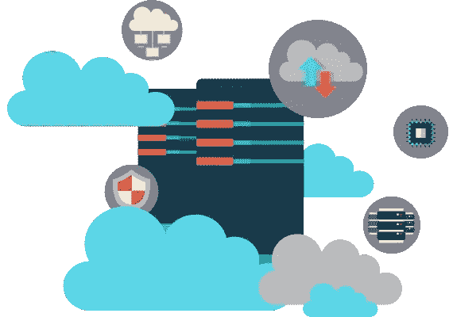

# VPS 服务器安装

> 原文：<https://medium.com/visualmodo/vps-server-wordpress-installation-4fdf5e4434c9?source=collection_archive---------0----------------------->

你准备好升级你的虚拟主机了吗？找出到底什么是 *VPS* 托管，并在虚拟私人服务器托管平台中找到最好的 WordPress 安装指南。

你第一次注册一个托管计划可能会非常混乱。有共享主机、专用服务器、托管服务，甚至还有虚拟专用服务器可供选择。有很多选择，问题在于知道你真正需要哪种类型的计划。

VPS 是共享主机的自然发展，但是名字让它们听起来过于复杂。在这篇文章中，我们会给你一个完整的分类，什么是副总裁，什么时候你应该考虑使用。然后，我们将教你如何用四个简单的步骤安装[VPS。我们开始吧！](https://visualmodo.com/)

# 什么是 VPS(以及何时应该考虑升级到 VPS)

使用共享主机，你和其他用户占用相同的服务器。这意味着你和其他人分享资源，如果你的网站需要更多的资源，这通常会导致性能问题。相比之下，V.P.S .使你仍然可以共享一个物理服务器，但是你得到了一个虚拟实例来托管你的网站。让我们来分析一下为什么这对您来说是好消息:

*   你会得到一定数量的资源。当你注册一个 V.P.S .时，你会得到一定数量的内存、存储空间和带宽，而且你不需要和任何人分享这些资源。
*   **它们易于升级。在大多数情况下，你可以要求你的[主机](https://visualmodo.com/)提供者在一瞬间给你的 V.P.S .增加更多资源。**
*   **您可以完全控制您的服务器。**即使你在处理一个虚拟服务器，你仍然可以完全控制它。
*   它们通常定价合理。更具体地说，你可以很容易地找到每月不到 10 美元的强大的启动 V.P.S .计划。

在我们看来，一旦你的 WordPress 网站超过了共享主机，你有两个升级的选择。你可以注册一个 V.P.S .计划，或者尝试托管 WordPress 主机。

如你所知，托管 WordPress 主机计划完全是为了方便。然而，就性能而言，如果没有 VPS 更好，你也可以做得一样好。唯一的区别是，如果你决定手动设置，VPS 需要更长的学习曲线。这意味着配置你的服务器，调整它来运行 WordPress，并安装平台本身。我们稍后将介绍如何做到这一点。

# 如何使用主机控制面板在虚拟主机上安装 WordPress

当谈到 WordPress 友好的 VPS 服务时，有很多很好的选择。然而，我们偏爱 Vultr ,因为它价格实惠，性能卓越。你可以自由选择任何你想托管你的网站的提供商，但是对于本教程，我们将使用 Vultr 作为例子。您可能需要检查您的主机是否允许您通过您的帐户仪表板设置 VPS。如果没有，你可以跳到下一节，我们将讨论如何通过命令行手动安装 WordPress。

假设你已经注册了一个 Vultr 账户，你下一步要做的就是登录并进入你仪表板上的*服务器*选项卡:

一旦你到达那里，点击屏幕右侧的蓝色*加*图标。在下一页，选择您的 VPSs 位置:

您选择的服务器将取决于您预期的大部分流量来自哪里。举例来说，如果你的网站主要面向美国用户，你应该选择基于美国的服务器。接下来，向下滚动到*服务器类型*部分，并跳转到*应用程序*选项卡。现在在底部寻找 WordPress 选项并点击它:

这会自动将 WordPress 安装到您的 V.P.S .上，使用最新的 64 位 CentOS 版本作为其操作系统(OS)。还有其他“发行版”可供使用，但 CentOS 是新 Vultr VPSs 的默认选择，主要是因为它的稳定性。

如果您继续向下滚动，您可以选择您的贵宾计划。最初，我们建议您选择每月 5 美元的计划:

这对于单个中等规模的 WordPress 网站来说应该足够了。更重要的是，你总是可以通过几次点击来扩展你的 VPS，但是降级你的计划要复杂得多。这样做给了你更多的灵活性。

继续，在*附加功能*部分有几个有趣的选项。例如，您可以启用基础计划成本额外 20%的自动备份，在本例中，这相当于 1 美元。另一方面，拒绝服务(DDoS) [保护](https://visualmodo.com/)会让你每月多花 10 美元:

这取决于你想启用哪些功能，但请记住，你可以随时使用插件进行备份，无需额外费用。最后，转到屏幕底部，为您的副总裁设置一个名称:

无论您选择什么名称，都只是为了内部识别，所以您可以选择任何您想要的名称。准备好后，点击下面的*立即部署*按钮。一旦 Vultr 完成安装，您的新 V.P.S .就可以使用了！您可以从*服务器*选项卡访问其设置:

在 VPS 的主设置屏幕中，您可以找到其余设置过程的说明:

通过使用 Vultr 提供的登录细节访问 URL，你将能够完成 WordPress 的安装(这类似于[常用方法](https://codex.wordpress.org/Installing_WordPress)):

完成后，你可以使用你的新网站做任何你想做的事情。只要记住将你的域名指向你的 VPSs IP 地址，你就一切就绪了！

# 如何在 V.P.S .上手动安装 WordPress 步)

如果你使用的 [VPS](https://visualmodo.com/) 不包括 WordPress 等应用的一键设置选项，你可以选择手动安装。在本例中，我们将在运行 CentOS 7 的全新 V.P.S .上完成整个设置。

# 第一步:通过 SSH 连接到你的副总裁

一旦您启动并运行了 VPS，您将需要两件事情来遵循这些说明:

1.  您的服务器的 *root* 密码，以便您可以运行必要的命令。
2.  一个[安全外壳(SSH)](http://searchsecurity.techtarget.com/definition/Secure-Shell) 客户端，比如 [Putty](http://www.putty.org/) 。

要访问您的副总裁，您需要安装 Putty 并打开应用程序。完成后，您将看到一个部分，您可以在其中指定要连接的目的地:

现在在*主机名(或 IP 地址)*字段中键入您的 VPSs IP 地址，将*端口*选项设置为 22，在*连接类型*下选择 *SSH* ，然后点击*打开*。将弹出一个命令窗口，询问您想以什么用户身份登录。键入*根*，*然后在提示时输入您的密码:*

如果您输入了正确的密码，您的 VPSs 名称应该会显示出来，然后我们就可以开始工作了！

# 第二步:安装运行 WordPress 所需的软件

要运行 WordPress，你需要一个 HTTP 服务器、一个数据库和 PHP。对于本教程，我们将安装 [Apache](https://httpd.apache.org/) 、 [MariaDB](https://mariadb.org/) 和最新版本的 [PHP](http://php.net/manual/es/intro-whatis.php) 。幸运的是，只需一个命令就可以实现这一点:

`sudo yum install httpd mariadb mariadb-server php php-common php-mysql php-gd php-xml php-mbstring php-mcrypt php-xmlrpc unzip wget -y`

这告诉您的服务器下载所有必要的文件并设置它们。这个过程可能需要几分钟，取决于你的服务器有多快，当一切准备就绪，你就可以输入更多的命令。

一旦底层软件准备就绪，您需要初始化它，并告诉您的服务器每次都要启动它。以下是您需要使用的命令:

`sudo systemctl start httpd`

`sudo systemctl start mariadb`

`sudo systemctl enable httpd`

`sudo systemctl enable mariadb`

在这个阶段，在你安装 WordPress 并开始使用它之前，只剩下一个步骤，那就是配置你的数据库。

# 步骤 3:配置 MariaDB 并创建一个 WordPress 数据库

在为您的网站创建数据库之前，您需要“保护”您的 MariaDB 安装，这样人们就无法远程访问它。要开始，请输入以下命令:

`sudo mysql_secure_installation`

之后，MariaDB 会要求您输入其 *root* 用户密码，密码应该是空白的，所以只需按回车键即可。然后，您将能够设置新的 *root* 密码。对于其余的设置，点击 *Y* 选择其余的四个选项，尤其是第三个，它不允许远程登录。

现在，使用以下命令登录到您的 MariaDB 帐户，并记住您需要输入您刚才设置的密码:

`mysql -u root -p`

一旦进入，您需要依次运行四个命令。下面的每一行都是单独的命令，所以请记住这一点。此外，请记住将用户*和密码*占位符*替换为更安全的占位符对，以便用于您的数据库:*

`CREATE DATABASE wordpress;`

`GRANT ALL PRIVILEGES on wordpress.* to 'user'@'localhost' identified by 'password';`

`FLUSH PRIVILEGES;`

`exit`

这就对了。您的新数据库已经可以使用了，所以我们不要让它等待。

# 步骤 4:安装并运行 WordPress

现在我们已经建立了我们的基础设施，最后一步是下载软件，并安装和配置它。让我们从一系列快速的命令开始，下载平台的最新版本，提取其文件，并将它们移动到您的*根目录*下。请记住，下面的每一行都是您需要单独运行的单独命令:

`wget [http://wordpress.org/latest.tar.gz](http://wordpress.org/latest.tar.gz)`

`tar -xzvf latest.tar.gz`

`sudo cp -avr wordpress/* /var/www/html/`

到目前为止一切顺利。现在，让我们为您的安装创建一个 [*上传*](https://visualmodo.com/) 文件夹，并使用以下两个命令为您的文件和文件夹分配正确的权限:

`sudo mkdir /var/www/html/wp-content/uploads`

`sudo chown -R apache:apache /var/www/html/`

`sudo chmod -R 755 /var/www/html/`

最后，让我们重命名你的 wp-config-sample.php 文件…

`cd /var/www/html/`

`sudo mv wp-config-sample.php wp-config.php`

`sudo nano wp-config.php`

…并对其进行配置，使其能够连接到您的数据库。您运行的最后一个命令将在命令行中使用 nano 编辑器打开该文件。使用起来有点棘手，但只需使用键盘箭头导航文件，并用第三步中输入的相同数据替换以下字段:

`define('DB_NAME', 'wordpress');`

`define('DB_USER', 'user');`

`define('DB_PASSWORD', 'password');`

更新这些字段后，在键盘上键入 *CTRL+O* 和 *CTRL+X* 。前者将保存您对文件所做的更改，而后者将关闭[nano*编辑器*](https://www.nano-editor.org/)。现在剩下要做的就是使用以下命令配置您的 VPS 以允许 HTTP 和 HTTPS 连接:

`sudo firewall-cmd --permanent --zone=public --add-service=http`

`sudo firewall-cmd --permanent --zone=public --add-service=https`

`sudo firewall-cmd --reload`

一旦你运行了它们，你就可以通过访问你的 VPSs 来访问 WordPress 安装程序，网址是[*http://yourvpsipgoesere，*](http://yourvpsipgoeshere,) 相应地替换占位符。

就是这样！我们经历了[命令](https://visualmodo.com/)的*批次*，但是当你意识到它主要是复制、粘贴和遵循指令时，过程本身是相当简单的。有了这个指南，你可以在任何你想要的 VPS 上安装 WordPress。

# 结论

如果你以前只体验过共享主机，使用 VPS 是一个很大的飞跃。幸运的是，大多数有声望的网站主持人都保持简单的体验。如果你不想使用命令行来定制你的 VPS，你的提供商可能会有工具来帮助你。

记住这一点，在 VPS 上设置 WordPress 有两种方法。大多数 VPS 服务为你提供一键设置选项，用于 WordPress 等流行平台，你也可以手动设置。后一种方法要求您能够自如地使用命令行，但是如果您知道应该遵循什么步骤，这并不困难。

关于在 VPS 上安装 WordPress 有什么问题吗？请在下面的评论区提问！