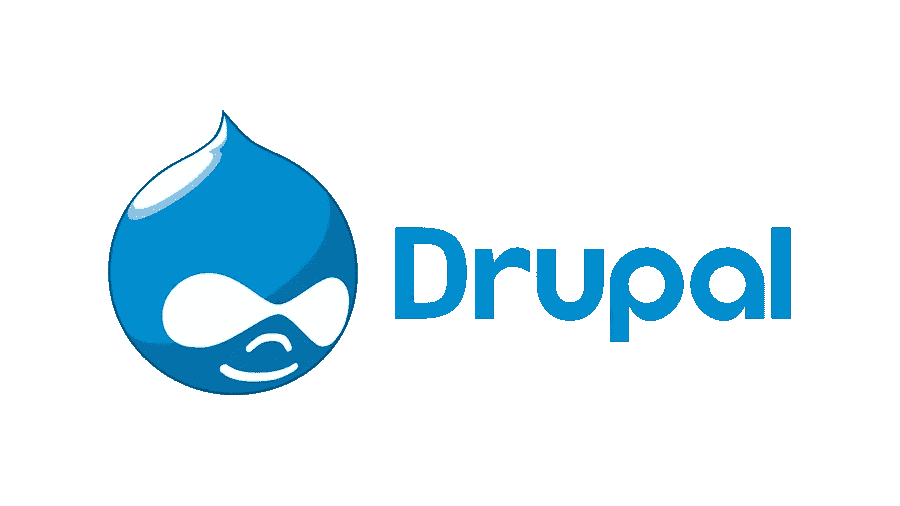

# 想建立一个企业网站吗？同样选择 Drupal

> 原文：<https://medium.com/visualmodo/wanna-build-an-enterprise-website-choose-drupal-for-the-same-8e628a75efdc?source=collection_archive---------0----------------------->

随着邪恶的疫情仍然笼罩着世界，毫无疑问，数字业务市场已经暴涨。根据 Statista 的数据，预计 2021 年将有超过 24 亿人在线购买材料。这清楚地表明，数字化是营销你的产品和保持你的品牌可见的唯一途径。在本文中，我们将分享为什么您可以选择 Drupal 来构建企业网站。

当你调查时，你会发现你的大多数竞争对手已经开始在线销售产品和服务。然而，为了让数字业务蓬勃发展，网站必须安全、可伸缩、高效。在这种情况下，对于想要留下印记的公司来说，Drupal 是最好的健壮解决方案。

# 为什么用 Drupal 来构建一个动态网站？

Drupal 是多个品牌用来设计网站的有效程序。据统计，Drupal CMS 用于创建和管理超过 170 万个网站。

以下是 Drupal 成为网站开发的最佳选择的原因。

# 1 Drupal 是一个开源平台:为企业网站选择 Drupal

广泛推广 Drupal 的一个显著特点是它是一个完全开源的平台。这意味着所有的功能和模块都是公开的。没有人必须支付任何类型的许可费。

此外，Drupal 还提供来自其社区的持续支持，并维护着广泛的扩展。由于是一个开源平台，Drupal 网站开发服务可以很容易地利用，使企业更容易在 Drupal 上建立自己的网站。

# 2 Drupal 提供多种特性:为企业网站选择 Drupal

大量的特性使得 Drupal 对网站开发更有吸引力。其中一些特征包括多语言支持、不同货币、多个商店、税收计算、优惠券、库存管理等。这些只是 Drupal 提供的部分特性。当你开始探索这个平台时，你会发现更多有益的特性。

# 3 Drupal 提供了对代码的完全控制

开发人员更喜欢 Drupal 的一个重要原因是可以完全控制网站的代码。它允许您根据自己的需求更改或修改代码。

要添加更多功能，您可以编辑代码并轻松集成服务。从网站的后端和前端定制现在是可能的。

# 4 使用 Drupal，您可以实现一个内容驱动的网站

Drupal 对于设计一个响应迅速且易于管理的高效网站非常有用。例如，品牌专家可以轻松地将博客上传到网站，而不会遇到任何问题。此外，品牌所有者可以在添加新产品的同时监控和组织现有产品。