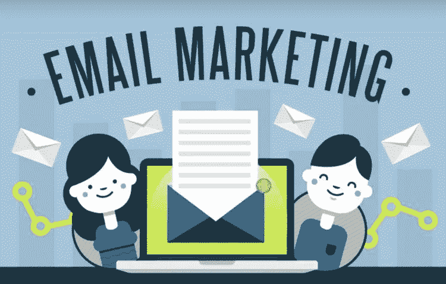

# 想成为电子邮件营销巨星？

> 原文：<https://medium.com/visualmodo/want-to-be-an-email-marketing-superstar-8ca4acb86796?source=collection_archive---------0----------------------->

## 电子邮件营销信息图

电子邮件营销通常不会产生特别的效果。52%收到商业邮件的人在收到邮件后不会采取任何行动，因此点击率处于历史低位。但这并不是说，每一个电子邮件活动注定表现平平。你可以做很多事情来提高你的电子邮件命中目标的几率，从而提高你的销售数据。我们添加了这张电子邮件营销信息图来帮助你。

[你将在下面看到的 EveryCloud 信息图](https://www.everycloudtech.com/giant-email-marketing-statistics-guide)包含了所有你需要的有证据支持的信息，让你的广告从“哼哼”变成“一路顺口溜”当[的安全意识培训](https://www.everycloudtech.com/security-awareness-training)专家们发现他们的电子邮件活动有点失败时，他们决定研究这个话题，幸运的是，他们并不吝啬分享研究结果。

我们剩下的是一个有价值的资源，其中包含基于实际证据的可用信息，而不是某人用拇指吮吸来填写一页的信息。你得到的提示会让你在更加一致的基础上看到真实的结果。

# 您将了解到:

*   男人和女人处理电子邮件的不同方式
*   典型的电子邮件营销绩效统计
*   为什么要考虑电子邮件自动化
*   电子邮件营销对收入有什么影响，更重要的是，特定类型的电子邮件会影响哪些领域
*   人们收到邮件后通常会做什么
*   如何提高你的点击率
*   查看电子邮件的设备如何影响点击率
*   关于电子邮件营销投资回报率的事实
*   更多关于电子邮件营销和移动设备。快速提示—在此做笔记
*   不同行业类型的典型开放率是多少
*   发送电子邮件的最佳时机是什么
*   为什么个性化[至关重要](https://awards.visualmodo.com/)
*   获奖主题行示例
*   电子邮件活动如何对抗社交媒体活动
*   什么会让你被标记为垃圾邮件发送者
*   你可能犯的错误
*   最后，在未来五年左右的时间里，这个领域的发展趋势是什么

总的来说，它包含了很多信息，是这个领域最全面的资源之一。它被分解成易于管理的信息，这样你可以在几分钟内消化这些提示。

# 电子邮件营销信息图

 [## 想成为电子邮件营销巨星？电子邮件营销信息图

### 电子邮件营销通常不会产生特别的效果。52%收到商业邮件的人…

visualmodo.com](https://visualmodo.com/email-marketing-superstar-infographic/)