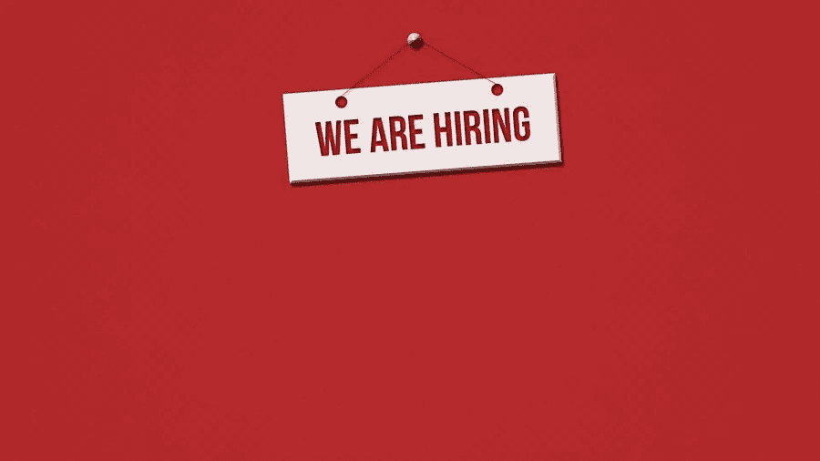

# 希望你的企业成为下一个大事件？要雇佣的 4 类人

> 原文：<https://medium.com/visualmodo/want-your-business-to-be-the-next-big-thing-4-types-of-people-to-hire-2538e9272a4?source=collection_archive---------0----------------------->

迈出了重要的一步，发现自己进入了梦寐以求的会议室？恭喜你。你做到了。嗯，差不多了。首先是好消息——你已经单枪匹马地成功说服了几个值得信赖的客户，他们对你的进展很满意，但是接下来呢？在这篇文章中，你会看到四种类型的人可以雇佣。

杰夫·贝索斯、马克·扎克伯格和许多其他成功的企业家都是白手起家的。但当他们开始爬得更高时，他们需要员工的帮助和协助。在劳动力不变的情况下，增长能力往往会停滞不前。所以，让我们来看看如何在合适的专业人士的帮助下像豆茎一样不断成长。

# 1.互联网奇才

一个了解互联网的人对任何企业来说都是一个真正的发现。因为现在是 2021 年，从字面上来说，你可以通过网络做任何事情，有一个网络营销战略顾问可以帮助你建立一个强大的在线存在。由于许多下一代千禧一代在社交媒体和其他平台上非常活跃，在互联网上建立自己的品牌可以获得许多参与和感兴趣的客户或顾客。gif、卷轴、迷因和视频内容是汹涌的现在和充满希望的未来！

通过搜索引擎优化，瞄准理想的受众，创造相关的内容，你可以实现业务的大规模增长。简单地说，如果有人能找到进入黑暗网络的方法，就留住他们！

# 2.完美主义者在公司:雇佣什么类型的人

作为企业主，你的想法就是你的宝贝。但是执行起来呢？没有双关语的意思，但是我们倾向于忽略我们想法中的缺陷和错误，就像对待婴儿一样。有一个完美主义者和直率的专家将有助于提出业务中的任何问题，无论是外部的还是内部的。

完美主义者不会拐弯抹角，而是会直言不讳地说出什么对公司最有利。他/她也最有可能紧跟当前趋势，并相信持续的变化。因此，尽管你可能不欣赏他们“率直”的个性，但他们肯定会成为你企业的资产。

# 3.你自己的华特·迪士尼:雇佣什么类型的人

变化是唯一不变的东西。我们都已经知道了，不是吗？但是变化是如何发生的呢？不同之处在于创新和创造力。我们的思想装不下一个盒子，似乎没有什么对我们来说是足够的。

在这个阶段，我们开始变得有创造力，我们的思想流影响着我们周围的人，缓慢而稳定地带来改变。现在，如果变化是王道，那么创造力无疑是国王的创造者。拥有一个华特·迪士尼就像用你自己的发明打开了市场上难以置信的大变化和小变化的大门。

# 4.“所有人都爱，没有人恨。”

总有这样一个人，他从不参与争论，但仍能让别人理解他的话。一个可以和这个星球上的任何人讨论，但又能保持他们兴趣的人。是的，同一个人只要几句话就能处理好任何情况，就是他了。

现在，并不是每个人都可以归入这一类，但是那些这样做的人，用正确的语言完成了工作并在最后期限前完成了任务。这些人擅长获得客户，创造有利可图的解决方案，也像《爱丽丝梦游仙境》中的爱丽丝一样擅长解决问题。

# 要雇用的人员类型结论

合适的人可能不会像拼图一样组合在一起，但他们确实让游戏变得有趣，这是你必须关注的，而不是成为你业务的机器人。如果你不想成为工作场所的下一个卡伦，那么创造一个健康的工作环境应该是你的首要任务。就像他们说的，“成为你希望看到的改变”，也是“成为你希望共事的老板。”

你认为自己属于这些类别中的任何一个吗？让我们知道哪一个特点最适合你。