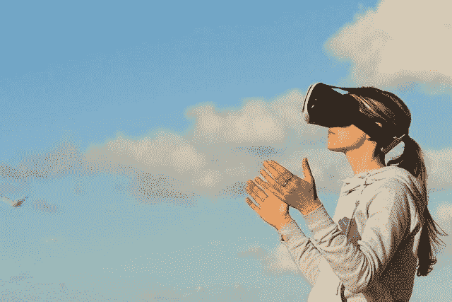

# 增强现实正在改变数字营销的方式

> 原文：<https://medium.com/visualmodo/ways-augmented-reality-ar-is-revamping-digital-marketing-743df5269405?source=collection_archive---------0----------------------->

还记得躺在床上看着明亮的星星照亮天空，但在你的房间内的天花板上开销？还是试图通过手机上的翻译应用程序阅读外语内容？或者，我们可以简单地玩一段有趣的《口袋妖怪 Go》，看看皮卡丘和其他人在街上跑来跑去的情形？在这篇文章中，我们将看到增强现实 AR 正在改造数字营销的 5 种方式。

没错，所有这些都是你与增强现实(AR)或增强现实(Augmented Reality)交互的一些形式。

增强现实(AR)改造数字营销的 5 种方式

AR 本身就是一种[交互体验](https://visualmodo.com/how-to-coordinate-your-digital-and-print-marketing-tactics/)，它专注于为预先指定的目的，为你的眼睛带来和/或创造一个新的、暂时的现实，这个目的可以是医疗程序，也可以是教育和营销目的。尽管数字营销的魔力已经渗透到了各个领域，但它仍是一个值得特别关注的领域。

使用第二个现实(AR)来帮助形成自己的观点或支持现有的观点已经不再是营销人员的幻想。就在虚拟现实兴起的同时，增强现实也缓慢而坚定地走进了营销和推广领域，而且从未回头

毕竟，他们所带来的影响是无可比拟的。

你知道吗，一项研究发现，约 72%的购物者仅仅因为 AR 就购买了他们甚至没有计划购买的商品。事实上，无论转化率如何，68%的人花在产品上的时间比通常更多，因为有可用的 AR。

增强现实(AR)改造数字营销的 5 种方式

很有意思吧。

让我们进一步了解 AR 可以通过哪些方式与数字营销携手合作，实现上述统计数据所示的惊人效果。

AR 如何影响营销？

有几种做法会影响营销工作的整体效果和有效性。不过，说到 AR，为数不多的几家公司已经在排行榜上拔得头筹。为了方便大家阅读，我们在下面分享了同样的内容。