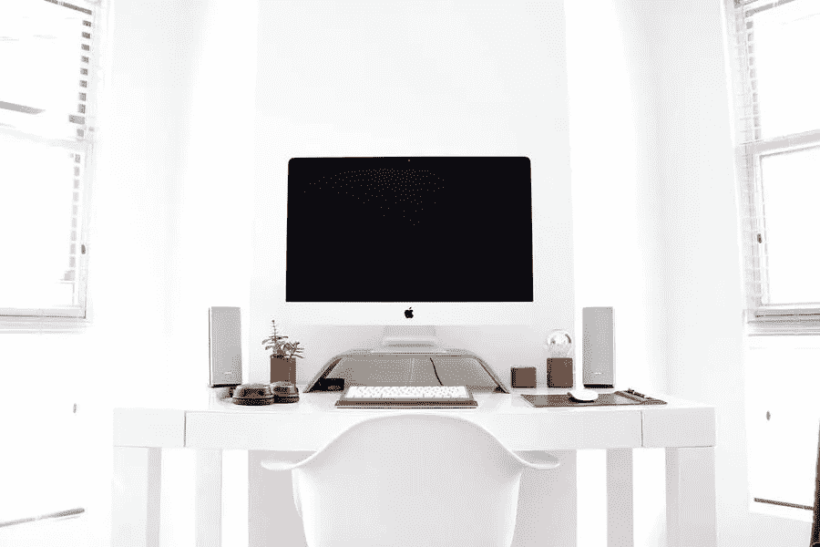

# 让您的工作站更具启发性的方法

> 原文：<https://medium.com/visualmodo/ways-to-make-your-workstation-more-inspiring-2bd45c713458?source=collection_archive---------0----------------------->

你是否环顾你目前的工作场所，对你所看到的感到毫无灵感？厌倦了同样的装饰，同样的笔筒，同样的一切？你想用你的工作站启发其他人，但它目前的状态如何？这是不可能的。

人们大部分时间都在他们的工作站上度过，无论该工作站是与其他人一起在办公室设置的，还是他们在家工作并且他们在他们的家庭办公室中设置了工作站。如果你在一个职业领域工作，要求你每天在办公桌前工作八个小时或更多，过一段时间后，你不会觉得有点无聊和乏味吗？你希望你的工作站成为你个性的延伸。您可以使用您的工作站来展示您的创意，展示为支持当地艺术家而购买的 DIY 艺术品或作品。

无论是哪种情况，你都希望你的工作站能激励你，激励他人，并在你早上坐下来的时候唤起成就感和喜悦感。

# 保持整洁，让您的工作站更具启发性

当你的工作站或家庭办公室一片混乱时，没有什么比这更能迅速抑制动力和灵感了。就垃圾和诸如此类的东西而言，它不一定是一片混乱，但它是凌乱的，这里有散落的纸张，那里有一支笔，那里有一支荧光笔，那里有文件夹。

花点时间整理一下你的桌子，发现空白的桌面非常适合激发新的想法！使用桌面工具，如可展开的文件夹、文具架、纸盘，甚至投资一些颜色鲜艳的便利贴，不仅可以增加色彩，还可以记下那些瞬间产生的想法。因此，让您的工作站更具启发性的好方法。

如果你打算让人们在一天中的不同时段接近你的工作站，例如，如果你是一名教师，那么你想要保护你的文书工作和艺术品。这就是层压机变得非常方便的地方，因为它用一层厚重的塑料保护重要的纸张、文件和你的灵感艺术品。你可以把液体洒在层压纸上，如果做得正确呢？那你就没什么可担心的了——擦干眼泪，回去工作吧！这就是为什么如果你是一名老师，尤其是年轻学生的老师，你必须保护你的课程大纲等等。在进入下一部分之前，请查看这款顶级的教师用层压机！

# 艺术品、艺术品和艺术品

想在工作日激励自己和他人？然后用办公室艺术品将人们吸引到你的氛围中并加入对话。选择一个适合你的个性和工作站的配色方案，选择不同的媒介，如壁挂、镶框岩画，甚至马赛克艺术来照亮你的工作站。因此，让您的工作站更具启发性的好方法。

寻找激励性的海报和语录来框定、展示和激励。找不到您要找的东西？那就自己做！拿出你最喜欢的励志名言，用相纸印在明亮的背景上，在相框里放一块木板垫，骄傲地展示出来。擅长针线活吗？那么，为什么不使用 needlepoint 来创建激励性的谚语，可以显示在你的工作站周围。

# 走向绿色

这是另一种不仅激励自己，也激励他人的方式。就你的工作站装饰而言，就是给办公室墙壁带来一点自然气息。将植物放在你桌子上颜色鲜艳的花盆里(不要太靠近边缘，否则会被碰掉或摔碎)，或者放在你工作台后面的窗台上。所以，让你的工作站更有灵感的好方法。

选择能在不同光照条件下生存的植物，比如吊兰。或者芦荟植物(当你需要快速保湿的时候也很方便！).你甚至可以选择季节性植物来标志一个新的开始！想想圣诞节期间的猩猩木和春天色彩鲜艳的三色紫罗兰吧！用一种叶子颜色鲜艳的燃烧植物给办公室带来一丝秋天的气息。这不仅能改善你工作场所周围的空气质量。但是当冲动袭来时，你也可以停下来闻闻植物。

# 让您的工作站更具启发性的结论

你不必发疯，也不必花一大笔钱把你的作品升级成鼓舞人心的绿洲。你只需要改变一些可以按照你自己的节奏完成的事情。一周，添加新的励志海报和艺术品；下一周？你可以把现有的桌面配件换成新的或翻新的。如果你确实在你雇主的总部和其他人一起工作。所以，在把任何东西粘在墙上、桌子上等等之前，一定要仔细检查，因为可能有相关的政策！

把你的工作站当成你工作的延伸，以你的工作站为荣。从您的工作站获得信心。看着其他人从你这里得到灵感，重做他们自己的工作站。适合他们的个性和创造性的一面。