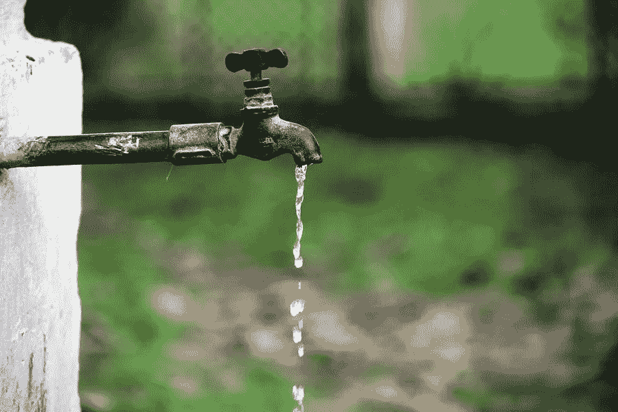

# 减少工作中水浪费的方法

> 原文：<https://medium.com/visualmodo/ways-you-can-reduce-water-wastage-at-work-868f531f0ad6?source=collection_archive---------0----------------------->

水对任何企业来说都是不可避免的开支。然而，水的浪费是完全可以预防的。浪费的水抬高了公用事业成本，损害了公司的盈利能力。这里有一些防止工作中过度浪费水的小技巧。在本文中，我们将分享您在工作中减少水浪费的方法。

# 进行审计以减少水的浪费

如果您一开始就不知道在哪里、何时以及如何浪费水，您打算如何停止浪费水？进行全面的用水审核可以帮助您确定需要改进的方面。一些第三方公司专门对工作场所的用水情况进行详细审计。

# 进行培训

归根结底，员工培训是确保您的场所用水量减少的最有效方式。让员工了解您的水资源审计中发现的浪费领域，并提出在工作中节水的方法。不要把它当成一个利润保护计划。取而代之的是，将节水培训纳入到更广泛的[战略中，使您的公司](https://expo.ooo/directory/)减少对环境的破坏。如果有广泛的环保培训计划，您的企业水费应该会和其他公用事业一样便宜。

# 收集雨水以减少水的浪费

根据 Statista 整理的研究，2020 年英国各地平均降雨量为 1308 毫米。雨水是一种奇妙而丰富的资源，但企业未能加以利用。许多办公室和零售场所都有户外区域，需要在夏季浇水。在更恶劣的天气里收集的雨水可以用来喂养植物。减少对昂贵自来水的需求。