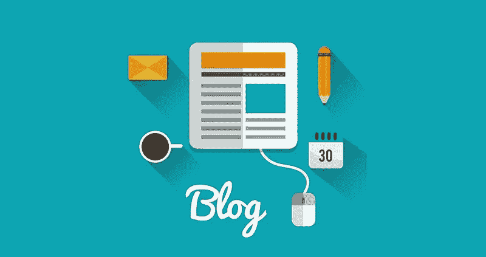

# 网页设计 101: 6 种让你的博客脱颖而出的方法

> 原文：<https://medium.com/visualmodo/web-design-101-6-ways-to-make-your-blog-stand-out-654f3661beda?source=collection_archive---------0----------------------->

如今博客已经变得相当流行，这就是为什么越来越多的人开始经营网站和博客。因为业内有众多的博主，所以让你出人头地、脱颖而出是必不可少的。要做到这一点，考虑它的整体:从内容到你的语气，甚至到设计网站。

以下是一些让你的博客脱颖而出的方法:

# 设计网站 101:博客脱颖而出

# 获得专业帮助

如果你足够精通技术来设计你的网站，那么你可以不需要聘请专家。然而，如果你不确定从哪里开始，你可以购买主题或者找一个专业的网页设计师来帮你。其中包括:

*   主题森林
*   [塔尔萨网页设计](https://www.muuwebdesign.com/)
*   优雅的主题
*   红利
*   十二跳
*   [VisualModo](https://visualmodo.com/)

# 有惊人的内容

如果你能拨动读者和访问者的心弦，回答一个常见的问题，给出一个建议，或者说出你对当前问题的看法，你的内容将永远与他们相关。如果你的内容能激励他人，那么很多读者会记住你。

以下是让你的内容变得不可思议的其他方法:

*   **总是使用杀手级的标题。**

你的标题应该包含关键词，因为这些是经常搜索的词，可以帮助你在搜索后排名靠前。你的标题也应该融入到你的网页设计中，例如，保持背景整洁。

*   为每个内容添加视觉效果。

专家建议每个内容至少包含一个视频和一张图片，这样也能让你的网页设计看起来更专业，更有创意。

*   谈谈你独特的经历。

每个人都有自己的故事，你的读者也会喜欢听你的故事。不要为了融入而试图复制别人的经验和观点。通过谈论你不可思议的经历来留下你的印记，这些经历可能是其他[博客作者](https://visualmodo.com/blog/)没有经历过的。

# 独一无二

永远不要忘记在你的内容和网页设计中加入个人风格。让你脱颖而出的最好方法就是不要跟随别人的作品，潮流，或者有一个固定的主题。

利用你的长处和短处。当考虑设计时，倾注你所有的想法，这样当最终的设计出来时，它将主要由你的选择和偏好组成。无论你做不到什么，也不考虑自己，这时候你应该把它留给专家，让他们来帮你。

# 易于导航的页面

很多博客都有不错的主题和设计；然而，它很难导航。搜索栏很难找到，也没有“联系我”选项，让他们联系你。

要想脱颖而出，你必须让你的博客易于浏览。以下是实现这一点的一些方法:

*   为每个主题类别使用标签/标题，避免难以阅读的草书字体。保持简单。
*   保持字体的颜色清晰易读。
*   如果可以的话，只使用简单的颜色作为背景。

# 让你的读者接触到你

当考虑你的博客设计时，一定要包括一个评论区，让你的[读者可以联系到你](https://www.lifehack.org/461780/6-effective-tactics-to-make-your-blog-stand-out)。你的读者会因此更爱你。另外:公司和企业家也更容易与你联系，寻求可能的产品合作和赞助。

# 活跃在社交媒体网络上

当你设计你的网站/博客并开始运行时，一定要添加一个标签，链接到你的社交媒体网络，如 Pinterest、Twitter、Instagram 和脸书。这将有助于你的读者感觉和你更亲近，更了解你的日常事件和发生的事情。

这样做也是在个人层面上了解自己的一种方式。你的读者将会看到你不仅仅是一个博客写手——你也是一个能让他们产生共鸣并成为[灵感](https://awards.visualmodo.com/)的人。

所有这些建议将有助于让你的访问者在你的博客中停留更长时间，并最终成为一个忠实的追随者。这些会让你的博客脱颖而出，也会让你的常客看到你的博客也值得分享给别人。