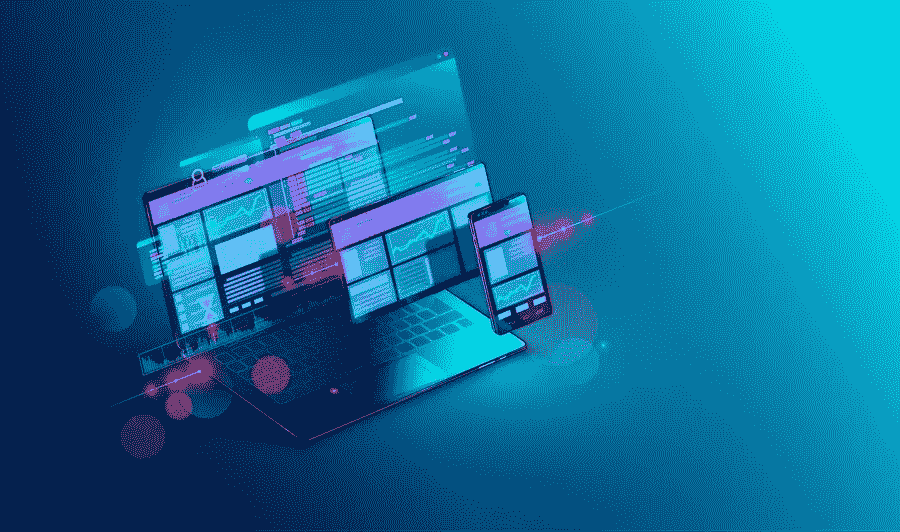

# 网页设计公司:创建强大网站设计的技巧

> 原文：<https://medium.com/visualmodo/web-design-company-tips-on-creating-a-powerful-website-design-c6cdd943bc2?source=collection_archive---------0----------------------->

网站是企业发展最有效的工具之一。当你想直接向潜在客户推销你的产品和服务时，这是你吸引他们登陆的地方。此外，它比其他广告方式覆盖面更广，启动成本也更低。为了提高你的品牌的知名度和权威性，这里有一些关于创建强大的[网站](https://visualmodo.com/blog/)设计的建议:

# 创建一个强大的网站设计

# 1 —提高站点速度

有这么多分散注意力的东西等着扑向你的目标受众，你必须确保一旦他们点击你的链接，他们就会停留在你的网站上。提高网站速度是增加他们留下来阅读你要说的内容的可能性的一个方法。网站速度指的是你的网页加载的时间。一个缓慢的域名只会吓跑潜在客户，所以你必须优化元素，如图像和文本，以便在客户登陆你的网站时立即加载。

提高网站速度的一些技巧包括:

*   **页面缓存** —缓存是将页面存储为静态文件的过程，以便在用户请求特定数据时更易于访问。
*   **图像压缩**——压缩图像意味着减少你网站上图像的文件大小，以缩短其加载时间。网上有很多工具可以自动完成这个过程。
*   **选择正确的主题**——除了创建出色的布局，这家[网络开发公司](https://www.maxburst.com/9-original-branding-ideas-to-leverage-in-2019-and-beyond/)建议开发互动内容来提高你的品牌知名度。响应式主题是一种可行的方式，因为无论访问者使用什么设备，它都能使页面快速加载，从而带来更好的用户参与度和体验。
*   **数据库优化**–您的数据库包含您的网站内容、设置和用户信息，并将其发送给您网站上的最终用户。你应该开始优化它，通过清除不活跃的帖子来保持信息通道的畅通。

# 2 —充分利用视觉层次

视觉层次是安排网站元素的实践，如字体大小、颜色、位置和空白，以强调每页的要点。通过使用这些视觉因素将读者的目光引导到你希望他们做的事情上来补充你的行动号召是至关重要的。

这就是你如何突出你的登陆页面的中心主题:

*   使用大字体。
*   将文本放在窗口的顶部。
*   从页面的常规调色板中选择一种突出的颜色。
*   添加一个引人注目的图形或视频，这是目前最前沿的网页设计趋势之一。
*   用空白使其从其他文本中突出出来。

# 3——坚持简约主义

虽然你应该在你的网站上利用和整合上述元素，但记住要保持适度。过度使用会导致视觉混乱，这会让你的顾客感到困惑，甚至更糟。避免给你的访客很多任务去完成。减少你的菜单项和表单域，并且每页只关注一个行动号召和一个目标。

谷歌[的一项研究](https://ai.google/research/pubs/pub38315)发现用户不喜欢视觉复杂性。以下是一些简化网站的方法:

*   **去掉侧边栏**——不要让你的读者点击侧边栏上他们想要的每一条信息，通过去掉这个元素，创建一个很长的页面，让这个过程对他们来说更容易。这样，他们可以滚动浏览你的内容，允许他们浏览所有内容，这增加了他们收到你的信息的可能性。
*   选择熟悉的布局——你可能会认为古怪的非标准网站设计会让你的域名从竞争者中脱颖而出。然而，人们会被简单的图标布局和他们理解的效果所吸引。选择一个典型的网站结构也会改善他们浏览你的网站的方式。

# 4 —注重可读性

可读性是用户能够识别和理解你的网站上的文字的容易程度。通过优先考虑这个因素，你可以确保你的用户可以毫无困难地浏览你的网站，并保留你希望他们记住的信息。有了这个，利用你的品牌最好的对比色、字体大小和字样。

# 结论

网站对于向潜在客户提供关于你的业务细节的第一手信息至关重要，比如你的办公地点、电话号码和电子邮件地址。此外，它还能让你成为可靠的知识来源，从而在你选择的领域建立信誉。有了正确的内容和搜索引擎优化策略，你就可以利用你的域名和一个强大的网站来树立你在行业中的权威。