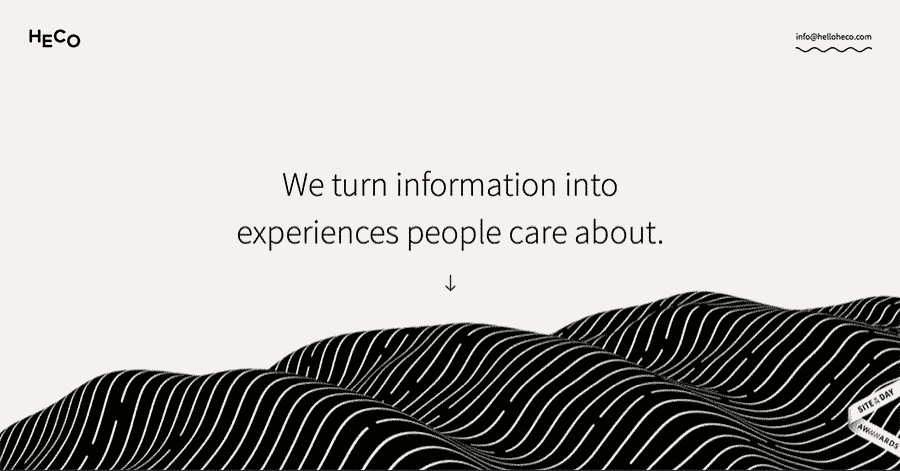

# 网页设计趋势

> 原文：<https://medium.com/visualmodo/webdesign-trends-b084236f3727?source=collection_archive---------0----------------------->

这会让你在 2018 年充满灵感

每一年都会带来新的机遇、新的商业理念和新的趋势——网页设计领域也不例外。随着技术的发展，网页设计也随之发展，即将到来的一年将会是网页设计中最激动人心和最具视觉冲击力的一年。查看最佳网页设计趋势。

# 2018 网页设计趋势

但是，确切地说，在即将到来的一年里，什么样的潮流会令人兴奋，具有视觉冲击力？让我们来看看 2018 年让你灵感不断的七大网页设计趋势:

# 自定义排版

排版一直是表达观点的一种方式。它们传达了你作为一个品牌的身份，就像它们传达了你的信息一样，因此，你要选择能表达你独特品牌个性的版式。2018 年，一切都是为了定制。

网页设计将跟随[实验性的字体设计趋势](https://99designs.com/blog/trends/logo-trends-2018/#experimental-typography)，我们将会看到自定义字体的使用急剧增加。由于最近的技术升级，更多的设备和浏览器可以支持自定义字体，这为品牌创造自己的字体打开了大门，这些字体最能表达他们的客户，他们的品牌和他们作为一个公司的身份。

定制排版趋势将使你的排版更加独特和个性化，这将有助于你从竞争中脱颖而出(并在此过程中加强你的品牌)。

# 明亮而充满活力的配色方案

过去，网页设计师选择的颜色与显示器、平板电脑和移动设备的局限性直接相关。但是现在，这些设备能够更好地再现更广泛的颜色，设计师们在颜色选择上变得更加大胆。而在 2018 年，色彩趋势只会越来越大。

2018 年将是色彩的大年。设计师不太可能稳扎稳打，而是更愿意尝试明亮、充满活力、过饱和的配色方案——这种颜色跳出屏幕，立即抓住网站访问者的注意力。

如果你想加入这一潮流，不要害怕颜色。大胆去做或者回家。确保[明白你为网站选择的颜色会如何影响访问者的行为](https://visualmodo.com/web-design-color-psychology/)。

# 浮动导航栏

你的导航栏是你网站最重要的元素之一；它会告诉你的访问者去哪里，以及当他们到达那里时会看到什么。在 2018 年，如果你想成为潮流，你需要让导航栏完全可访问——无论你的访问者碰巧在页面的哪个位置。

虽然固定导航栏在专注于转换的网站上已经存在了几年，但在 2018 年，预计设计师们会更进一步，创建“浮动”导航栏，完全脱离网站的其他设计。

从设计和 UX 的角度来看，这种分离都是很棒的，因为它会让你的网站在视觉上看起来更有趣，而且它也强化了导航栏是一个独立的元素，会跟随用户的浏览体验。

# 粒子背景

视频背景看起来很棒，但可能会导致一些主要的性能问题。但在 2018 年，一个趋势是解决这个问题，那就是粒子背景。

为什么是粒子背景？这些动画是轻量级的 javascript，允许将动作集成到网站的背景中，而不会将加载时间减慢到爬行。这是两全其美的事情——你可以创建一个像视频一样引人注目的背景，但你不必处理视频臭名昭著的麻烦和性能问题。

# 动画片

说到动画，网站的背景并不是我们在 2018 年看到它们的唯一地方。通过将动画整合到整个网站来增强用户体验，无论是在页面加载时保持用户的注意力，还是在用户停留在特定图标上时加强信息传递，都是将静态网站转变为更有活力的网站的好方法。

# 优先考虑移动设备

官方消息— [移动浏览已经超过桌面](https://www.theguardian.com/technology/2016/nov/02/mobile-web-browsing-desktop-smartphones-tablets)。由于移动浏览如此受欢迎，2018 年一个巨大的网页设计趋势将是把重点放在移动设计上。

移动设计曾经笨拙、简单，而且不太用户友好。但随着越来越多的消费者选择手机作为他们的浏览设备，设计必须成熟才能跟上需求。如果你想在 2018 年具有竞争力，你需要确保你的移动设计是中肯的。

在接下来的一年里，寻找提升你的手机游戏的方法，比如推出汉堡，它将菜单最小化，以适应更小的手机屏幕。

# 梯度

虽然平板颜色已经风靡多年，但 2018 年将会看到渐变的回归。虽然上一次我们看到渐变时，它们相当柔和(就像苹果的 iOS 图标)，但这一次，它们将变得响亮。

如果你想让你的网站在接下来的一年里有新鲜感，加入渐变背景——渐变过滤的照片和响亮、大胆、充满活力的颜色渐变都很流行。

# 包装东西

这是新的一年，这意味着新的趋势——现在你知道了网页设计领域最热门的七个趋势，你可以将它们融入到你的网页设计中，以确保你的网站是及时的，符合潮流的，完全符合 2018 年的。

**作者简介:**卡米尔·法郎

卡米尔是设计平台 [99designs](https://99designs.co.uk/) 的营销经理。他热衷于视觉传达、心理学和企业家精神。当你没有沉浸在数字营销的世界中时，你可能会发现他在世界各地旅行，演奏音乐或练习冥想。