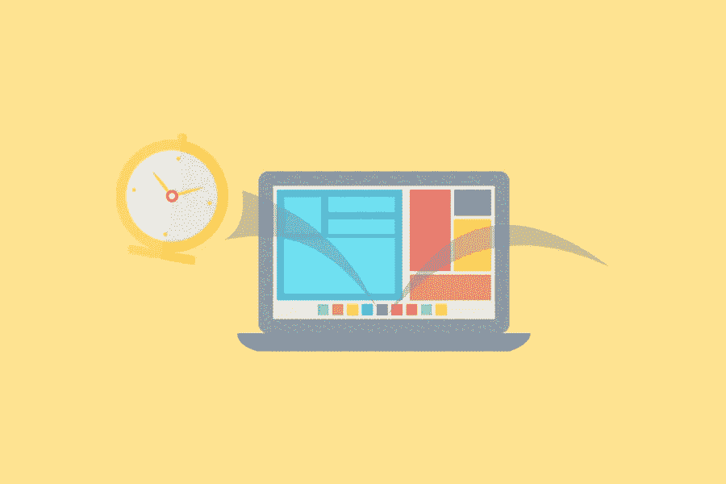

# 网站建设者 Vs 自定义网站什么最适合你？

> 原文：<https://medium.com/visualmodo/website-builder-vs-custom-website-what-works-best-for-you-ba8b5629b420?source=collection_archive---------0----------------------->

有趣的是，我们正在谈论 2020 年网站建设者与定制网站设计，因为我记得 1996 年网站建设者与定制设计的辩论。你应该制作一个免费的 GeoCities 页面，还是雇人在 Adobe Dreamweaver 中创建一个网站？时代真的不会改变，技术只是在进步。在这篇文章中，我们将看到什么是最适合你的网站建设和定制网站设计。

无论如何，现代时代的网站设计成本是一个复杂的课题，因为网站本身也变成了复杂的东西。互联网不是由几行 HTML 和一些。GIF 图形了。因此，网站建设者填补了那些想要快速和容易的结果的人的空白，而定制网站设计是一种优质服务。

现在的问题是，哪个对你最好？我将通过客观地比较你能从两者中期待什么来尝试回答这个问题。

# 比较成本:网站建设者与自定义网站

定制网站设计肯定要比网站建设者前期花费更多。网站建设者的目的是作为廉价和易于使用的平台，按月或按年订阅。有些人喜欢指出，你将支付更高的网站建设域名托管费，这在技术上是正确的。由于方便的因素，网站建设商对主机服务收取的费用要高一些。

通过网站建设商的托管计划平均每月从 10 美元到 25 美元不等，并且还可以每月收取额外的费用，如额外的存储空间，网站上的高级应用程序等。网站建设者就是靠订阅微不足道的服务赚钱的。这是一个好主意，比较各种网站建设平台的细则服务，例如在这里你可以看到最好的房地产网站建设者的比较。

由专业团队进行网站设计的前期成本要高得多，中小型网站设计的前期成本在 5000 美元到 10000 美元之间，而企业电子商务业务的前期成本可能会高得多。然而，你将在域名托管、SSL 证书等方面支付更少的费用。

# 月租费考虑呢？

虽然与网站建设商相比，网站设计似乎会有更高的前期成本和更低的月成本，从长远来看可以为你省钱，但需要注意的是，一些网站设计公司可以将你锁定在每月维护合同中，其中包括技术支持、分析、SEO 微调等内容，这些东西也不便宜。

根据你网站的规模，网站设计公司的月维护费可能不完全值得。

这有点像让专业汽车修理厂每月调整你的汽车机油和轮胎压力，但出于某种原因，他们一直要求你更换离合器总成。明白我的意思吗？

因此，最终的成本，包括前期和每月考虑，一个网站建设者通常会更便宜，为中小型博客或电子商务企业，即使有更高的域名托管和存储费用。

然而，对于大型企业，尤其是有许多页面和脚本要加载的电子商务网站，数字设计公司提供的每月维护和支持是值得的。

作为这一部分的最后一点，有一种方法可以让你 DIY 网站建设者。廉价的域名托管。你可以使用离线的网站生成器来导出网站代码。上传到你选择的域名。这比仅仅使用一个带有[内置主机计划](https://visualmodo.com/web-hosting-works/)的普通网站建设商需要更多一点的技术知识，但这是一个节省月费的好选择。

# 网站建设者与定制网站:网站运行的时间

使用网站构建器，您只需为您的网站拼凑一些模板、网站元素、附加脚本和小部件。你可以在不到一天的时间里建立并运行一个全新的网站。

专业的网站设计需要更长的时间，从 12 到 16 周不等，这取决于你的网络项目的范围。这涉及到大量的协作、定制代码的编写等等。

我是说真的，这不难想象。这就是 16 英寸 x 20 英寸的数字绘画和 36 英寸 x 48 英寸的原始油画之间的区别。显然，油画原作需要更长的时间。

# 定制因素

同样，我们可以使用绘画参考。因为一个在线网站建设者基本上就像一个油漆的数字。您只能使用网站构建器平台上的模板和应用程序。你可以做一个非常漂亮干净的网站，没问题，但是它仍然只是一个模板，除非你购买一个独特的网站主题，比如 WordPress。

有了定制的网站设计，在合理的范围内，天空是无限的。你的网站定制的每一个方面，因为你使用自定义代码。

这并不是说一个网站建设者会给你一个廉价的外观一般的网站。有些平台确实允许很好的定制。如果你熟悉 CSS 之类的网站代码。但是，您仍然会看到实际可用工具的局限性。

# 结论:建站者 vs 定制网站？

在决定哪一个最适合你的问题上有太多的变数，但最终归结为这一点。如果你是一个博客写手，或者一个小型电子商务网站，或者一个展示他们作品的艺术家。所以，一个网站建设者会得到这份工作。这是你最好的选择，因为定制网页设计和日常维护可能不在你的预算之内。

如果你是一个大型电子商务网站或企业公司，你真的想要定制网站设计。一个大型电子商务网站实际上需要他们的设计师每月维护。如果你的网站看起来像一个网站建设者模板，那就不是一个好的公司形象。很明显。