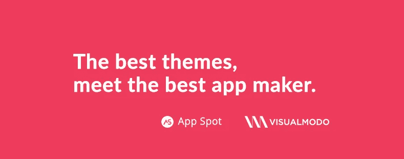
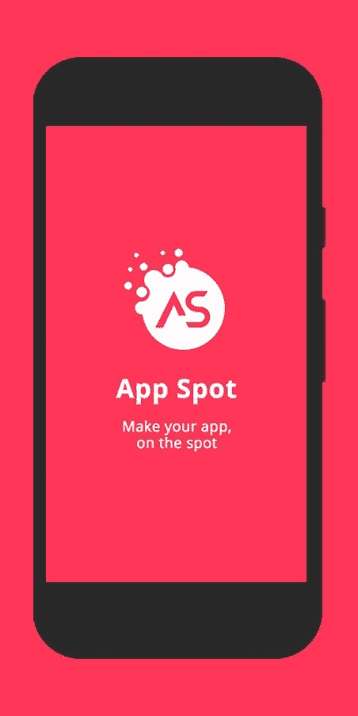
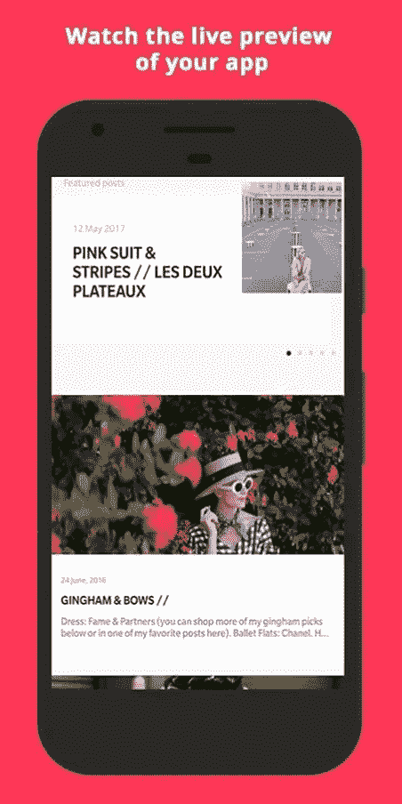

# 我们与 App Spot 合作

> 原文：<https://medium.com/visualmodo/weve-partnered-with-app-spot-347148982d97?source=collection_archive---------1----------------------->

我们 Visualmodo 坚持不懈地致力于提供最好的和简化的主题，帮助你立即开始并扩大你的受众。我们相信你知道，内容消费习惯正在改变，从桌面到移动，我们意识到博客作者现在需要一个应用程序来支持他们的博客，App Spot 可以做到这一点。

# 什么是 App Spot？

为你的博客制作一个应用程序的过程是一个勇敢的尝试——与设计师、多个开发者、一个质量分析师等等打交道。—这一切都是在你建立受众和发展博客的同时进行的。这是一次可怕的经历。有些博客作者半途而废，因为他们被为他们的博客制作一个应用程序的艰巨任务拒绝了。

我们希望改进为您的博客制作应用程序的流程，并与世界领先的应用程序制造商之一 App Spot 合作。App Spot 的人已经开发了一个[安卓应用](http://m.onelink.me/c0a35445)，可以让你为自己的博客制作一个应用。方便、可靠、无缝的体验。我们 VisualModo 希望消除与制作博客应用程序相关的一个重要压力。因此，我们与[应用 Spot](http://m.onelink.me/c0a35445) 合作。

从今天开始，全世界的 VisualModo 新老客户都可以在 App Spot 上享受为你的博客制作应用的乐趣。

您的博客的应用程序将具有以下功能:
1)您的博客的原生 Android 应用程序。3 个免费应用主题可供选择。
3)发送推送通知—向您的应用用户发送无限量的推送通知，无需额外费用。
4)社交分享——允许你的应用程序用户在任何社交网络上与他们的朋友分享你的博客文章。
5)与 Google Adsense 集成—现在使用原生 Google Adsense 赚取更多。添加您的 AdMob 发布者 id。就是这样！
6)您可以启用和禁用注释显示。

App Spot 不收取重复费用。你的博客应用一次性收费 29.99 美元。

我们希望您，我们的消费者，会发现这种合作关系是有帮助的。我们相信它改善了增加你的博客受众的一个重要方面，使你的读者更容易使用你的应用程序与你保持联系——用 [App Spot](http://m.onelink.me/c0a35445) 制作。

