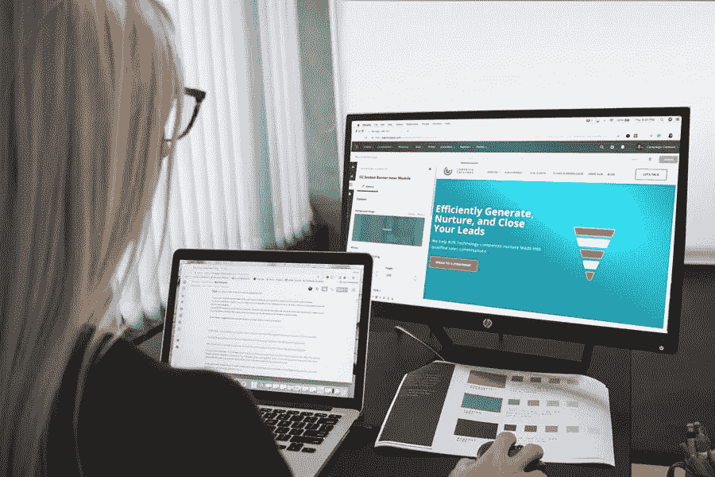

# 当开始一个网页设计工作室时，什么方法最有效？

> 原文：<https://medium.com/visualmodo/what-approaches-work-best-when-starting-a-web-design-studio-8eaa0400130d?source=collection_archive---------0----------------------->

当你在一家网站设计工作室做过网页设计师、网页开发人员、社交媒体经理或相关职位时，最终你可能会想自己出去。成为一个网络工作室的创始人和所有者与一周工作五天或更多天是完全不同的，但没有运营整个业务的令人担忧的负担。

在这篇文章中，我们介绍了一些创建网络工作室的方法，这些方法可能会给你一个良好的开端，并使你在最初的几年里更有可能成长。

# 开始一个网页设计工作室

# 办公室还是远程办公？

远程工作现在很流行。有许多成功的创业公司和在线公司完全是在没有办公室的情况下远程办公的。他们通过偶尔的非正式聚会来应对，租用会议室或使用共同工作空间来定期聚会。同事之间使用视频会议以及 Slack 之类的通信工具使得远距离的团队合作变得更加容易。

另一种方法是马上开设一个办事处。这提供了一致的工作环境。然而，这也大大增加了启动成本。虽然沟通是简化的，但很难证明额外的运营成本是合理的，除非未来有巨大的扩展计划，或者这被视为唯一可行的方法。

有趣的是，甚至一些主流公司最近也从拥有大型办公室转向出租整层楼的共同工作空间，因为随着客户名单的增减，这给了他们更大的灵活性来扩大或缩小他们的团队。

# 全职工作者还是自由职业者？

在选择办公室时，你会选择在那里工作的全职员工。可以使用一种混合模式，其中一些员工有一张办公桌，其他人将被招聘为远程工作的永久员工(通常这些人不住在办公室附近)。

当经营一个完全远程的公司时，使用远程工作者或大量的自由职业者是另一种方法(例如像 Automattic，WordPress 的创造者)。以 Automattic 的 700 名员工为例，他们仍然让远程员工参加不定期会议和年度聚会。与远程工作者或自由职业者一起工作也能节省大量成本。

然而，自由职业者可能更难管理。他们是独立的，会有多个客户，每个客户都有自己的项目和最后期限。公司节省的成本往往会在忠诚度和专注度上放弃。因此，这是每个创始人必须为自己做出的选择。

# 什么样的营销方式最适合网站设计工作室？

进入公司的人可能有他们可以贡献的客户。客户经常和明星开发商一起搬家，即使他们的前雇主对此不太满意。这取决于每个创始人在这方面从哪里获得客户。一些人认为这在道德上是错误的，而另一些人认为商业是现代战争，一切都是公平的。

对于任何营销来说，方法应该是既有效又负担得起的。大多数初创公司用于营销目的的资金有限，但必须达到一定的收入水平才能在最初几年生存。因此，公司必须正确评估获得每个客户的成本，以计入他们的服务费用。

# 谨慎应对销售增长放缓和成本上升

在[创业](https://awards.visualmodo.com/)的路上，很容易过度热情。这很好，但对财务预测来说就不太好了，在财务预测中，谨慎要好得多。

算出你的销售预算，然后减半。使用较低的现金流估计来预测较少的资金进入企业。

对于商业和网站设计工作室的费用，在你的花费上要节俭。如果销售没有像希望的那样迅速实现，你将需要额外的钱来度过难关，直到情况好转。

# 学习商业以便更好地掌握它

要成为一名更好的企业家，有必要学习如何去做。对大多数人来说，虽然他们可以看到其他创始人做错了什么，但创办和经营自己的企业完全是另一回事。

如果你想适当地学习商业，明智的做法是考虑参加 [MBA 在线课程](https://online.suffolk.edu/programs/mba)。这些课程在知名教育机构讲授，涵盖了商业的许多有用方面，但现在也可以在网上找到。对于刚刚起步的忙碌创业者来说，他们的业余时间可以用来通过业余教育提高业务水平。

当拥有一个网络工作室时，营销必须是日常活动。虽然你不会每天都找到新客户，但你的品牌必须在市场上广为人知。谨慎行事，让你的新公司有机会在营运资金耗尽之前找到收入来源。