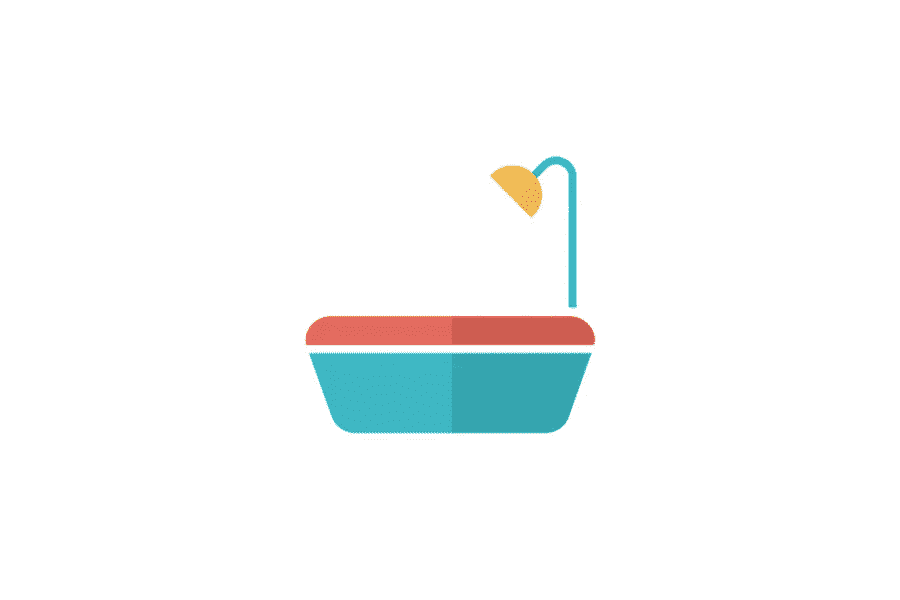

# 家庭水处理的步骤是什么？

> 原文：<https://medium.com/visualmodo/what-are-the-steps-of-a-home-water-treatment-42ceccd756e3?source=collection_archive---------0----------------------->

当谈到了解家庭水处理的步骤是什么？首先，你需要了解有不同类型的水净化设备。一些净化器使用反渗透和蒸馏，而另一些使用更类似于多级单元的东西。无论您使用哪种类型的过滤装置。你需要确保它能去除氯、铅、囊肿和细菌。THMs(三卤甲烷)，VOCs，TCE(三氯乙烯)，甲草胺，苯，阿特拉津，MTBE，以及自来水中发现的任何其他物质。

# 家庭水处理的步骤

所以，当你想知道家庭水处理的步骤时。您需要确保净化器能够清除上述所有化学污染物。许多公司都有网站，提供如何在家里净化自己的水的说明。该信息适用于软水和硬水。这些信息并不总是完整或最新的，但仍然值得研究。事实上，如果你关心家人的健康。所以，使用公共处理设施并相信他们会给你安全、健康的水是一种疏忽。

如果你不放心自己做，你可以请专业人士来帮忙。墨尔本有水管工修理堵塞的下水道，但他们也知道如何安装家庭水处理设备。许多有经验的管道工都精通所有的管道需求。

如果你决定在家里净化自己的水，那么你需要知道家庭水处理的步骤，包括使用净水器。首先，水中的必要元素被替换。氯是迄今为止最常被去除的元素。根据水的硬度，除了钙和镁之外，可能还需要加入碳颗粒。如果你的水含有有机物，那么使用木炭过滤系统这样的多媒体块是必要的。

# 有毒物质的清除

接下来，是去除水中的有毒物质。在大多数情况下，这是通过使用反渗透步骤，过滤掉所有的有机化合物，留下健康的，必要的矿物质。在这个过程中也有使用颗粒碳的系统。通过这种方法可以除去的一些杂质有:挥发性有机化合物、铅、包囊、处方药、杀虫剂、苯、林丹、甲草胺和甲基叔丁基醚。

除此之外，还有一些其他的水处理步骤，取决于所使用的[净化系统](https://visualmodo.com/some-highly-effective-ways-to-reduce-energy-consumption/)的类型。例如，蒸馏只是净水器的一个步骤。为了除去氯及其副产品，它必须经过蒸汽压缩步骤。有水