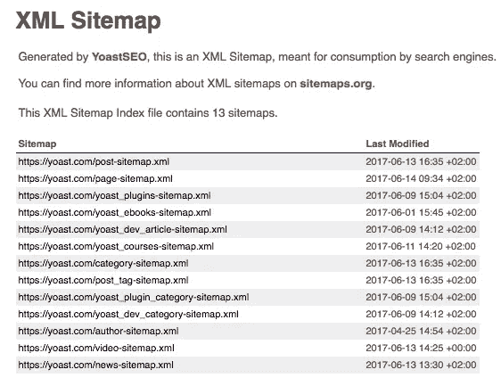
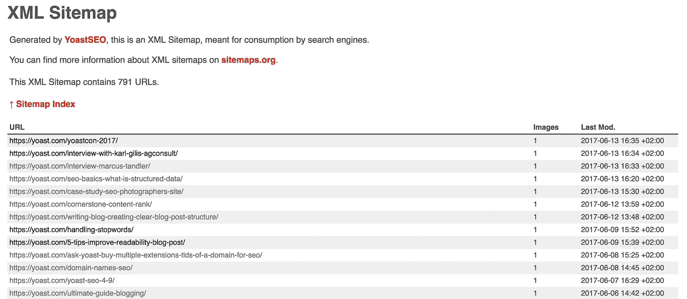
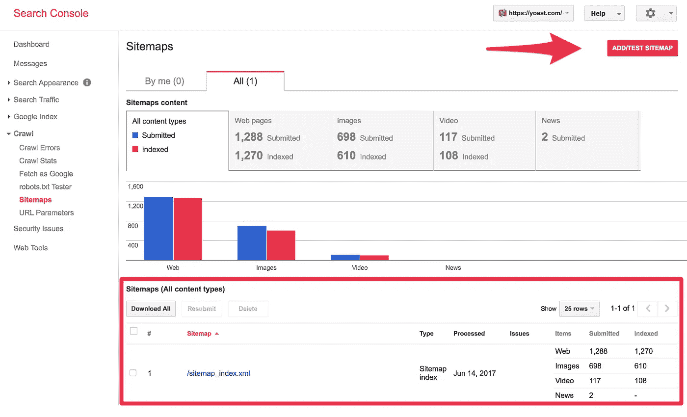
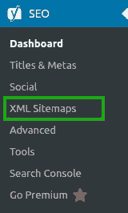
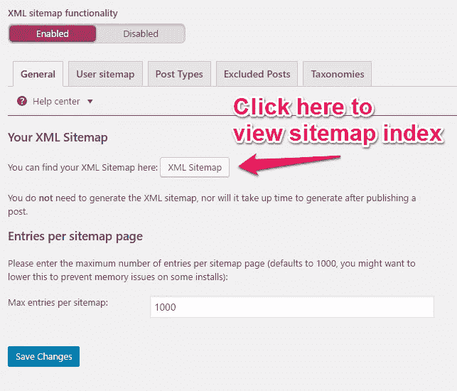

# 什么是 XML 站点地图？为什么我要有一个？

> 原文：<https://medium.com/visualmodo/what-are-xml-sitemaps-why-should-i-have-one-a424b5f5e35a?source=collection_archive---------2----------------------->

一个好的 XML 站点地图是一个网站所有重要页面的路线图。这个路线图指导谷歌搜索网站上的所有主要内容。拥有一个 XML 站点地图对 SEO 是有好处的，因为 Google 可以非常快速地检索到网站的基本页面，即使网站的内部链接并不是完美无缺的。在这里，我们将解释什么是 XML 站点地图，以及它们如何帮助你提高排名。

# 什么是 XML 站点地图？

你希望谷歌抓取你网站的每一个重要页面。但是有可能页面没有任何内部链接，这使得它们很难被找到。你可以使用 XML sitemap 来确保 Google 能够找到并抓取你网站上所有你认为重要的页面。XML 站点地图包含站点的所有重要页面，有助于 Google 确定站点的结构:

上面的 XML 站点地图显示了由 [Yoast SEO 插件](https://yoast.com/wordpress/plugins/seo/)创建的 Yoast 网站的 [XML 站点地图。如果你继续阅读这篇文章，我们将解释我们的插件如何帮助你创建最好的 XML 站点地图。如果你没有使用我们的插件，可能你自己的 XML 站点地图看起来有点不同，但它的工作方式是一样的。](https://yoast.com/sitemap_index.xml)

正如你所看到的，Yoast 的 XML 站点地图显示了几个“索引”XML 站点地图:…/post-sitemap.xml、…/page-sitemap.xml、…/video-sitemap.xml 等。这种分类使站点结构尽可能清晰。如果您单击其中一个 index XML 站点地图，您将看到该特定站点地图中的所有 URL。例如，如果你点击“…/post-sitemap.xml”，你会看到 Yoast.com 所有帖子的网址(点击放大图片):

每行末尾的日期告诉谷歌我们最后一次更新帖子的时间。这对于 SEO 是有益的，因为你希望 Google 快速抓取你更新的内容。当 XML 站点地图中的日期改变时，Google 知道有新的内容要抓取和索引。

有时，由于其中 URL 的数量，有必要拆分一个索引 XML 站点地图。一个单独的 XML 站点地图中的 URL 数量限制设置为 50.000 个。这意味着，例如，如果您的网站有超过 50，000 个帖子，您应该为帖子 URL 添加两个单独的 XML 站点地图。因此，您实际上添加了另一个索引 XML 站点地图。我们已经在 Yoast SEO 插件中设置了 1.000 个 URL 的限制，以保持您的 XML 站点地图快速加载。

# 什么网站需要 XML 站点地图？

如果我们看一下 Google 的文档，他们说 XML 网站地图对“*真正大型的网站”*、对“*有大量档案的网站”*、对“*只有少量外部链接的新网站”*以及对“*使用富媒体内容的网站”*都有好处。

我们同意这些类型的网站肯定会从 XML 站点地图中受益。然而，在 Yoast，[我们认为 XML 网站地图对每个网站都有好处](https://yoast.com/the-sense-and-nonsense-of-xml-sitemaps/)。在每一个网站上，你都希望谷歌能轻松找到最重要的页面，并知道你上次更新这些页面的时间。这就是为什么我们在 Yoast SEO 插件中增加了这个功能。

# 哪些页面应该出现在 XML 站点地图中？

如何决定需要在 XML 站点地图中包含哪些页面？总是从考虑一个 URL 的相关性开始:当一个访问者登陆一个特定的 URL 时，这是一个好的结果吗？你想让访问者登陆那个网址吗？否则，该 URL 可能不应该出现在 XML 站点地图中。然而，如果你*真的*不想让那个网址出现在搜索结果中，你就需要[添加一个 noindex，follow’标签](https://yoast.com/robots-meta-tags/)。将其排除在 XML 站点地图之外并不意味着 Google 不会索引该 URL。如果谷歌可以通过以下链接找到它，谷歌可以索引该网址。

# 例子 1:一个开始的博客

让我们以一个新的博客为例。所有者希望谷歌快速找到博客的新网址，以确保他的目标群体可以在谷歌中找到他的博客。因此，立即创建一个 XML 站点地图是一个好主意。所有者已经为第一个帖子创建了一些描述类别，并且他已经编写了第一个帖子。他还设置了一些标签。然而，他还没有足够的内容来填充标签概览页面。由于这些标签概览页面包含“单薄的内容”，向访问者展示它们还没有价值。因此，现在最好将标签的 URL 放在 XML 站点地图之外。在这种情况下，标签页也可以设置为“noindex，follow ”,因为你不希望人们从搜索结果中找到这些 URL。

# 示例 2:媒体和图像

另一个不必要的 XML 站点地图的例子是“媒体”或“图像”XML 站点地图。因为你的图片可能会在你的页面和帖子中使用，所以这些图片已经包含在你的“帖子”网站地图或“页面”网站地图中了。添加单独的“媒体”或“图像”XML 站点地图是多余的。我们建议永远不要在 XML 站点地图中使用这个。只有当图像是你的主要业务时，你才能例外。例如，当你是一名摄影师时，你可能想向 Google 显示一个单独的“媒体”或“图像”XML 网站地图。

# 如何让谷歌找到你的 XML 网站地图

如果你想让谷歌快速找到你的 XML 网站地图，你必须把它添加到你的[谷歌搜索控制台](https://yoast.com/tag/google-search-console/)账户。你可以通过导航到 [*【爬行】*](https://yoast.com/google-webmaster-tools-crawl/) 然后点击*【网站地图】*在搜索控制台中找到网站地图。您将立即看到您的 XML 站点地图是否已经添加到搜索控制台。如果没有，点击下图中箭头右边的“添加/测试网站地图”按钮。

Yoast 的 XML 站点地图被添加到 Google 搜索控制台

正如您在图片中看到的，添加您的 XML 站点地图有助于检查您的站点地图中的所有页面是否真的被 Google 索引。如果某个网站地图的“提交”和“索引”数量有很大差异，我们建议对此进行进一步分析。也许某个错误阻止了某些页面被编入索引，或者也许您应该添加更多内容或链接到尚未编入索引的内容。

# Yoast SEO 和 XML 站点地图

因为 XML 站点地图的重要性，我们已经在 Yoast SEO 插件中添加了这个功能。XML 站点地图可用于免费和高级版本的插件。

Yoast SEO 会自动为您的网站创建一个 XML 站点地图。你可以通过点击 WordPress 安装侧边栏中的“XML 站点地图”来找到它:

现在你已经阅读了这篇完整的文章，你知道拥有一个 XML 站点地图是很重要的，因为拥有一个 XML 站点地图可以帮助你站点的 SEO。如果你在你的 XML 站点地图中添加了正确的 URL，Google 可以很容易地访问你最重要的页面和文章。除此之外，谷歌还可以很容易地找到更新的内容，所以他们知道某个网址是否需要再次抓取。最后，将 XML 站点地图添加到 Google 搜索控制台有助于 Google 快速找到您的站点地图，此外，它还允许您检查站点地图错误。在接下来的屏幕中，您可以启用或禁用网站的 XML 站点地图。除此之外，你可以点击“XML sitemap”按钮在浏览器中查看你的 XML sitemap:
查看你自己的 XML sitemap！在“启用”或“禁用”开关下面的选项卡中，您可以找到不同的站点地图，您可以在 XML 站点地图中包含或排除这些地图:用户/作者、帖子类型和分类。除此之外，如果您认为某个帖子的内容不够有价值，您还可以从 XML 站点地图中排除该帖子。

现在去检查你自己的 XML 站点地图，看看你做的是否正确！来源[https://visualmodo.com/](https://visualmodo.com/)