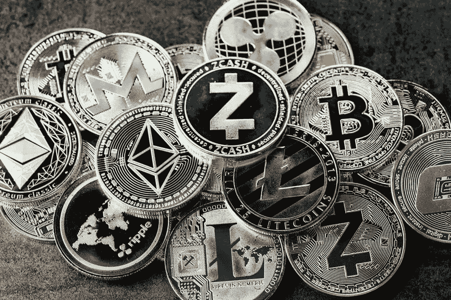

# 加密货币越来越受欢迎对你意味着什么？

> 原文：<https://medium.com/visualmodo/what-does-cryptocurrencys-increasing-popularity-mean-for-you-bc000c8e4013?source=collection_archive---------0----------------------->

世界上几乎所有的东西都在朝着数字化的方向发展，经济也不例外。在这篇文章中，你将看到加密货币越来越受欢迎对你意味着什么？

一种有前途的数字支付形式是加密货币，它目前正在席卷全球。围绕其使用的对话已经开始主导关于货币和支付方式未来的主流讨论。大型老牌机构，如 PayPal、Square.inc 和特斯拉等，都已经对加密货币世界的领导者比特币表示认可。

# 它们真的是不可信的系统吗？

无信任系统指的是不受中央机构监管的货币，比如纸币。没有一个民族国家或政府能够控制一个不可信的系统。

加密货币是否真的是不可信的系统对货币的未来有影响。这是因为他们的主要区别因素之一是他们从可能影响其未来价值的机构中获得的自主权。

J. A Grundfest 教授认为，加密货币虽然享有一定程度的自主权，但并不是完全不可信的。他们依赖为其提供动力的底层基础设施，而该基础设施所在的位置在理论上掌握着对加密的控制权。

即使有这种可能性，加密货币仍然是最接近不可信系统的，正因为如此，它们的受欢迎程度继续飙升。

# 加密货币的日益普及对你来说意味着什么？

预测是棘手的，然而加密货币作为一种支付模式的日益普及可能意味着几件事。如果你目前持有一种或几种加密货币，或者正在考虑投资一种加密货币，你可能会想知道受欢迎程度的提高会对你的投资产生什么影响。简而言之，这是一件好事还是仅仅是一场仅限于谈论，而对货币本身没有实际影响的狂热？

下面，让我们来看看 crypto 可能会如何应对流行和使用的激增。

*   监管环境的改善

为了支持这种日益增长的兴趣，crypto 的监管环境必须随着它的流行而发展。它必须继续保护用户身份，同时还必须促进税收合规性并阻止洗钱。因此，既要足够复杂以避免黑客攻击，又要足够容易被消费者理解和使用。它必须尽可能地分散，但又足够“受控”,以便在基础上得到充分的保护和保障。

市场也需要监管。一个公平的市场应该准备好了。人们应该能够很容易地找到购买密码的最佳经纪人，而不会在网络空间被利用。

已经有证据表明，这些措施是为了应对密码货币的广泛使用而制定的。

*   增加信任:密码货币日益流行

密码货币越来越受欢迎的直接因素是对它们的信任程度。随着越来越多的人对密码货币的价值越来越有信心，他们的价值也越来越大。

当涉及到密码货币时，价值波动和易变性一直是个问题。但其中一些波动可能是市场对各种形式的数字货币变得有信心。