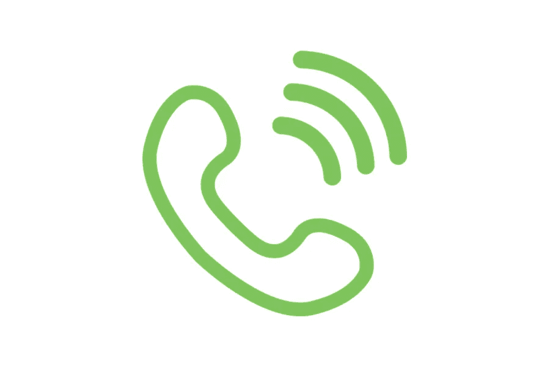

# 什么是 can 电话系统，它是如何工作的？

> 原文：<https://medium.com/visualmodo/what-is-a-could-phone-system-and-how-does-it-work-f99fd1c84111?source=collection_archive---------0----------------------->

越来越多的企业正在转向基于云的电话系统。你的企业也应该搬迁吗？有效可靠的沟通方式是任何成功企业的基石。基于云的电话系统，也称为互联网呼叫或互联网协议语音(VoIP)，随着云存储在所有业务领域的普及，已经变得非常流行。然而，它们可能并不适合每个人。在本文中，我们将解释什么是云电话系统以及它是如何工作的。继续读下去，看看它是否适合你。

云电话系统是一种商业 VoIP(互联网协议语音)电话系统，允许您通过互联网连接拨打和接听商业电话。

# 云电话系统的优点:节约成本

转换到 VoIP 的小企业可以减少高达 40%的本地电话费用。这些小企业将国际电话费用降低了 90%。显示传统电话系统典型月费用的屏幕截图。显示商业 VoIP 系统典型月成本的屏幕截图。

相当多的云 VoIP 提供商每分钟的收费低于领先的固定电话服务。无论你的通话量和使用情况如何，几乎可以肯定的是，基于云的电话系统每月的费用比固定电话服务要低。

无限分钟套餐对于高流量的呼叫中心来说是经济实惠的，而现收现付的定价模式可以适应那些节约使用分钟的业务。所以，从上面的例子来看，平台不需要你购买昂贵的硬件来维护和安装，这为你节省了很多。

# 地理灵活性

显示云系统的地理灵活性的屏幕截图。云电话系统提供了地理上的灵活性，让您可以轻松地远程工作。

在系统上打电话，你不必坐在桌子旁边。云电话系统允许你在任何有网络连接的地方工作。我们还可以设置 IP 电话，插入您的笔记本电脑，或使用智能手机上的软电话从您的云电话系统拨打电话。这意味着您可以在家、在旅途中或作为全职远程员工工作。

对于远程团队来说，Nextiva 是一个很好的云电话系统。它有许多先进的功能和出色的支持。您可以轻松添加远程团队成员并设置呼叫转移规则。此外，Nextiva 的移动和桌面应用程序易于使用。这使得它成为远程团队在实践培训困难时的一个很好的选择。此外，Nextiva 的统一通信平台带有内置的 CRM 和实时聊天功能。

# 统一通信

云电话系统是统一通信的完美推动者。统一通信就是将丰富的通信渠道和选项整合到一个接入点。云统一通信通过允许高校和客户使用他们首选的渠道，使他们与高校和客户的沟通更加一致和便捷。

因此，当您通过桌面软电话打电话并不得不离开一段时间时，您不必挂断电话，而是可以将呼叫转移到您的移动电话并继续通话。一些提供商还提供增强协作的价值，如即时消息、在线状态、CRM 集成等。