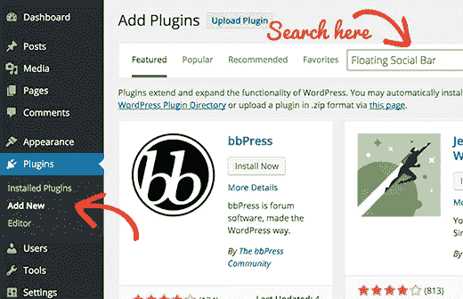

# 什么是 WordPress 插件？

> 原文：<https://medium.com/visualmodo/what-is-a-wordpress-plugin-73b0440a9094?source=collection_archive---------0----------------------->

插件是一个软件，包含一组可以添加到 WordPress 网站的功能。他们可以扩展你的 WordPress 网站的功能或者增加新的特性。WordPress 插件是用 PHP 编程语言编写的，与 WordPress 无缝集成。

# 什么是 WordPress 插件？

在 WordPress 社区，有一种说法流传很广:“有一个插件可以做到这一点”。它们让用户无需知道一行代码就可以轻松地在网站上添加功能。在[官方 WordPress 插件目录](https://visualmodo.com/blog)有数千个可以免费下载。在 WP 初学者，我们写了所有的[最好的 WordPress 插件](https://visualmodo.com/)。我们甚至分享了一份我们使用的插件列表[。除了免费插件，第三方公司和开发者还提供了大量令人惊叹的商业插件。](http://www.wpbeginner.com/blueprint/)

作为站点管理员，您可以从管理区安装/卸载插件。您也可以使用 FTP 客户端下载并手动安装它们。

因为绝大多数插件都是免费的，所以需要注意的是它们通常没有技术支持。因此，在选择要在您的站点上安装哪些组件时，一定要小心谨慎。虽然有些插件几乎可以做任何事情，但有些插件的质量比其他插件高得多。为了选择正确的，你应该问自己几个问题。有多久没更新了？是否兼容 WordPress 的最新版本？人们的支持问题得到回答了吗？它有什么类型的评级？

有一种说法认为 WordPress 插件会降低你网站的速度。这不是真的。只有坏网站的数量会降低你的网站速度。

所有的主题都完全兼容你想要的任何功能。