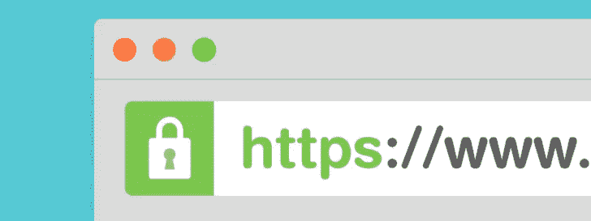
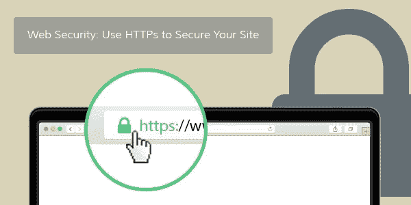

# 什么是 HTTPS 为什么让你的网站安全

> 原文：<https://medium.com/visualmodo/what-is-https-why-make-your-site-secure-5ab46fbcb3bf?source=collection_archive---------0----------------------->

在线安全是一个网站成功的一个至关重要的方面，但却经常被忽视。现在看看什么是 HTTPS，为什么你应该使用它。

如果你要经营一家网上商店或电子商务网站，你显然希望确保客户在网站上提供给你的信息，包括他们的信用卡号码，都得到安全处理。然而，网站安全不仅仅是在线商店的事情。而电子商务网站和任何其他处理敏感信息(信用卡、社会保险号、财务数据等)的网站。)是安全传输的明显候选者，但事实是所有网站都可以从安全中受益。

# 什么是 HTTPS？

为了保护一个网站的传输(从网站到访问者以及从访问者回到你的网络服务器)，这个网站需要使用[HTTPS](https://visualmodo.com/)——或者带安全套接字层的超文本传输协议，或者 SSL。HTTPS 是一种通过网络传输加密数据的协议。当有人向你发送任何类型的敏感数据时，HTTPS 会保证传输的安全。

HTTPS 和 HTTP 连接工作有两个主要区别:

*   HTTPS 连接到端口 443，而 HTTP 连接到端口 80
*   HTTPS 用 [SSL](https://visualmodo.com/) 加密发送和接收的数据，而 HTTP 以纯文本形式发送

大多数在线商店的顾客都知道，当他们进行交易时，应该在 URL 中寻找“https ”,并在浏览器中寻找锁图标。如果你的店面不使用 HTTPS，你会失去客户，你也可能会让你自己和你的公司承担严重的责任，如果你缺乏安全性危及他人的私人数据。

这就是为什么今天几乎所有的在线商店都在使用 HTTPS 和 SSL——但是正如我们刚才所说的，使用安全的网站不再仅仅是电子商务网站了。

在今天的网站上，所有的网站都可以从 SSL 的使用中获益。谷歌实际上推荐今天的网站使用这种方法来验证网站上的信息确实来自该公司，而不是有人试图以某种方式欺骗网站。

因此，谷歌现在奖励使用 SSL 的网站，这是除了提高安全性之外，将 SSL 添加到您的网站的另一个原因。

# 发送加密数据

如上所述，HTTP 以纯文本形式发送通过互联网收集的数据。这意味着，如果你有一个要求信用卡号码的表单，任何人都可以通过数据包嗅探器截获该信用卡号码。由于有许多免费的嗅探器软件工具可用，这可以做任何人都很少的经验或培训。通过 HTTP(非 HTTPS)连接收集信息，您就冒着数据被截取的风险，而且由于数据没有加密，会被窃贼使用。

# 托管安全页面需要什么

要在网站上托管安全页面，您只需要做几件事情:

*   一个支持 ssl 加密的 [Web 服务器](https://visualmodo.com/),比如带有 mod_ssl 的 Apache
*   唯一的 IP 地址—这是证书提供商用来验证安全证书的地址
*   来自 SSL 证书提供商的 SSL 证书

如果你不确定前两项，你应该联系你的虚拟主机提供商。他们会告诉你是否可以在你的网站上使用 HTTPS。

在某些情况下，如果您正在使用一个非常低成本的主机提供商，您可能需要转换主机公司或升级您在当前公司使用的服务，以便获得您需要的 SSL 保护。如果是这种情况，请做出改变！使用 SSL 的好处值得一个改进的托管[环境](https://visualmodo.com/)的额外费用！

# 一旦你拿到了 HTTPS 证书

一旦你从一个信誉良好的提供商那里购买了 SSL 证书，你的主机提供商将需要在你的 web 服务器中设置证书，这样每次通过 https://协议访问一个页面时，它都会到达安全的服务器。一旦设置完成，您就可以开始构建需要安全保护的网页了。这些页面可以像其他页面一样构建，如果您在站点上使用绝对链接路径链接到其他页面，您只需要确保链接到 https 而不是 HTTP。

如果你已经有了一个为 HTTP 建立的网站，现在你已经改成了 HTTPS，你也应该已经准备好了。只需检查链接以确保任何绝对路径都已更新，包括图像文件或其他外部资源(如 CSS 表、JS 文件或其他文档)的路径。

以下是更多使用 [HTTPS](https://visualmodo.com/) 的技巧:

*   **指向 https://服务器上的所有 Web 表单。**每当你在你的网站上链接到 Web 表单时，养成用完整的服务器 URL 链接它们的习惯，包括 https://名称。这将确保它们始终是安全的。
*   使用安全页面上图像的相对路径。如果您对图像使用完整路径(http://www…)，而这些图像不在安全服务器上，您的客户将会收到类似“发现不安全数据”的错误消息。继续？”这可能会令人不安，许多人看到这种情况后会停止购买。如果您使用相对路径，您的图像将从与页面其余部分相同的安全服务器上加载。

我们提供 [WordPress SSL/HTTPS](http://www.mojomarketplace.com/item/ssl-installation) 证书安装服务。关于 SSL 证书的一个重要说明是，谷歌在考虑网页排名和搜索引擎优化时，会考虑更多的 HTTPS 网站。