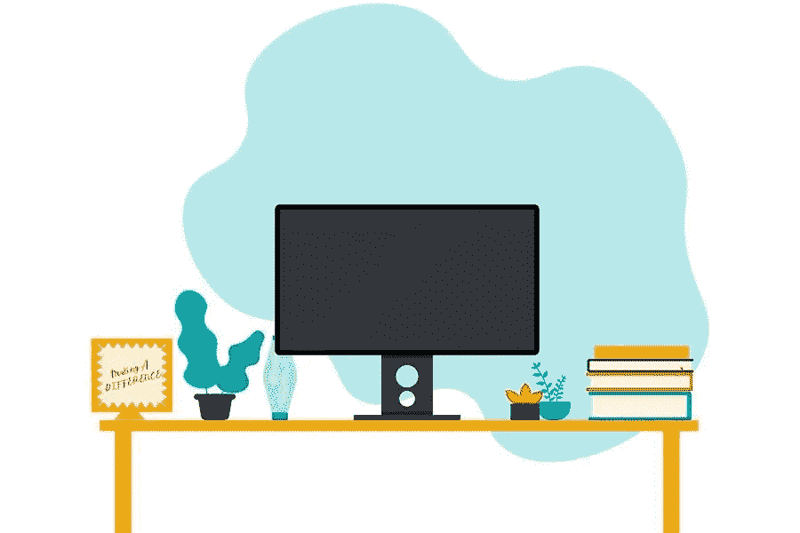

# 什么是远程工作，如何提高工作效率？

> 原文：<https://medium.com/visualmodo/what-is-remote-work-and-how-to-be-productive-on-it-f90ea207446d?source=collection_archive---------0----------------------->

对于许多人来说，远程工作听起来像是梦想成真——灵活的工作时间加上整天穿着睡衣的可能性。理论上，这是一个没有缺陷的愿景。然而，事实证明，在这种情况下很难保持专注，最重要的是，很难保持高效。了解什么是远程工作，以及帮助您在一整天的远程工作中保持高效的五个技巧，以便您可以完成工作

你知道那种感觉吗？当你看着你的手表，现在是下午 5 点，你意识到你今天什么都没做？你是否每天早上起来都有一大堆要做的事情，而且随着时间的推移，这些事情越来越多？如果是这样的话，那么我们专门为你收集了 5 条建议，帮助你在远程工作中保持高效。

# 组织你的工作场所

远程工作时生产力的主要敌人是把工作区和放松区混在一起。为了有效地完成你的职业任务，有必要将工作场所与家庭和私人事务分开。由于这一点，你会觉得你不是在你的日常家居环境。

即使只是把最分散注意力的东西移到一臂之遥的地方，也会让你更容易抑制住捡起它们的冲动。另一个好办法是投资一个屏风，把你工作的办公区和休息的休闲区分开(特别是当你的工作室和卧室相连的时候)。设定固定的工作时间并坚持下去也是一个好主意。

# 列一张待办事项清单

在办公室里，你可能和你的上司有联系，他们以某种方式控制你的工作效果，给你分配任务等等。反过来，在家里，你必须负责及时执行分配的任务。待办事项清单是一切的基础。没有它，你可能会迷失在众多的职责和任务中。这就是为什么，在开始工作之前，你应该坐下来写下你这一天要做的每一件事。

的确，一天当中，你会接到更多需要完成的任务。这样的计划可以让你决定你有多少时间去做额外的工作，以及你是否有时间去完成它们。当你有了计划，你可以迅速通知主管你什么时候可以完成任务。如果是很重要很紧急的事情，你可以决定第二天把哪个工作挪到第三天，为紧急任务腾出空间。

# 以高效的远程工作开始每一天

远程工作时，建立一个日常习惯是非常重要的。想想你需要多少时间来完成你的晨间仪式。早餐、早咖啡、瑜伽课——无论你早上需要做什么，都要列入你的日程表。然后穿着得体地去上班。当然，你不需要穿优雅的衬衫和夹克。

选择整洁或适合办公室的衣服。这个简单的步骤既有助于你的工作效率，也有助于和你一起生活的人。你和其他人都会得到相同的信息:“我现在在工作”，这意味着你现在不应该被其他事情打扰。

# 番茄工作法

你可能听说过这种简单而极其有效的时间管理技巧。如果你想在家有效地工作，或者已经这样做了，你至少应该尝试一下。所以把你的任务分成几个部分。每个节目持续 25 分钟。这是您为完成整个或部分远程工作分配的时间。

设置一个计时器，在计时器响起之前完成第一项任务。不要打断自己，也不要让别人打断你。只有 25 分钟。过了这段时间，你应该休息 5 分钟。如果在工作中出现了一个重要的想法——把它写下来。这样，你不会忘记它，也不会让你分心。

将工作分成更小、更短的时间段可以让你更好地专注于任务。番茄工作法让你更容易激励自己去工作和开始，由于这一点，你变得更有效率。

# 高效远程工作人员的工作生活平衡

远程办公的话很容易累垮。工作和家庭生活之间界限会很快变得模糊。因此，保持健康的工作生活平衡是关键。许多在家庭办公系统工作的人忘记了重要的休息。这让我们保持清醒和头脑清醒。

这个原则反过来也适用。你最好不要在工作时间处理私事。这只是表面上节省时间。事实上，它打破了你的工作节奏，经常阻止你在一天的剩余时间里恢复工作。

在家远程工作有一个显著的优势。这是你自己设定工作时间表的自由，当然，除非。您需要遵循特定的自上而下的要求。

另一方面，在家庭办公环境中保持较高的工作效率是一项挑战。遵循我们说明书中的这 5 点。你可以肯定，第二天你会带着更大的热情回到你的工作岗位上，你会更有精神，因此也更有效率。

如果你对提高你的远程工作感兴趣，看看这篇关于在家工作的文章。