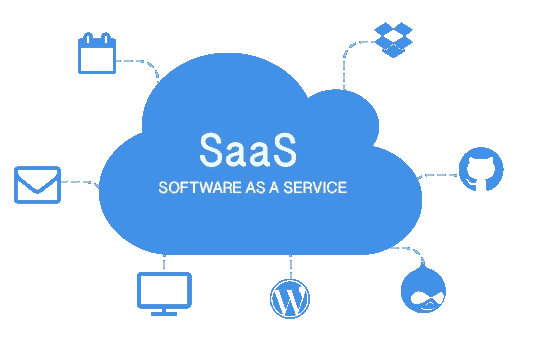
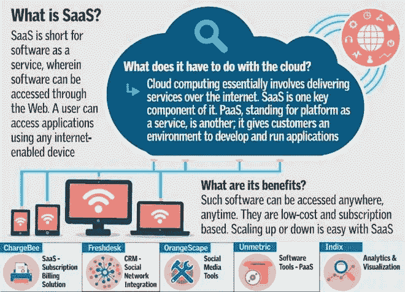

# 什么是 SAAS？

> 原文：<https://medium.com/visualmodo/what-is-saas-b3ccb55e18ab?source=collection_archive---------0----------------------->

你需要知道的事情

近年来，越来越多的企业对互联网工具、服务和互联网基础设施开放，并购买(或者更准确地说，租用)SaaS 服务。从在线发票、客户管理和通过 CRM 挖掘潜在客户，到租赁服务器。

# 那么什么是 SAAS 呢？

**SaaS** —软件即服务的简称。如果说过去我们需要购买本地软件并在本地使用，那么今天很多软件都可以通过网络界面供所有人、任何电脑或移动设备使用，而且通常花费[少得多](https://visualmodo.com/)。

SaaS 可以被视为软件服务、应用程序和基础设施的一种外包形式。例如，与其浪费宝贵的时间和金钱建立一个登陆页面，并与设计师和程序员交谈，你可以租用一个 SaaS 服务，一个建立在网上提供的登陆页面上的系统。每月支付通常几美元的费用(取决于系统使用的程度)，您就可以快速、轻松地构建自己的登录页面。额外的例子:谷歌安置测试工具，CRM [系统](https://visualmodo.com/)，云，热图和分析，以及虚拟聊天网站等等。

以下是当今最大的几家 SAAS 公司:Salesforce、Linkedin、Workday、DropBox、Service Now、New Relic、Zendesk 等等。在这里你可以看到 250 家最大的 SAAS 公司的名单。

许多最近正在成长的初创公司都是建立在 SaaS 商业模式衡量利润的基础上的，他们的客户流失率的增长是预先知道的。

# 那么，我们必须知道哪些 SaaS 创业概念呢？

**MRR** —代表每月经常性收入。其意图是每月的商业周期使顾客成为其订户。MRR:每个月都在成长意味着成长。

**ARR** —同样的原则也适用于年度经常性收入，即年度收入回报。

**ARPU** —代表每个[用户](https://visualmodo.com/)的平均收入。这意味着平均收入是多少(购买了特定包的客户)。计算很简单:MRR 除以活跃客户的数量。通常低 ARPU 显示了小客户的工作，而不是企业。每个公司的目标都是在不损失用户的情况下，尽可能地增加 ARPU

**用户流失** —根据用户的放弃率。计算方法是:(已取消的客户数量/上个月的活动客户数量)乘以 100。这个数字是 SaaS 公司希望尽可能降低的，如下图所示

**收入流失** —根据利润的废弃率。计算方法是:(MRR 因取消和降级套餐导致的下降/上个月的 MRR)乘以 100。

**—代表终身价值。这个概念基本上意味着普通顾客对你来说总共值多少钱。计算如下:ARPU 除以用户流失。例如:如果用户每月平均支付 50 美元，用户流失率为 10%，那么 LTV 就是 500 美元。从这里开始，该公司将削减其能够获得客户的财务投资。**

****CAC** —代表[客户](https://visualmodo.com/)收购成本。换句话说，获得一个客户的成本是多少。包括雇佣销售人员的费用，各种营销和广告费用等等。**

****

# **你想看到所有这些数据吗？**

****

**初创公司 Baremetrics(也就是 SaaS 本身)是一个为 SaaS 公司开发的分析系统，这些公司与某些支付提供商合作，并以视觉上美丽和简单的方式向他们提供上述数据和许多其他数据。你可以在 Baremetrics 或 SaaS 公司的网站上看到它们的真实数据。**

****