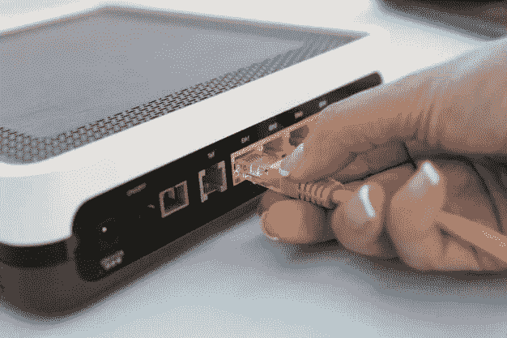

# 最便宜的互联网和有线电视服务是什么？

> 原文：<https://medium.com/visualmodo/what-is-the-cheapest-internet-and-cable-service-ddd3bce041f9?source=collection_archive---------0----------------------->

没有信用检查的互联网和有线电视服务是一个大问题。因此，许多有线电视服务运营商已经开始检查具有良好信用评分的有线电视服务。你不用担心得到一个信用不良的互联网和有线电视服务，因为也有一些有线电视运营商提供有线电视服务没有信用检查。

所以你已经有不良信用，并发现廉价的有线电视服务没有信用检查。有一些低收入家庭也遭受着糟糕的经济状况。但是家庭娱乐即使生活状态不好也不能忽视。廉价的互联网和有线电视服务现在你的门口没有信用检查，以确保您的家庭娱乐完全是在移动中。

# 最便宜的互联网和有线电视服务

通常我们通过有线网络看电视。在技术的帮助下，有线电视服务的形式正在被互联网所取代。现在人们对在网上看有线电视感到满意。有这么多公司提供互联网，使看电视更方便。但是服务提供公司检查信用问题，以确保你有足够的能力支付每月账单。

现在你没有良好的经济条件，但你可以获得最便宜的互联网和有线电视服务，为您的家庭娱乐。当然，我们会提供一些对您的信用状况没有问题的互联网服务提供商的名单。

# Dish 无信用检查电缆

获得有线电视服务并不简单，因为你有不良信用，表明你没有能力支付他们每月的账单。幸运的是，Dish no credit check cable 提供了一个很好的解决方案，确保您可以在 Dish 的帮助下观看有线电视。重要的是要注意，没有终止费或你不必去为任何合同。这可能是一笔好交易，因为财务状况不佳的人可能会随时停止服务。

有不同的计划，你可以看看。这些计划包括免费提供 HBO 三个月的 Flex TV。Dish LATINO 是另一个很棒的计划，可以轻松提供 270 个频道。

# 直接有线电视无信用检查

当你在搜索没有信用检查的有线电视服务时，直接的有线电视没有信用检查确实是另一个不错的选择。这种直接有线电视有许多特色。设备唾手可得，无需额外付费。您可以免费选择，因为有线电视直播有一个应用程序，提供 200 多个高清频道，具有 4K 超功能。更重要的是，高清和 DVR 服务可以成为直播电视的另一个很好的功能。

# 康卡斯特互联网和有线电视服务没有信用检查

康卡斯特是互联网世界的一个巨人。幸运的是，这个网络可以很好地满足你的需求，比如看有线电视。有很多计划，你可以选择，以确保你可以得到更好的服务，没有一个良好的信用评分。低收入家庭可以利用他们的计划，使他们的家庭娱乐更加愉快。你可以得到一个 X1 V 盒子，可以点播 YouTube、网飞和电视直播。

# 频谱有线服务无信用检查

当你有不良信用时，没什么好担心的。频谱可以是一个伟大的地方去，你可以利用他们的计划，而没有良好的信誉。Spectrum 拥有良好的网络基础设施，全国范围内都可以使用。当然，你是一个低收入家庭，有较低的计划率。这些计划从 20 美元到 100 美元不等。然后你可以选择什么可以是最好的和负担得起的给你。

# FiOS 由威瑞森没有信用检查

威瑞森是另一个以低廉价格提供互联网的伟大平台。所以这个互联网可以很好地为你提供有线电视服务。他们的计划是为低收入家庭设计的。如果你没有使用有线电视的选择，那么 Wi-Fi 支持可以是你的选择。

# 互联网和有线电视服务最终裁决

有线电视服务在每个城市和州都非常昂贵，互联网是观看有线电视的一个好选择。这里讨论的互联网服务提供商对你的信用评分没有问题。你需要的是你应该每月支付互联网的费用。这就是你如何能在没有信用检查的情况下观看有线电视。